* css盒模型

  * 标准盒子模型：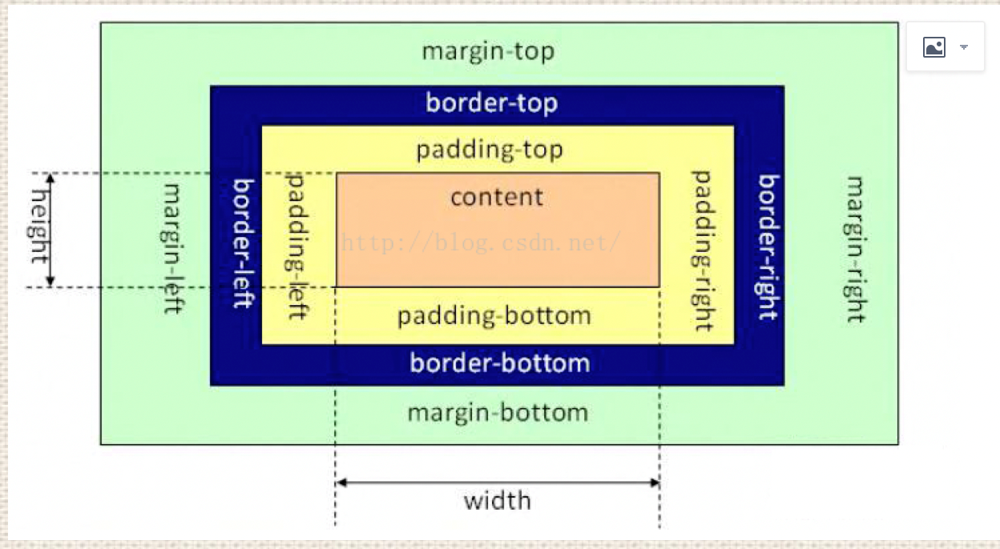
  * IE盒子模型：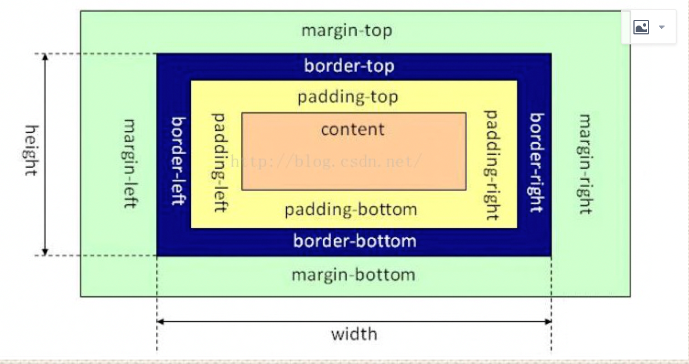
  * 在CSS3中引入了box-sizing属性，box-sizing:content-box表示标准的盒子模型，box-sizing:border-box表示的是IE盒子模型，box-sizing:inherit表示继承父元素的box-sizing
  * 设置一个元素的背景颜色，背景颜色会填充哪些区域？background-color设置的背景颜色会填充元素的content、padding、border区域

* 块元素：独占一行，并且有自动填满父元素，可以设置margin和pading以及高度和宽度；行元素：不会独占一行，width和height会失效，并且在垂直方向的padding和margin会失效。块级元素可以包含行内元素；块级元素不一定能包含块级元素，比如 div 中可以包含 div，但 p 标签中不能包含 div（文本级标签与容器级标签）。行内元素一般不能包含块级元素，比如 span 中不能包含 div，但有个特例：在 HTML5 中， a 标签中可以包含 div。

* 我们可以通过display属性将块级元素和行内元素进行相互转换，display即“显示模式”。display主要取值有none,block,inline-block,inline,flex等。

  * block元素会独占一行，多个block元素会各自新起一行。默认情况下，block元素宽度自动填满其父元素宽度。block元素可以设置width,height属性。块级元素即使设置了宽度,仍然是独占一行。block元素可以设置margin和padding属性。

  * inline元素不会独占一行，多个相邻的行内元素会排列在同一行里，直到一行排列不下，才会新换一行，其宽度随元素的内容而变化。inline元素设置width,height属性无效。inline元素的margin和padding属性，水平方向的padding-left, padding-right, margin-left, margin-right都产生边距效果；但竖直方向的padding-top, padding-bottom, margin-top, margin-bottom不会产生边距效果。

  * inline-block：简单来说就是将对象呈现为inline对象，但是对象的内容作为block对象呈现。之后的内联对象会被排列在同一行内。比如我们可以给一个link（a元素）inline-block属性值，使其既具有block的宽度高度特性又具有inline的同行特性。

  * flex元素子元素们会在水平方向上，从左至右排列。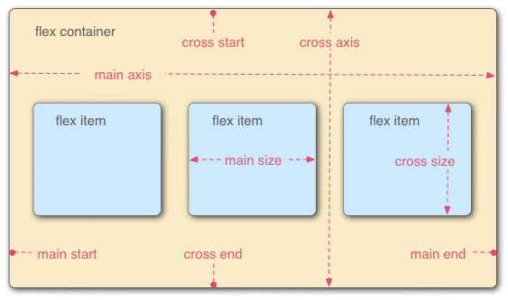

    弹性盒子：指的是使用 display:flex 或 display:inline-flex 声明的父容器；子元素/弹性元素：指的是父容器里面的子元素们（父容器被声明为 flex 盒子的情况下）。

    ```css
    .box{
      display: flex;
    }
    
    行内元素也可以使用 Flex 布局。
    .box{
      display: inline-flex;
    }
    
    Webkit 内核的浏览器，必须加上-webkit前缀。
    .box{
      display: -webkit-flex; /* Safari */
      display: flex;
    }
    注意，设为 Flex 布局以后，子元素的float、clear和vertical-align属性将失效。
    ```

    * 容器的属性

      * flex-direction：

        row（默认值）：主轴为水平方向，起点在左端。

        row-reverse：主轴为水平方向，起点在右端。

        column：主轴为垂直方向，起点在上沿。

        column-reverse：主轴为垂直方向，起点在下沿。

      * flex-wrap：

        nowrap（默认）：不换行。

        wrap：换行，第一行在上方。

        wrap-reverse：换行，第一行在下方。

      * flex-flow：是flex-direction属性和flex-wrap属性的简写形式，默认值为row nowrap。
        .box {
          flex-flow: <flex-direction> || <flex-wrap>;
        }

      * justify-content：定义了项目在主轴上的对齐方式。

        flex-start（默认值）：左对齐

        flex-end：右对齐

        center： 居中

        space-between：两端对齐，项目之间的间隔都相等。

        space-around：每个项目两侧的间隔相等。所以，项目之间的间隔比项目与边框的间隔大一倍。

      * align-items：定义项目在交叉轴上如何对齐。

        flex-start：交叉轴的起点对齐。

        flex-end：交叉轴的终点对齐。

        center：交叉轴的中点对齐。

        baseline: 项目的第一行文字的基线对齐。

        stretch（默认值）：如果项目未设置高度或设为auto，将占满整个容器的高度。

      * align-content：定义了多根轴线的对齐方式。如果项目只有一根轴线，该属性不起作用。

        flex-start：与交叉轴的起点对齐。

        flex-end：与交叉轴的终点对齐。

        center：与交叉轴的中点对齐。

        space-between：与交叉轴两端对齐，轴线之间的间隔平均分布。

        space-around：每根轴线两侧的间隔都相等。所以，轴线之间的间隔比轴线与边框的间隔大一倍。

        stretch（默认值）：轴线占满整个交叉轴。

    * 项目的属性

      * Order：定义项目的排列顺序。数值越小，排列越靠前，默认为0。
      * flex-grow：定义项目的排列顺序。数值越小，排列越靠前，默认为0。如果所有项目的flex-grow属性都为1，则它们将等分剩余空间（如果有的话）。如果一个项目的flex-grow属性为2，其他项目都为1，则前者占据的剩余空间将比其他项多一倍。
      * flex-shrink：定义了项目的缩小比例，默认为1，即如果空间不足，该项目将缩小。如果所有项目的flex-shrink属性都为1，当空间不足时，都将等比例缩小。如果一个项目的flex-shrink属性为0，其他项目都为1，则空间不足时，前者不缩小。负值对该属性无效。
      * flex-basis：定义了在分配多余空间之前，项目占据的主轴空间（main size）。浏览器根据这个属性，计算主轴是否有多余空间。它的默认值为auto，即项目的本来大小。它可以设为跟width或height属性一样的值（比如350px），则项目将占据固定空间。
      * flex：是flex-grow, flex-shrink 和 flex-basis的简写，默认值为0 1 auto。后两个属性可选。建议优先使用这个属性，而不是单独写三个分离的属性，因为浏览器会推算相关值。
      * align-self：允许单个项目有与其他项目不一样的对齐方式，可覆盖align-items属性。默认值为auto，表示继承父元素的align-items属性，如果没有父元素，则等同于stretch。该属性可能取6个值，除了auto，其他都与align-items属性完全一致。

    flex 布局的优势

    * flex 布局的子元素不会脱离文档流，很好地遵从了“流的特性”。但你如果用 float 来做布局，float 属性的元素会脱离文档流，而且会涉及到各种 BFC、清除浮动的问题。浮动相关的问题，比较麻烦，所以也成了面试必问的经典题目。但有了 flex 布局之后，这些问题都不存在的。
    * flex 是一种现代的布局方式，是CSS3 规范。flex 非常提供了丰富的属性，非常灵活，让布局的实现更佳多样化，且方便易用。故flex 唯一的缺点就在于，它不支持低版本的 IE 浏览器。

  * grid 网格布局：它将网页划分成一个个网格，可以任意组合不同的网格，做出各种各样的布局。以前，只能通过复杂的 CSS 框架达到的效果(Bootstrap)，现在浏览器内置了。

    * display: grid(display: inline-grid)和dispay: flex

      flex 布局是轴线布局，只能指定"项目"针对轴线的位置，可以看作是一维布局。Grid 布局则是将容器划分成"行"和"列"，产生单元格，然后指定"项目所在"的单元格，可以看作是二维布局。grid布局远比flex布局强大。

    * 容器属性

      grid-template-columns属性定义每一列的列宽，grid-template-rows属性定义每一行的行高。除了使用绝对单位px，也可以使用百分比；重复写同样的值非常麻烦，尤其网格很多时，这时，可以使用repeat()函数，简化重复的值；如果希望每一行（或每一列）容纳尽可能多的单元格，这时可以使用auto-fill关键字表示自动填充；为了方便表示比例关系，网格布局提供了fr关键字（fraction 的缩写，意为"片段"），如果两列的宽度分别为1fr和2fr，就表示后者是前者的两倍，fr可以与绝对长度的单位结合使用，这时会非常方便，minmax(100px, 1fr)表示列宽不小于100px，不大于1fr；auto关键字表示由浏览器自己决定长度（基本上等于该列单元格的最大宽度，除非单元格内容设置了min-width）；网格布局允许网格线有名字，并且同一根线可以有多个名字，比如[fifth-line row-5]

      grid-row-gap属性设置行与行的间隔（行间距），grid-column-gap属性设置列与列的间隔（列间距）。grid-gap属性是grid-column-gap和grid-row-gap的合并简写形式，如果grid-gap省略了第二个值，浏览器认为第二个值等于第一个值（最新标准可直接把前缀的grid给去除了）

      grid-template-areas属性用于定义区域，也即是每个区域取一个名字，以后可以对区域进行操作。网格布局允许指定"区域"（area），一个区域由单个或多个单元格组成。

      grid-auto-flow默认值是row，即"先行后列"，也可以将它设成column，变成"先列后行"，还可以设成row dense和column dense，row dense表示"先行后列"，并且尽可能紧密填满，尽量不出现空格。

      justify-items属性设置单元格内容的水平位置（左中右），align-items属性设置单元格内容的垂直位置（上中下），place-items属性是align-items属性和justify-items属性的合并简写形式，如果省略第二个值，则浏览器认为与第一个值相等。

      justify-content属性是整个内容区域在容器里面的水平位置（左中右），align-content属性是整个内容区域的垂直位置（上中下），place-content属性是align-content属性和justify-content属性的合并简写形式，如果省略第二个值，浏览器就会假定第二个值等于第一个值。

      grid-auto-columns属性和grid-auto-rows属性用来设置，浏览器自动创建的多余网格的列宽和行高，它们的写法与grid-template-columns和grid-template-rows完全相同。如果不指定这两个属性，浏览器完全根据单元格内容的大小，决定新增网格的列宽和行高。

      grid-template属性是grid-template-columns、grid-template-rows和grid-template-areas这三个属性的合并简写形式。grid属性是grid-template-rows、grid-template-columns、grid-template-areas、grid-auto-rows、grid-auto-columns、grid-auto-flow这六个属性的合并简写形式。

    * 项目属性

      grid-column-start属性：左边框所在的垂直网格线。grid-column-end属性：右边框所在的垂直网格线。grid-row-start属性：上边框所在的水平网格线。grid-row-end属性：下边框所在的水平网格线。这四个属性的值还可以使用span关键字，表示"跨越"，即左右边框（上下边框）之间跨越多少个网格。grid-column属性是grid-column-start和grid-column-end的合并简写形式，grid-row属性是grid-row-start属性和grid-row-end的合并简写形式。

      grid-area属性指定项目放在哪一个区域。rid-area属性还可用作grid-row-start、grid-column-start、grid-row-end、grid-column-end的合并简写形式，直接指定项目的位置。

      justify-self属性设置单元格内容的水平位置（左中右），跟justify-items属性的用法完全一致，但只作用于单个项目。align-self属性设置单元格内容的垂直位置（上中下），跟align-items属性的用法完全一致，也是只作用于单个项目。place-self属性是align-self属性和justify-self属性的合并简写形式。

* HTML标准流里面的限制非常多，导致很多页面效果无法实现。如果我们现在就要并排、并且就要设置宽高，那该怎么办呢？办法是：移民！脱离标准流！css中一共有三种手段，使一个元素脱离标准文档流：

  * 浮动
  * 绝对定位
  * 固定定位

* 浮动（属性float）：float的元素，display是什么？一旦一个元素浮动了，那么，将能够并排了，并且能够设置宽高了。无论它原来是个div还是个span。所有标签，浮动之后，已经不区分行内、块级了。浮动想学好，一定要知道三个性质：

  * 性质1：浮动的元素脱标，脱标即脱离标准流。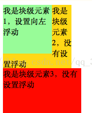此种情况出现是因为元素1设置浮动后脱离了标准流，于是这个标签在另外一个层面上进行排列。而第二个<div>还在自己的层面上遵从标准流进行排列。所以元素2变为标准文档流的第一个盒子了

  * 性质2：浮动的元素互相贴靠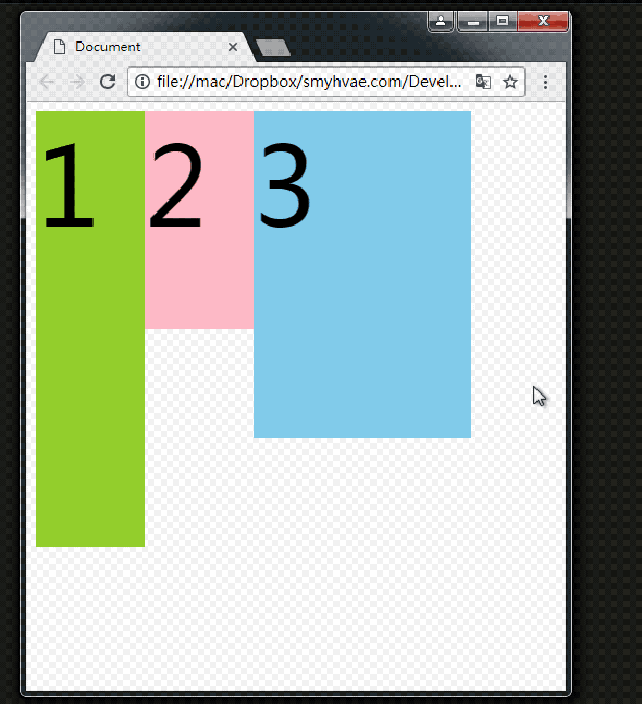我们给三个div均设置了float: left;属性之后，然后设置宽高。当改变浏览器窗口大小时，可以看到div的贴靠效果：3号如果有足够空间，那么就会靠着2号。如果没有足够的空间，那么会靠着1号大哥。 如果没有足够的空间靠着1号大哥，3号自己去贴左墙。

  * 性质3：浮动的元素有“字围”效果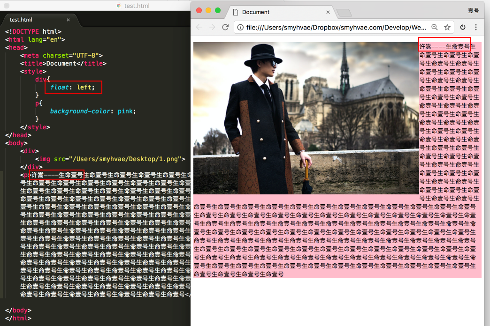上图中，我们发现：div挡住了p，但不会挡住p中的文字，形成“字围”效果。不管左右还是右左都一样，如下两图所示：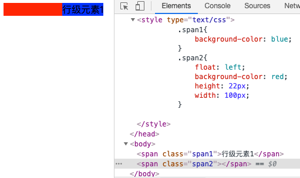 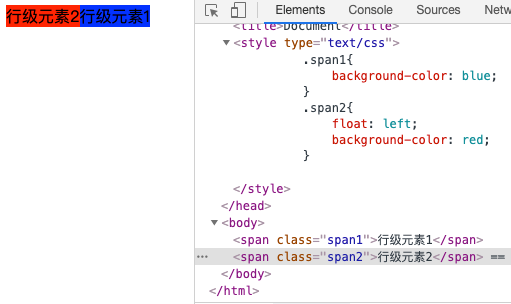

    总结：标准流中的文字不会被浮动的盒子遮挡住。（文字就像水一样)

  * 性质4：收缩，一个浮动的元素，如果没有设置width，那么将自动收缩为内容的宽度（这点非常像行内元素）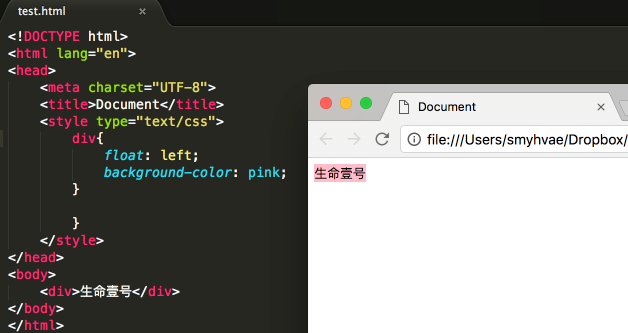上图中，div本身是块级元素，如果不设置width，它会单独霸占整行；但是，设置div浮动后，它会收缩。

  * 浮动的补充（做网站时注意)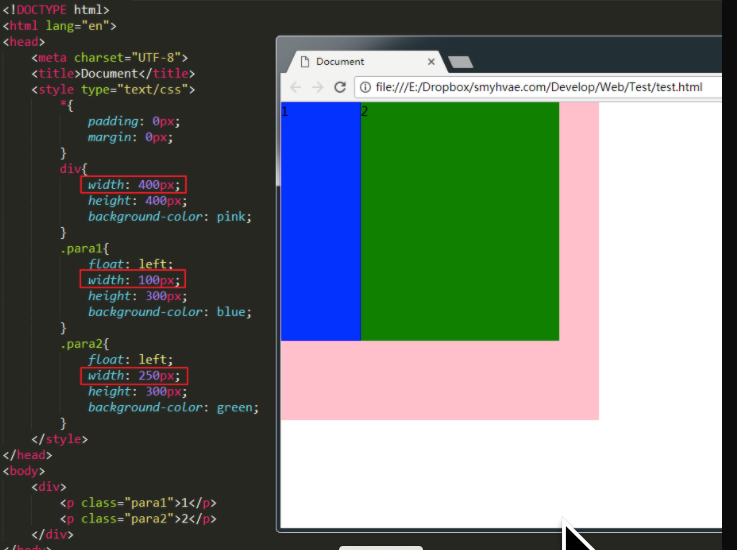上图所示，将para1和para2设置为浮动，它们是div的儿子。此时para1+para2的宽度小于div的宽度。效果如上图所示。可如果设置para1+para2的宽度大于div的宽度，我们会发现，para2掉下来了：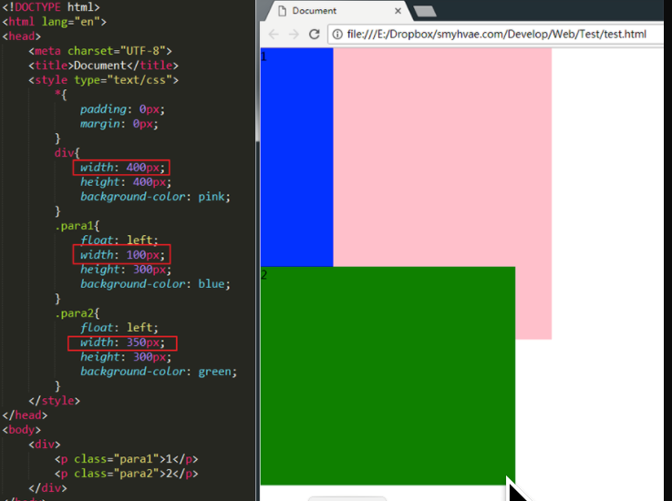一个父亲是不能被浮动的儿子撑出高度的。故可发现浮动是基于父元素的，而且会溢出父元素，这就牵扯到了浮动清除。

    * 在非IE浏览器（如Firefox）下，当容器的高度为auto，且容器的内容中有浮动（float为left或right）的元素，在这种情况下，容器的高度不能自动伸长以适应内容的高度，使得内容溢出到容器外面而影响（甚至破坏）布局的现象。这个现象叫浮动溢出，为了防止这个现象的出现而进行的CSS处理，就叫CSS清除浮动。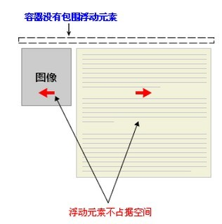

      * 使用带clear属性的空元素

        clear就是清除，both指的是左浮动、右浮动都要清除。clear:both的意思就是：不允许左侧和右侧有浮动对象。所以可以什么都不做，给浮动元素后面的元素添加clear属性，等同于直接另起一行并延续到下一行。

        这种方法有一个非常大的、致命的问题，它所在的标签，margin属性失效了。所以可在浮动元素后使用一个空元素如<div class="clear"></div>，并在CSS中赋予.clear{clear:both;}属性即可清理浮动。亦可使用<br class="clear" />或<hr class="clear" />来进行清理。

        近些年，有演化出了“内墙法”，即一个父亲是不能被浮动的儿子撑出高度的，所以我们可以反其道行之，如下图所示：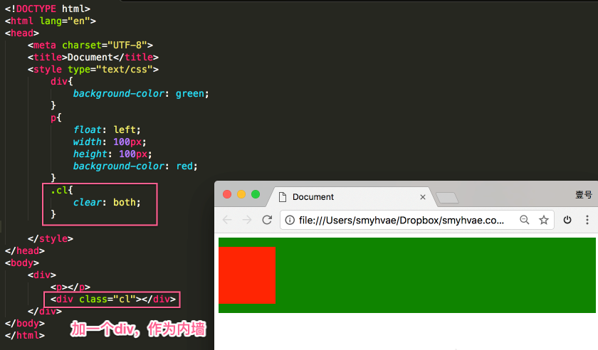内墙法的优势（本质区别)在于：内墙法可以给它所在的家撑出高度。即：父元素的高度可以自适应内容。

      * 使用CSS的overflow属性

        给浮动元素的容器添加overflow:hidden;或overflow:auto;可以清除浮动，另外在 IE6 中还需要触发 hasLayout。所以这么写：overflow: hidden;_zoom:1;

        在添加overflow属性后，浮动元素又回到了容器层，把容器高度撑起，达到了清理浮动的效果。

      * 给浮动的元素的容器添加浮动

        给浮动元素的容器也添加上浮动属性即可清除内部浮动，但是这样会使其整体浮动，影响布局，不推荐使用。

      * 使用CSS的:after伪元素

        结合:after 伪元素（注意这不是伪类，而是伪元素，代表一个元素之后最近的元素）和 IEhack ，可以完美兼容当前主流的各大浏览器，这里的 IEhack 指的是触发 hasLayout。

        给浮动元素的容器添加一个clearfix的class，然后给这个class添加一个:after伪元素实现元素末尾添加一个看不见的块元素（Block element）清理浮动。

* position属性

  * 固定定位fixed：

    元素的位置相对于浏览器窗口是固定位置，即使窗口是滚动的它也不会移动。Fixed定位使元素的位置与文档流无关，因此不占据空间。 Fixed定位的元素和其他元素重叠。

  * 相对定位relative：

    如果对一个元素进行相对定位，它将出现在它所在的位置上。然后，可以通过设置垂直或水平位置，让这个元素“相对于”它的起点进行移动。 在使用相对定位时，无论是否进行移动，元素仍然占据原来的空间。因此，移动元素会导致它覆盖其它框。

    相对定位的用途

    如果想做“压盖”效果（把一个div放到另一个div之上），我们一般不用相对定位来做。相对定位，就两个作用：微调元素；做绝对定位的参考，子绝父相

    相对定位的定位值：left：盒子右移；right：盒子左移；top：盒子下移；bottom：盒子上移；PS：负数表示相反的方向。

  * 绝对定位absolute：

    绝对定位的元素的位置相对于最近的已定位父元素，如果元素没有已定位的父元素，那么它的位置相对于<html>。 absolute 定位使元素的位置与文档流无关，因此不占据空间。absolute 定位的元素和其他元素重叠，绝对定位的盒子脱离了标准文档流。所以，所有的标准文档流的性质，绝对定位之后都不遵守了。绝对定位之后，标签就不区分所谓的行内元素、块级元素了，不需要display:block就可以设置宽、高了。

    绝对定位的参考点（重要）

    * 如果用top描述，那么参考点就是页面的左上角，而不是浏览器的左上角：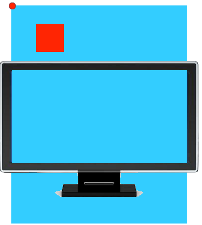
    * 如果用bottom描述，那么参考点就是浏览器首屏窗口尺寸（好好理解“首屏”二字），对应的页面的左下角：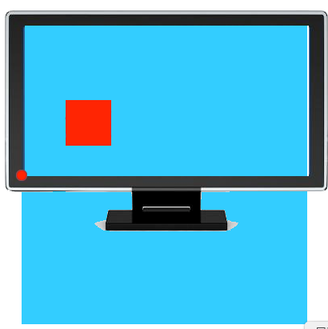
    * 下图中，绿色部分是父亲div的padding，蓝色部分p是div的内容区域。此时，如果div相对定位，p绝对定位，那么， p将无视父亲的padding，在border内侧为参考点，进行定位：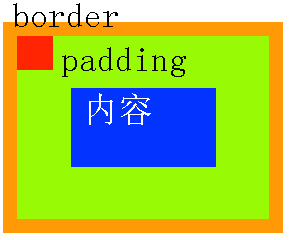

  * 粘性定位sticky：

    元素先按照普通文档流定位，然后相对于该元素在流中的flow root（BFC）和 containing block（最近的块级祖先元素）定位。而后，元素定位表现为在跨越特定阈值前为相对定位，之后为固定定位。

  * 默认定位Static：

    默认值。没有定位，元素出现在正常的流中（忽略top, bottom, left, right 或者 z-index 声明）。inherit:规定应该从父元素继承position 属性的值。

    z-index属性：表示谁压着谁。数值大的压盖住数值小的。有如下特性：

    * 属性值大的位于上层，属性值小的位于下层。
    * z-index值没有单位，就是一个正整数。默认的z-index值是0。
    * 如果大家都没有z-index值，或者z-index值一样，那么在HTML代码里写在后面，谁就在上面能压住别人。定位了的元素，永远能够压住没有定位的元素。
    * 只有定位了的元素，才能有z-index值。也就是说，不管相对定位、绝对定位、固定定位，都可以使用z-index值。而浮动的元素不能用。
    * 从父现象：父亲怂了，儿子再牛逼也没用。意思是，如果父亲1比父亲2大，那么，即使儿子1比儿子2小，儿子1也能在最上层。

* BFC（块级格式化上下文）：一个独立的渲染区域，并且有一定的布局规则。A block formatting context is a part of a visual CSS rendering of a Web page. It is the region in which the layout of block boxes occurs and in which floats interact with each other.翻译过来就是块格式化上下文是CSS可视化渲染的一部分，它是一块区域，规定了内部块盒 的渲染方式，以及浮动相互之间的影响关系

  BFC特性：

  * 内部的块级盒子会在垂直方向，一个接一个的放置。
  * 两个盒子垂直方向的间距由margin决定，属于同一个BFC的两个相邻盒子的外边距会发生折叠。
  * BFC就是页面上的一个隔离的独立容器，容器里面的子元素不会影响到外面的元素，外面的元素也不会影响到子元素。
  * 计算BFC的高度，浮动元素也参与计算。

  那些元素会生成BFC：

  * 根元素
  * float不为none的元素
  * position为fixed和absolute的元素
  * display为inline-block、table-cell、table-caption，flex，inline-flex的元素
  * overflow不为visible的元素

  BFC应用

  * 清除浮动，但是可能会有副作用，推荐还是使用伪元素clearfix的方式。
    解决方案：为父元素加上overflow: hidden；使其形成BFC，根据BFC特性第5条，计算高度时就会计算float的元素的高度，达到清除浮动影响的效果。
  * 阻止元素被浮动元素覆盖，可以实现两栏自适应布局。
    解决方法：为元素设置overflow: hidden/auto触发元素的BFC，根据BFC特性，BFC的区域是独立的，不会与页面其他元素相互影响，且不会与float元素重叠，因此就可以形成两栏自适应布局。
  * 防止垂直margin合并。
    解决方案：为其中一个元素包裹一层元素，并未这个外层元素设置overflow: hidden;使其形成BFC。因为BFC内部是一个独立的容器，所以不会与外部相互影响，可以防止margin合并。

* 关于文字样式的属性，都具有继承性，这些属性包括：color、 text-开头的、line-开头的、font-开头的；关于盒子、定位、布局的属性，都不能继承。如果想要改变一个DOM元素的字体颜色，不在它本身上进行操作？可以更改父元素的color。

* 垂直居中的方法

  * margin:auto法，定位为上下左右为0，margin：0可以实现脱离文档流的居中。

    ```css
    div{
    width: 400px;
    height: 400px;
    position: relative;
    border: 1px solid #465468;
    }
    img{
    position: absolute;
    margin: auto;
    top: 0;
    left: 0;
    right: 0;
    bottom: 0;
    }
    ```

    ```html
    <div>
    
    </div>
    ```

  * 绝对定位margin负值法

    ```css
    .container{
    width: 500px;
    height: 400px;
    border: 2px solid #379;
    position: relative;
    }
    .inner{
    width: 480px;
    height: 380px;
    background-color: #746;
    position: absolute;
    top: 50%;
    left: 50%;
    margin-top: -190px; /*height的一半*/
    margin-left: -240px; /*width的一半*/
    }
    补充：其实这里也可以将marin-top和margin-left负值替换成，transform：translateX(-50%)和transform：translateY(-50%)
    补充：绝对定位 + translate，因为 translate() 函数中使用百分比值时，是以这个元素自身的宽度和高度为基准进行换算和移动的（动态计算宽高）。
    ```

  * table-cell（未脱离文档流的）：设置父元素的display:table-cell,并且vertical-align:middle，这样子元素可以实现垂直居中

    ```css
    div{
    width: 300px;
    height: 300px;
    border: 3px solid #555;
    display: table-cell;
    vertical-align: middle;
    text-align: center;
    }
    img{
    vertical-align: middle;
    }
    ```

  * 利用flex：将父元素设置为display:flex，并且设置align-items:center;justify-content:center;

    ```css
    .container{
    width: 300px;
    height: 200px;
    border: 3px solid #546461;
    display: -webkit-flex;
    display: flex;
    -webkit-align-items: center;
    align-items: center;
    -webkit-justify-content: center;
    justify-content: center;
    }
    .inner{
    border: 3px solid #458761;
    padding: 20px;
    } 
    补充：flex 布局 + margin: auto（推荐）
    先给父容器设置 display: flex，再给指定的子元素设置我们再熟悉不过的 margin: auto，即可让这个指定的子元素在剩余空间里，水平垂直居中。
    ```

* 选择器分类

  * id选择器（#myid）
  * 类选择器（.myclassname）
  * 标签选择器（div,h1,p）
  * 后代选择器（h1 p）
  * 相邻后代选择器（⼦）选择器（ul>li）
  * 兄弟选择器（li~a）
  * 相邻兄弟选择器（li+a）
  * 属性选择器（a[rel="external"]）
  * 伪类选择器（a:hover,li:nth-child）
  * 伪元素选择器（::before、::after）
  * 通配符选择器（*）

* 选择器权重

  权重记忆⼝诀：从0开始，⼀个⾏内样式+1000，⼀个id选择器+100，⼀个属性选择器、class或者伪类+10，⼀个元素选择器，或者伪元素+1，通配符+0

  常⽤选择器权重优先级：!important > id > class > tag，如果两条样式都使⽤!important，则权重值⾼的优先级更⾼，在css样式表中，同⼀个CSS样式你写了两次，后⾯的会覆盖前⾯的

* link标签和import标签的区别：link属于html标签，而@import是css提供的。页面被加载时，link会同时被加载，而@import引用的css会等到页面加载结束后加载。link是html标签，因此没有兼容性，而@import只有IE5以上才能识别。link方式样式的权重高于@import的。

* 多个相邻（兄弟或者父子关系）普通流的块元素垂直方向marigin会重叠，折叠的结果为：

  * 两个相邻的外边距都是正数时，折叠结果是它们两者之间较大的值。
  * 两个相邻的外边距都是负数时，折叠结果是两者绝对值的较大值。
  * 两个外边距一正一负时，折叠结果是两者的相加的和。

  如果不在标准流，比如盒子都浮动了，那么两个盒子之间是没有塌陷现象的。

  margin这个属性，本质上描述的是兄弟和兄弟之间的距离； 最好不要用这个marign表达父子之间的距离。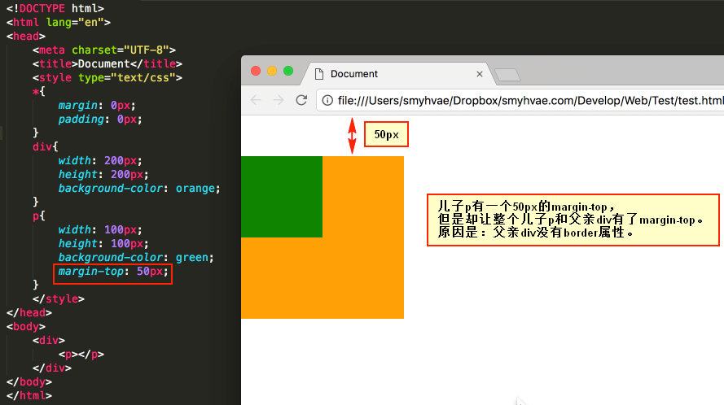 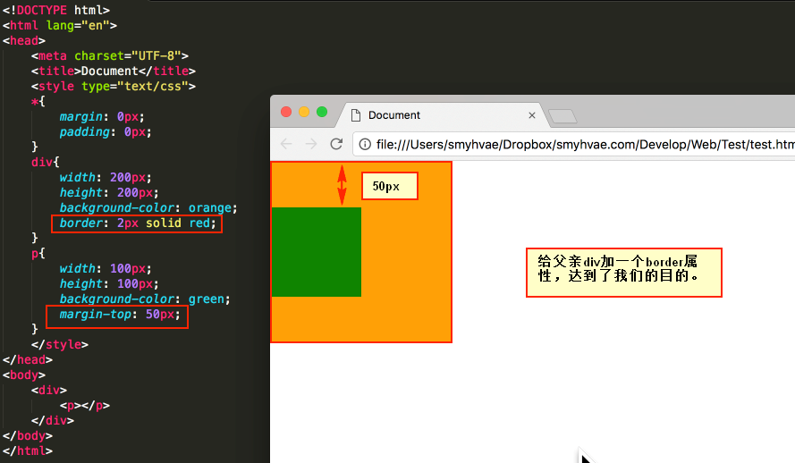例子如上两图的奇怪现象所示，原因是如果父亲没有border，那么儿子的margin实际上踹的是“流”，踹的是这“行”。所以，父亲整体也掉下来了。

* CSS画正方体

  ```html
  <!DOCTYPE html>
  <html lang="en">
  <head>
  <meta charset="UTF-8">
  <title>perspective</title>
  <style>
  .wrapper{
  width: 50%;
  float: left;
  }
  .cube{
  font-size: 4em;
  width: 2em;
  margin: 1.5em auto;
  transform-style:preserve-3d;
  transform:rotateX(-35deg) rotateY(30deg);
  }
  .side{
  position: absolute;
  width: 2em;
  height: 2em;
  background: rgba(255,99,71,0.6);
  border: 1px solid rgba(0,0,0,0.5);
  color: white;
  text-align: center;
  line-height: 2em;
  }
  .front{
  transform:translateZ(1em);
  }
  .bottom{
  transform:rotateX(-90deg) translateZ(1em);
  }
  .top{
  transform:rotateX(90deg) translateZ(1em);
  }
  .left{
  transform:rotateY(-90deg) translateZ(1em);
  }
  .right{
  transform:rotateY(90deg) translateZ(1em);
  }
  .back{
  transform:translateZ(-1em);
  }
  </style>
  </head>
  <body>
  <div class="wrapper w1">
  <div class="cube">
  <div class="side front">1</div>
  <div class="side back">6</div>
  <div class="side right">4</div>
  <div class="side left">3</div>
  <div class="side top">5</div>
  <div class="side bottom">2</div>
  </div>
  </div>
  <div class="wrapper w2">
  <div class="cube">
  <div class="side front">1</div>
  <div class="side back">6</div>
  <div class="side right">4</div>
  <div class="side left">3</div>
  <div class="side top">5</div>
  <div class="side bottom">2</div>
  </div>
  </div>
  </body>
  </html>
  ```

* CSS画三角形

  ```css
  #triangle02{
  width: 0;
  height: 0;
  border-top: 50px solid blue;
  border-right: 50px solid red;
  border-bottom: 50px solid green;
  border-left: 50px solid yellow;
  }
  ```

* 画一条0.5px的线

  * 采用meta viewport的方式

    ```html
    <meta name="viewport" content="initial-scale=1.0, maximum-scale=1.0, user-scalable=no" />
    ```

  * 采用border-image的方式

  * 采用transform: scale()的方式

* Viewport：移动设备上的viewport分为layout viewport 、 visual viewport 和 ideal viewport 三类，其中的 ideal viewport 是最适合移动设备的viewport，ideal viewport的宽度等于移动设备的屏幕宽度，只要在css中把某一元素的宽度设为ideal viewport的宽度(单位用px)，那么这个元素的宽度就是设备屏幕的宽度了，也就是宽度为100%的效果。ideal viewport 的意义在于，无论在何种分辨率的屏幕下，那些针对ideal viewport 而设计的网站，不需要用户手动缩放，也不需要出现横向滚动条，都可以完美的呈现给用户。

* 利用meta标签对viewport进行控制

  我们在开发移动设备的网站时，最常见的的一个动作就是把下面这个东西复制到我们的head标签中。

  ```html
  <meta name="viewport" content="width=device-width, initial-scale=1.0, maximum-scale=1.0, user-scalable=0">
  ```

  该meta标签的作用是让当前viewport的宽度等于设备的宽度，同时不允许用户手动缩放。也许允不允许用户缩放不同的网站有不同的要求，但让viewport的宽度等于设备的宽度，这个应该是大家都想要的效果，如果你不这样的设定的话，那就会使用那个比屏幕宽的默认viewport，也就是说会出现横向滚动条。

  在苹果（安卓差不多）的规范中，meta viewport 有6个属性(暂且把content中的那些东西称为一个个属性和值)，如下：

  * width：设置layout viewport  的宽度，为一个正整数，或字符串"width-device"
  * initial-scale：设置页面的初始缩放值，为一个数字，可以带小数
  * minimum-scale：允许用户的最小缩放值，为一个数字，可以带小数
  * maximum-scale：允许用户的最大缩放值，为一个数字，可以带小数
  * height：设置layout viewport  的高度，这个属性对我们并不重要，很少使用
  * user-scalable：是否允许用户进行缩放，值为"no"或"yes", no 代表不允许，yes代表允许
    这些属性可以同时使用，也可以单独使用或混合使用，多个属性同时使用时用逗号隔开就行了。

* CSS3中用text-overflow，overflow-x和overflow-y来处理溢出。其中text-overflow文本溢出属性，值为clip是修剪文本；ellipsis为显示省略符号来表被修剪的文本；string为使用给定的字符串来代表被修剪的文本。CSS使用overflow属性处理溢出

  使文字数量不同在相同的地方显示，给盒子加固定高度

  ```css
  overflow：hidden;
  display：-webkit-box; 将盒子转换为弹性盒子
  -webkit-line-clamp：2; 设置显示多少行
  text-overflow：ellipsis; 文本以省略号显示   
  -webkit-box-orient：vertical; 文本显示方式，默认水平
  ```

  让文字只显示一行，超出显示省略号

  ```css
  	overflow: hidden;
  	white-space: nowrap;
  	text-overflow: ellipsis;
  ```

  让文字最多只显示两行，超出后显示省略号

  ```css
  	overflow:hidden;
  	text-overflow:ellipsis;
  	display:-webkit-box;
  	-webkit-box-orient:vertical;
  	-webkit-line-clamp:2;
  ```

  文字换行属性：flex-wrap,word-break,white-space

* line-height一般是指布局里面一段文字上下行之间的高度，是针对字体来设置的，height一般是指容器的整体高度，

  前置条件：如果我们给父亲div的行高设为31px，然后给儿子a的行高也设置为31

  结果：当我们给儿子a设置了字体属性之后，会发现，父亲被撑高为32px了。因为font字体自身会比较大，多撑出了一个像素。

  解决办法：行内元素尽量不要设置font属性。对于行内元素而言，如果它和父亲都设置了行高，就不要去给自己设置font属性了。要么就，不要同时设置行高

* 隐藏盒子的几种方式

  * overflow：hidden;   //隐藏盒子超出的部分
  * display: none;	  隐藏盒子，而且不占位置(用的最多)。比如，点击X，关闭京东首页上方的广告栏。
  * visibility: hidden;   //隐藏盒子，占位置。visibility: visible;   //让盒子重新显示
  * opacity: 0;       //设置盒子的透明度（不建议，因为内容也会半透明），占位置
  * Position/top/left/...-999px   //把盒子移得远远的，占位置。
  * margin-left: 1000px;

  visibility=hidden, opacity=0，display:none

  opacity=0，该元素隐藏起来了，但不会改变页面布局，并且，如果该元素已经绑定一些事件，如click事件，那么点击该区域，也能触发点击事件的；visibility=hidden，该元素隐藏起来了，但不会改变页面布局，但是不会触发该元素已经绑定的事件；display=none，把元素隐藏起来，并且会改变页面布局，可以理解成在页面中把该元素删除掉一样。

* Animation和transition大部分属性是相同的，他们都是随时间改变元素的属性值，他们的主要区别是transition需要触发一个事件才能改变属性，而animation不需要触发任何事件的情况下才会随时间改变属性值，并且transition为2帧，从from .... to，而animation可以一帧一帧的。

* html 元素的默认样式，比如下拉框这种比较复杂的元素，是自带默认样式的。如果没有这个默认样式，则该元素在页面上不会有任何表现，则必然增加一些工作量。同时，默认样式也会带来一些问题：比如，有些默认样式我们是不需要的；有些默认样式甚至无法去掉。如果我们不需要默认的样式，这里就需要引入一个概念：CSS Reset。

  常见的 CSS Reset 方案

  * CSS Tools: Reset CSS。链接：https://meyerweb.com/eric/tools/css/reset/

  * 雅虎的 CSS Reset。链接：https://yuilibrary.com/yui/docs/cssreset/，我们可以直接通过 CDN 的方式引入

    ```html
    <link rel="stylesheet" type="text/css" href="http://yui.yahooapis.com/3.18.1/build/cssreset/cssreset-min.css">
    ```

  * 方式三：（比较有争议）

    ```css
    *{
        margin: 0;
        padding: 0;
    }
    ```

    上面何种写法，比较简洁，但也有争议。有争议的地方在于，可能会导致 css 选择器的性能问题。

  * Normalize.css

    上面的几种 css reset 的解决思路是：将所有的默认样式清零。但是，Normalize.css 的思路是：既然浏览器提供了这些默认样式，那它就是有意义的。既然不同浏览器的默认样式不一致，那么，Normalize.css就将这些默认样式设置为一致。

* 用户动态计算长度值，任何长度值都可以使用calc()函数计算，需要注意的是，运算符前后都需要保留一个空格，例如：width: calc(100% - 10px)；

* css六种布局方式总结：圣杯布局、双飞翼布局、Flex布局、绝对定位布局、表格布局、网格布局。
  * 圣杯布局是指布局从上到下分为header、container、footer，然后container部分定为三栏布局。这种布局方式同样分为header、container、footer。圣杯布局的缺陷在于 center 是在 container 的padding中的，因此宽度小的时候会出现混乱。
  * 双飞翼布局给center 部分包裹了一个 main 通过设置margin主动地把页面撑开。
  * Flex布局是由CSS3提供的一种方便的布局方式。
  * 绝对定位布局是给container 设置position: relative和overflow: hidden，因为绝对定位的元素的参照物为第一个postion不为static的祖先元素。 left 向左浮动，right 向右浮动。center 使用绝对定位，通过设置left和right并把两边撑开。 center 设置top: 0和bottom: 0使其高度撑开。
  * 表格布局的好处是能使三栏的高度统一。
  * 网格布局可能是最强大的布局方式了，使用起来极其方便，但目前而言，兼容性并不好。网格布局，可以将页面分割成多个区域，或者用来定义内部元素的大小，位置，图层关系。

* 双栏布局

  * float + margin：假设左边栏固定，右边栏自适应

    ```html
    <body>
        <div class="box">
            <div class="left">左边</div>
            <div class="right">右边</div>
        </div>
        内容内容内容
    </body>
    ```

    ```css
    .left {
        float: left;
        width: 200px;
        background-color: gray;
        height: 400px;
    }
    .right {
        margin-left: 210px;
        background-color: lightgray;
        height: 200px;
    }
    .box {
    	overflow: hidden;
    }
    ```

* 三栏布局

  * position + margin

    ```html
    <div class="box">
        <div class="left">左边</div>
        <div class="middle">中间</div>
        <div class="right">右边</div>
    </div>
    ```

    ```css
    .box {
        position: relative;
    }
    .left {
        position: absolute;
        top: 0;
        left: 0;
        width: 200px;
        height: 200px;
        background-color: gray;
    }
    .right {
        position: absolute;
        top: 0;
        right: 0;
        width: 200px;
        height: 200px;
        background-color: gray;
    }
    .middle {
        margin-left: 210px;
        margin-right: 210px;
        background-color: lightgray;
        height: 200px;
    }
    ```

  * 浮动：有一个很明显的缺点，就是我们的代码层面上来讲 html 内容结构不正确，我们必须把.middle 元素放在最下面而不是中间位置，这是 float 所产生的的布局影响所导致的。

    ```html
    <div class="box">
        <div class="left">左边</div>
        <div class="right">右边</div>
        <div class="middle">中间</div>
    </div>
    ```

    ```css
    .box {
        overflow: hidden;
    }
    .left {
        float: left;
        background-color: gray;
        width: 200px;
        height: 200px;
    }
    .right {
        float: right;
        background-color: gray;
        width: 200px;
        height: 200px;
    }
    .middle {
        height: 200px;
        background-color: lightgray;
        margin-left: 210px;
        margin-right: 210px;
    }
    ```

  * 圣杯布局：采用父元素设置边距的方法，左右元素设置相对定位辅助。

    ```html
    <div class="box">
        <div class="middle">中间</div>
        <div class="left">左边</div>
        <div class="right">右边</div>
    </div>
    ```

    ```css
    .box {
        overflow: hidden;
        padding: 0 210px;
    }
    .middle {
        float: left;
        width: 100%;
        height: 200px;
        background-color: lightgray;
    }
    .left {
        float: left;
        width: 200px;
        height: 200px;
        background-color: gray;
        margin-left: -100%;
        position: relative;
        left: -210px;
    }
    .right {
        float: left;
        width: 200px;
        height: 200px;
        background-color: gray;
        margin-left: -200px;
        position: relative;
        right: -210px;
    }
    ```

  * 双飞翼布局：在中间采用嵌套子元素方法，通过设置子元素外边距来展示。

    ```html
    <div class="box">
        <div class="middle">
            <div class="content">中间</div>
        </div>
        <div class="left">左边</div>
        <div class="right">右边</div>
    </div>
    ```

    ```css
    .box {
        overflow: hidden;
    }
    .middle {
        float: left;
        width: 100%;
    }
    .middle .content {
        margin: 0 210px;
        height: 200px;
        background-color: lightgray;
    }
    .left {
        float: left;
        width: 200px;
        height: 200px;
        background-color: gray;
        margin-left: -100%;
    }
    .right {
        float: left;
        width: 200px;
        height: 200px;
        background-color: gray;
        margin-left: -200px;
    }
    ```

  * flex布局

    ```html
    <div class="wrap">
        <div class="left">左侧</div>
        <div class="middle">中间</div>
        <div class="right">右侧</div>
    </div>
    
    <style type="text/css">
        .wrap {display: flex; justify-content: space-between;}
        .left, .right, .middle {height: 100px;}
        .left {width: 200px; background: coral;}
        .right {width: 120px; background: lightblue;}
        .middle {background: #555; width: 100%; margin: 0 20px;}
    </style>
    ```

  * Table 布局：无法设置栏间距

    ```html
    <!DOCTYPE html>
    <html lang="en">
    <head>
        <style>
            .container {
    	    display: table;
    	    width: 100%;
            }
            .left, .main, .right {
    	    display: table-cell;
            }
            .left {
    	    width: 200px;
    	    height: 300px;
    	    background-color: red;
            }
            .main {
    	    background-color: blue;
            }
            .right {
    	    width: 100px;
    	    height: 300px;
    	    background-color: green;
            }
        </style>
    </head>
    <body>
        <div class="container">
    	<div class="left"></div>
    	<div class="main"></div>
    	<div class="right"></div>
        </div>
    </body>
    </html>
    ```

* 移动端布局

  如果只做pc端，那么静态布局（定宽度）是最好的选择；

  如果做移动端，且设计对高度和元素间距要求不高，那么弹性布局（rem+js）是最好的选择，一份css+一份js调节font-size搞定；

  如果pc，移动要兼容，而且要求很高那么响应式布局还是最好的选择，前提是设计根据不同的高宽做不同的设计，响应式根据媒体查询做不同的布局。
  * 静态布局：px布局。不管浏览器尺寸具体是多少，网页布局始终按照最初写代码时的布局来显示。

    设计方法：PC：居中布局，所有样式使用绝对宽度/高度(px)，设计一个Layout，在屏幕宽高有调整时，使用横向和竖向的滚动条来查阅被遮掩部分；移动设备：另外建立移动网站，单独设计一个布局，使用不同的域名如wap.或m.。

  * 流式布局（Liquid Layout）：主要的划分区域的尺寸使用百分数（搭配min-、max-属性使用）。屏幕分辨率变化时，页面里元素的大小会变化而但布局不变。

    设计方法：使用%百分比定义宽度，高度大都是用px来固定住，可以根据可视区域 (viewport) 和父元素的实时尺寸进行调整，尽可能的适应各种分辨率。往往配合 max-width/min-width 等属性控制尺寸流动范围以免过大或者过小影响阅读。

    子元素的height或width中使用百分比，是相对于子元素的直接父元素，width相对于父元素的width，height相对于父元素的height。

    子元素的top和bottom如果设置百分比，则相对于直接非static定位(默认定位)的父元素的高度，同样，子元素的left和right如果设置百分比，则相对于直接非static定位(默认定位的)父元素的宽度。

    子元素的padding如果设置百分比，不论是垂直方向或者是水平方向，都相对于直接父亲元素的width，而与父元素的height无关。跟padding一样，margin也是如此，子元素的margin如果设置成百分比，不论是垂直方向还是水平方向，都相对于直接父元素的width。

    border-radius不一样，如果设置border-radius为百分比，则是相对于自身的宽度，除了border-radius外，还有比如translate、background-size等都是相对于自身的。

  * 自适应布局（Adaptive Layout） ：即创建多个静态布局，每个静态布局对应一个屏幕分辨率范围。屏幕分辨率变化时，页面里面元素的位置会变化而大小不会变化。

    设计方法：使用 @media 媒体查询给不同尺寸和介质的设备切换不同的样式。在优秀的响应范围设计下可以给适配范围内的设备最好的体验，在同一个设备下实际还是固定的布局。

    ```css
    @media screen and (max-width: 550px){//320-550px
        body{
          background-color:#6633FF;
        }
    }
    @media screen and (max-width: 320px){//0-320px
        body{
          background-color:#FFFF00;
        }
    }
    ```

  * 响应式布局（Responsive Layout） ：检测窗口大小利用bootstrap布局。每个屏幕分辨率下面会有一个布局样式，即元素位置和大小都会变。

    设计方法：媒体查询+流式布局。通常使用 @media 媒体查询 和网格系统 (Grid System) 配合相对布局单位进行布局，实际上就是综合响应式、流动等上述技术通过 CSS 给单一网页不同设备返回不同样式的技术统称。

    优点：适应pc和移动端，如果足够耐心，效果完美

    缺点：媒体查询是有限的，也就是可以枚举出来的，只能适应主流的宽高；要匹配足够多的屏幕大小，工作量不小，设计也需要多个版本。

    css3中引入了一个新的单位vw/vh，与视图窗口有关，vw表示相对于视图窗口的宽度，vh表示相对于视图窗口高度，除了vw和vh外，还有vmin和vmax两个相关的单位。各个单位具体的含义如下：

    | 单位 | 含义                              |
    | ---- | --------------------------------- |
    | vw   | 相对于视窗的宽度，视窗宽度是100vw |
    | vh   | 相对于视窗的高度，视窗高度是100vh |
    | vmin | vw和vh中的较小值                  |
    | vmax | vw和vh中的较大值                  |

    同样的，如果要将px换算成vw单位，很简单，只要确定视图的窗口大小（布局视口），如果我们将布局视口设置成分辨率大小，比如对于iphone6/7 375 * 667的分辨率，那么px可以通过如下方式换算成vw：1px = （1/375）* 100 vw

    此外，也可以通过postcss的相应插件，预处理css做一个自动的转换，postcss-px-to-viewport可以自动将px转化成vw。

  * 弹性布局（rem/em布局或Flex布局） 

    css3 rem：如果通过rem来实现响应式的布局，只需要根据视图容器的大小，动态的改变相应属性即可。在响应式布局中，必须通过js来动态控制根元素相应属性的大小。也就是说css样式和js代码有一定的耦合性。且必须将改变相应属性的代码放在css样式之前。

    rem,em区别：rem,em都是顺应不同网页字体大小展现而产生的。其中，em是相对其父元素，在实际应用中相对而言会带来很多不便；而rem是始终相对于html大小，即页面根元素。

    px2rem，表示的是从px转化为rem。原理也很简单，重点在于预处理以px为单位的css文件，处理后将所有的px变成rem单位（一般不手动处理了，webpack自动转）。可以通过两种方式来实现：webpack loader的形式和webpack中使用postcss plugin

* CSS3新特性：CSS3边框如border-radius、box-shadow等；CSS3背景如background-size、background-origin等；CSS3 2D，3D转换如transform等；CSS3动画如animation等。

* DOM的变化影响到了预算内存的几何属性比如宽高，浏览器重新计算元素的几何属性，其他元素的几何属性也会受到影响，浏览器需要重新构造渲染树，这个过程称之为重排；浏览器将受到影响的部分重新绘制在屏幕上 的过程称为重绘；引起重排重绘的原因有：

  * 添加或者删除可见的DOM元素，
  * 元素尺寸位置的改变
  * 浏览器页面初始化，
  * 浏览器窗口大小发生改变，重排一定导致重绘，重绘不一定导致重排，

  减少重绘重排的方法有：

  * 不在布局信息改变时做DOM查询，
  * 使用csstext,className一次性改变属性
  * 使用fragment
  * 对于多次重排的元素，比如说动画。使用绝对定位脱离文档流，使其不影响其他元素

* click在ios上有300ms延迟，原因及如何解决？

  原因：移动端的双击会缩放导致click判断延迟，这是为了检查用户是否在做双击，为了能够立即响应用户的点击事件，才有了FastClick。解决办法：

  * 粗暴型，禁用缩放

    ```html
    <meta name="viewport" content="width=device-width, user-scalable=no">
    ```

  * 利用FastClick，其原理是：检测到touchend事件后，立刻出发模拟click事件，并且把浏览器300毫秒之后真正出发的事件给阻断掉

* Sass(Scss)

  定义变量：$变量名：值；值为k-v形式的写为：$font(s:10px,m:12px,l:14px)，获取键：map-get($font,s)

  可嵌套，但是如果是类似div:hover这种，则需要在嵌套的里面写为&:hover

  复用代码：定义用@mixin n{样式表}，使用时用@include n(n为变量名)

* 前端优化
  * 降低请求量：合并资源，减少HTTP 请求数，minify / gzip 压缩，webP，lazyLoad。
  * 加快请求速度：预解析DNS，减少域名数，并行加载，CDN 分发。
  * 缓存：HTTP 协议缓存请求，离线缓存 manifest，离线数据缓存localStorage。
  * 渲染：JS/CSS优化，加载顺序，服务端渲染，pipeline。

