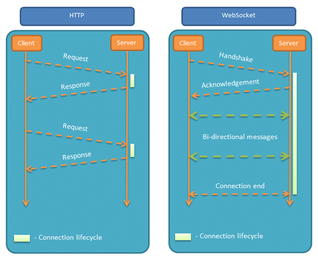

* http: 超文本传输协议，是互联网上应用最为广泛的一种网络协议，是一个客户端和服务器端请求和应答的标准（TCP），用于从WWW服务器传输超文本到本地浏览器的传输协议，它可以使浏览器更加高效，使网络传输减少。

  * 当我们打开浏览器，在地址栏中输入URL，然后我们就看到了网页。 原理是怎样的呢？

    * 实际上我们输入URL后，首先需要找到这个url域名的服务器ip,为了寻找这个ip，浏览器首先会寻找缓存，查看缓存中是否有记录，缓存的查找记录为：浏览器缓存-》系统缓存-》路由器缓存，缓存中没有则查找系统的hosts文件中是否有记录，如果没有则查询DNS服务器，得到服务器的ip地址后，浏览器根据这个ip以及相应的端口号，构造一个http请求。

      这个请求报文会包括这次请求的信息，主要是请求方法，请求说明和请求附带的数据，并将这个http请求封装在一个tcp包中，这个tcp包会依次经过传输层，网络层，数据链路层，物理层到达服务器，即我们的浏览器给Web服务器发送了一个Request, Web服务器接到Request后进行处理。

      服务器解析这个请求来作出响应，返回相应的html，生成相应的Response，然后发送给浏览器。因为html是一个树形结构，浏览器根据这个html来构建DOM树，在dom树的构建过程中如果遇到JS脚本和外部JS连接，则会停止构建DOM树来执行和下载相应的代码，这会造成阻塞，这就是为什么推荐JS代码应该放在html代码的后面，之后根据外部样式，内部样式，内联样式构建一个CSS对象模型树CSSOM树，构建完成后和DOM树合并为渲染树，这里主要做的是排除非视觉节点，比如script，meta标签和排除display为none的节点，之后进行布局，布局主要是确定各个元素的位置和尺寸，之后是渲染页面。

      因为html文件中会含有图片，视频，音频等资源，在解析DOM的过程中，遇到这些都会进行并行下载，浏览器对每个域的并行下载数量有一定的限制，一般是4-6个，当然在这些所有的请求中我们还需要关注的就是缓存。

      缓存一般通过Cache-Control、Last-Modify、Expires等首部字段控制。 Cache-Control和Expires的区别在于Cache-Control使用相对时间，Expires使用的是基于服务器 端的绝对时间，因为存在时差问题，一般采用Cache-Control，在请求这些有设置了缓存的数据时，会先 查看是否过期，如果没有过期则直接使用本地缓存，过期则请求并在服务器校验文件是否修改，如果上一次 响应设置了ETag值会在这次请求的时候作为If-None-Match的值交给服务器校验，如果一致，继续校验 Last-Modified，没有设置ETag则直接验证Last-Modified，再决定是否返回304。浏览器解析Response中的HTML,这样我们就看到了网页。

      我们的Request 有可能是经过了代理服务器，最后才到达Web服务器的。

  * URL(Uniform Resource Locator) 地址用于描述一个网络上的资源，基本格式：schema://host[:port#]/path/.../\[;url-params\]\[?query-string][#anchor]
    
    ​	scheme：指定低层使用的协议(例如：http, https, ftp)
    ​	host：HTTP服务器的IP地址或者域名
    ​	port#：HTTP服务器的默认端口是80，这种情况下端口号可以省略。如果使用了别的端口，必须指明，例如 http://www.cnblogs.com:8080/
    ​	path：访问资源的路径
    ​	url-params，query-string：发送给http服务器的数据
    ​	anchor：锚
    
  * URL 的一个例子：http://www.mywebsite.com/sj/test;id=8079?name=sviergn&x=true#stuff
    	Schema: http
    	host: www.mywebsite.com
    	path: /sj/test
    	URL params: id=8079
    	Query String: name=sviergn&x=true
    	Anchor: stuff

  * http协议是无状态的，同一个客户端的这次请求和上次请求是没有对应关系，对http服务器来说，它并不知道这两个请求来自同一个客户端。 为了解决这个问题， Web程序引入了Cookie机制来维护状态（还有session）.另外，HTTP/1.1持久连接（HTTP keep-alive）方法，只要任意一端没有明确提出断开连接，则保持TCP连接状态，在请求首部字段中的Connection: keep-alive即为表明使用了持久连接

  * 缓存分为两种：强缓存和协商缓存；强缓存相关字段有expires、cache-control，如果cache-control与expires同时存在的话，cache-control的优先级高于expires；
    协商缓存相关字段有Last-Modified/If-Modified-Since，Etag/If-None-Match

    * |          | 获取资源形式 | 状态码              | 发送请求到服务器                 |
    | -------- | ------------ | ------------------- | -------------------------------- |
    | 强缓存   | 从缓存取     | 200（from cache）   | 否，直接从缓存取                 |
    | 协商缓存 | 从缓存取     | 304（not modified） | 是，通过服务器来告知缓存是否可用 |

    * 
    
  * Get和Post方法的区别

    * Http协议定义了很多与服务器交互的方法，最基本的有4种，分别是GET,POST,PUT,DELETE. 一个URL地址用于描述一个网络上的资源，而HTTP中的GET, POST, PUT, DELETE就对应着对这个资源的查，改，增，删4个操作。 我们最常见的就是GET和POST了。GET一般用于获取/查询资源信息，而POST一般用于更新资源信息.
    * GET提交的数据会放在URL之后，以?分割URL和传输数据，参数之间以&相连，如EditPosts.aspx?name=test1&id=123456.  POST方法是把提交的数据放在HTTP包的Body中.
    2. GET提交的数据大小有限制（因为浏览器对URL的长度有限制），而POST方法提交的数据没有限制.
    * GET方式需要使用Request.QueryString来取得变量的值，而POST方式通过Request.Form来获取变量的值。
    * get请求只能进行url编码，而post支持多种编码方式.
    * get请求类似于查找的过程，用户获取数据，可以不用每次都与数据库连接，所以可以使用缓存。post不同，post做的一般是修改和删除的工作，所以必须与数据库交互，所以不能使用缓存。因此get请求适合于请求缓存。

  * Response 消息中的第一行叫做状态行，由HTTP协议版本号， 状态码， 状态消息 三部分组成。状态码用来告诉HTTP客户端，HTTP服务器是否产生了预期的Response.HTTP/1.1中定义了5类状态码， 状态码由三位数字组成，第一个数字定义了响应的类别
    1XX  提示信息 - 表示请求已被成功接收，继续处理
    2XX  成功 - 表示请求已被成功接收，理解，接受
    3XX  重定向 - 要完成请求必须进行更进一步的处理
    4XX  客户端错误 -  请求有语法错误或请求无法实现
    5XX  服务器端错误 -   服务器未能实现合法的请求

  * http2.0与http1.1对比

    * 多路复用：通过单一的HTTP/2连接请求发起多重的请求-响应消息，多个请求stream共享一个TCP连接，实现多留并行而不是依赖建立多个TCP连接。在http1.1中此功能也有，但浏览器客户端在同一时间，针对同一域名下的请求有一定数量限制（连接数量），超过限制会被阻塞。
    * 内容安全：因为http2.0是基于https的，天然具有安全特性，通过http2.0的特性可以避免单纯使用https的性能下降。
    * 二进制分帧：HTTP2.0会将所有的传输信息分割为更小的信息或者帧，并对他们进行二进制编码。HTTP2.0中所有加强性能的核心是二进制传输，在HTTP1.x中，我们是通过文本的方式传输数据。
    * 首部压缩：在HTTP1.0中，我们使用文本的形式传输header，在header中携带cookie的话，每次都需要重复传输几百到几千的字节，这着实是一笔不小的开销。在HTTP2.0中，我们使用了HPACK压缩格式对传输的header进行编码，减少了header的大小。并在两端维护了索引表，用于记录出现过的header，后面在传输过程中就可以传输已经记录过的header的键名，对端收到数据后就可以通过键名找到对应的值。
    * 服务器端推送：服务端推送是一种在客户端请求之前发送数据的机制。在HTTP2.0中，服务器可以对一个客户端的请求发送多个响应。如果一个请求是由你的主页发送的，服务器可能会响应主页内容、logo以及样式表，因为他知道客户端会用到这些东西。这样不但减轻了数据传送冗余步骤，也加快了页面响应的速度，提高了用户体验。推送的缺点：所有推送的资源都必须遵守同源策略。换句话说，服务器不能随便将第三方资源推送给客户端，而必须是经过双方的确认才行

  * https: 是以安全为目标的HTTP通道，简单讲是HTTP的安全版，即HTTP下加入SSL层，HTTPS的安全基础是SSL，因此加密的详细内容就需要SSL。https协议的主要作用是：建立一个信息安全通道，来确保数组的传输，确保网站的真实性。

    主要的区别如下：

    * Https协议需要ca证书，费用较高
    * http是超文本传输协议，信息是明文传输，https则是具有安全性的ssl加密传输协议。
    * 使用不同的链接方式，端口也不同，一般而言，http协议的端口为80，https的端口为443
    * http的连接很简单，是无状态的；HTTPS协议是由SSL+HTTP协议构建的可进行加密传输、身份认证的网络协议，比http协议安全。

    指纹：

    * 指纹可以理解为证书身份的唯一代表，是用来保证证书的完整性的，确保证书没有被修改过。证书在发布之前，CA机构对证书的内容用指纹算法（一般是sha1或sha256）计算得到一个hash值，这个hash值就是指纹。

    数字签名：

    * 签名是在信息后面加上的一段数字串，可以证明该信息有没有被修改过。数字证书在发布的时候，CA机构将证书的指纹和指纹算法通过自己的私钥加密得到的就是证书的签名了

    证书的指纹和签名的作用，我们在验证证书的时候，首先通过机构的根公钥去解密证书的签名，解密成功的话会得到证书的指纹和指纹算法，指纹是一个hash值，它代表着证书的原始内容，此时再通过指纹算法计算证书内容得到另外一个hash值，如果这两个hash值相同，则代表证书没有被篡改过，否则就是被篡改了

    https协议的工作原理

    * 客户使用https url访问服务器，则要求web 服务器建立ssl链接。
    * web服务器接收到客户端的请求之后，会将网站的证书（证书中包含了公钥），返回或者说传输给客户端。
    * 浏览器接收到证书以后，就要开始进行验证工作了。首先从证书中得知证书的颁发机构，然后从浏览器系统中去寻找此颁发机构的根证书。世界上权威CA机构的根证书都是预先嵌入到浏览器中的，如果在浏览器系中没有找到对应的根证书，就代表此机构不是受信任的，那么就会警告无法确认证书的真假，比如以前打开12360网站就会提示，现在不会了。
    * 如果我们找到了证书颁发机构的根证书，那么就从根证书中取得那个根公钥，用根公钥去解密此证书的数字签名，成功解密的话就得到证书的指纹和指纹算法，指纹是证书内容通过指纹算法计算得到的一个hash值，这里我们称之为h1，h1代表证书的原始内容；然后用指纹算法对当前接收到的证书内容再进行一次hash计算得到另一个值h2，h2则代表当前证书的内容，如果此时h1和h2是相等的，就代表证书没有被修改过。
    * 在证书没有被修改过的基础上，再检查证书上的使用者的URL（比如csdn.net）和我们请求的URL是否相等，如果相等，那么就可以证明当前浏览器链接的网址也是正确的，而不是一些钓鱼网之类的。
    * 客户端和web服务器端开始协商SSL链接的安全等级，也就是加密等级。客户端浏览器通过双方协商一致的安全等级，建立会话密钥，然后通过网站的公钥来加密会话密钥，并传送给网站。发送会话密钥的时候也会对消息内容进行签名操作。web服务器通过自己的私钥解密出会话密钥。web服务器通过会话密钥加密与客户端之间的通信。

    https协议的缺点

    * https握手阶段比较费时，会使页面加载时间延长50%，增加10%~20%的耗电。
    * https缓存不如http高效，会增加数据开销。
    * SSL证书也需要钱，功能越强大的证书费用越高。
    * SSL证书需要绑定IP，不能再同一个ip上绑定多个域名，ipv4资源支持不了这种消耗。

  * TCP和UDP 

  * CDN的全称是Content Delivery Network，即内容分发网络。CDN的基本原理是广泛采用各种缓存服务器，将这些缓存服务器分布到用户访问相对集中的地区或网络中，在用户访问网站时，利用全局负载技术将用户的访问指向距离最近的工作正常的缓存服务器上，由缓存服务器直接响应。

  * 我们已经有了 HTTP 协议，为什么还需要另一个协议？它能带来什么好处？答案很简单，因为 HTTP 协议有一个缺陷：通信只能由客户端发起。websocket最大特点就是，服务器可以主动向客户端推送信息，客户端也可以主动向服务器发送信息，是真正的双向平等对话，属于服务器推送技术的一种。

    链接样例ws://example.com:80/some/path，其他特点包括：

    * 建立在 TCP 协议之上，是HTML5中的协议，服务器端的实现比较容易。
    * 与 HTTP 协议有着良好的兼容性。默认端口也是80和443，并且握手阶段采用 HTTP 协议，因此握手时不容易屏蔽，能通过各种 HTTP 代理服务器。比http请求头多了upgrade，connection两个属性。
    * 数据格式比较轻量，性能开销小，通信高效。
    * 可以发送文本，也可以发送二进制数据。
    * 没有同源限制，客户端可以与任意服务器通信。
    * 协议标识符是ws（如果加密，则为wss），服务器网址就是 URL。

    http 长连接和 websocket 的长连接区别

    * HTTP1.1通过使用Connection:keep-alive进行长连接，HTTP 1.1默认进行持久连接。在一次 TCP 连接中可以完成多个 HTTP 请求，但是对每个请求仍然要单独发 header，Keep-Alive不会永久保持连接，它有一个保持时间，可以在不同的服务器软件（如Apache）中设定这个时间。
    * websocket是一个真正的全双工。长连接第一次tcp链路建立之后，后续数据可以双方都进行发送，不需要发送请求头。
    * keep-alive双方并没有建立正真的连接会话，服务端可以在任何一次请求完成后关闭。WebSocket 它本身就规定了是正真的、双工的长连接，两边都必须要维持住连接的状态。

  * cookie字段

    name：cookie的名称。
    value：cookie的值。
    domain：可以访问此cookie的域名；非顶级域名，如二级域名或者三级域名，设置的cookie的domain只能为顶级域名或者二级域名或者三级域名本身，不能设置其他二级域名的cookie，否则cookie无法生成。顶级域名只能设置domain为顶级域名，不能设置为二级域名或者三级域名，否则cookie无法生成。二级域名能读取设置了domain为顶级域名或者自身的cookie，不能读取其他二级域名domain的cookie。所以要想cookie在多个二级域名中共享，需要设置domain为顶级域名，这样就可以在所有二级域名里面或者到这个cookie的值了。顶级域名只能获取到domain设置为顶级域名的cookie，其他domain设置为二级域名的无法获取。
    path：可以访问此cookie的页面路径。 比如domain是abc.com,path是/test，那么只有/test路径下的页面可以读取此cookie。
    expires/Max-Age：此cookie超时时间。若设置其值为一个时间，那么当到达此时间后，此cookie失效。不设置的话默认值是Session，意思是cookie会和session一起失效。当浏览器关闭(不是浏览器标签页，而是整个浏览器) 后，此cookie失效。
    Size：cookie大小。
    http：cookie的httponly属性。若此属性为true，则只有在http请求头中会带有此cookie的信息，而不能通过document.cookie来访问此cookie。
    secure：设置是否只能通过https来传递此条cookie

  * cookie session区别

    * cookie数据存放在客户的浏览器上，session数据放在服务器上。
    * cookie不是很安全，别人可以分析存放在本地的COOKIE并进行COOKIE欺骗。考虑到安全应当使用session。
    * session会在一定时间内保存在服务器上。当访问增多，会比较占用你服务器的性能。考虑到减轻服务器性能方面，应当使用COOKIE。
    * 单个cookie保存的数据不能超过4K，很多浏览器都限制一个站点最多保存20个cookie。

  * Cookie、sessionStorage、localStorage的区别

    * 共同点：都是保存在浏览器端，并且是同源的
    * Cookie：cookie数据始终在同源的http请求中携带（即使不需要），即cookie在浏览器和服务器间来回传递。而sessionStorage和localStorage不会自动把数据发给服务器，仅在本地保存。cookie数据还有路径（path）的概念，可以限制cookie只属于某个路径下,存储的大小很小只有4K左右。 （key：可以在浏览器和服务器端来回传递，存储容量小，只有大约4K左右）
    * sessionStorage：仅在当前浏览器窗口关闭前有效，自然也就不可能持久保持，localStorage：始终有效，窗口或浏览器关闭也一直保存，因此用作持久数据；cookie只在设置的cookie过期时间之前一直有效，即使窗口或浏览器关闭。（key：本身就是一个回话过程，关闭浏览器后消失，session为一个回话，当页面不同即使是同一页面打开两次，也被视为同一次回话）
    * localStorage：localStorage 在所有同源窗口中都是共享的；cookie也是在所有同源窗口中都是共享的。（key：同源窗口都会共享，并且不会失效，不管窗口或者浏览器关闭与否都会始终生效）

  * XSS（跨站脚本攻击）是指攻击者在返回的HTML中嵌入javascript脚本，为了减轻这些攻击，需要在HTTP头部配上，set-cookie：httponly-这个属性可以防止XSS,它会禁止javascript脚本来访问cookie。secure - 这个属性告诉浏览器仅在请求为https的时候发送cookie。
    XSS防御的总体思路是：对输入(和URL参数)进行过滤，对输出进行编码。也就是对提交的所有内容进行过滤，对url中的参数进行过滤，过滤掉会导致脚本执行的相关内容；然后对动态输出到页面的内容进行html编码，使脚本无法在浏览器中执行。虽然对输入过滤可以被绕过，但是也还是会拦截很大一部分的XSS攻击。

  * CSRF：跨站请求伪造，可以理解为攻击者盗用了用户的身份，以用户的名义发送了恶意请求，比如用户登录了一个网站后，立刻在另一个tab页面访问量攻击者用来制造攻击的网站，这个网站要求访问刚刚登陆的网站，并发送了一个恶意请求，这时候CSRF就产生了，比如这个制造攻击的网站使用一张图片，但是这种图片的链接却是可以修改数据库的，这时候攻击者就可以以用户的名义操作这个数据库，防御方式的话：使用验证码，检查https头部的refer，使用token

  * RESTful(Representational State Transfer表述性状态转移)&RPC(Remote Procedure Call远程过程调用)

    * RESTful：URL定位资源，用HTTP动词（GET,POST,DELETE,DETC）描述操作。

      特点：

      * 简单、直接、开发方便。利用现成的http协议
      * 接口更加通用
      * 会携带http的请求响应头，消息臃肿，会有无用的网络开销。

    * Rpc：rpc通常包含传输协议和序列化协议。

      特点：

      * 远程过程调用，更准确的说应该是一种协议应用，http是一种协议
      * 速度快，效率高(针对http1.1)
      * 更精简、更加保密、更加可定制
      * 可以像调用本地接口一样使用
      * 但rpc限制了开发的语言环境
      * RPC框架一般都有注册中心，有丰富的监控管理
      * RPC框架一般是面向服务的封装。通常会封装一层服务发现和函数代理调用，针对服务的可用性和效率等都做了优化
      * 一般会提供服务发现、负载均衡、水平扩展一整套分布式发现的机制
      * RPC的核心并不在于使用什么协议。rpc可以使用http来实现。
      * RPC的目的是让你在本地调用远程的方法，而对你来说这个调用是透明的，你并不知道这个调用的方法是部署哪里。通过RPC能解耦服务，这才是使用RPC的真正目的。

    * 如何选择：如果需要更高的传输效率，需要服务发现、水平扩展等相关技术，可以选用rpc；如果想要调用简单，接口更加通用，与编程语言无关，可以选用基于http的restful

* 文本级标签：p、span、a、b、i、u、em。文本级标签里只能放文字、图片、表单元素。（p标签里不能放a和input，但是我们实测会发现在这里嵌套可以正常显示，是因为浏览器帮我们做了处理）

* 容器级标签：div、h系列、li、dt、dd。容器级标签里可以放置任何东西。

* 从CSS的角度讲，CSS的分类和上面的很像，就p不一样：除了p之外，所有的文本级标签，都是行内元素。p是个文本级，但是是个块级元素；所有的容器级标签都是块级元素，还有p标签。

* HTML标准流里面的限制非常多，导致很多页面效果无法实现。如果我们现在就要并排、并且就要设置宽高，那该怎么办呢？办法是：移民！脱离标准流！这就要使用到css的样式了；

* css中一共有三种手段，使一个元素脱离标准文档流：
  * 浮动
  * 绝对定位
  * 固定定位

* 特殊字符（转义字符）

  * \&nbsp;：空格 （non-breaking spacing，不断打空格）
  * \&lt;：小于号（less than）
  * \&gt;：大于号（greater than）
  * \&amp;：符号&
  * \&quot;：双引号
  * \&apos;：单引号
  * \&copy;：版权©
  * \&trade;：商标™
  * \&#32464;：文字绐。其实，#32464是汉字绐的unicode编码

* 任何一个标准的HTML页面，第一行一定是一个以<!DOCTYPE ……>开头的语句。这一行，就是文档声明头，即 DocType Declaration，简称DTD。DTD可告知浏览器文档使用哪种 HTML 或 XHTML 规范。Doctype声明于文档最前面，告诉浏览器以何种方式来渲染页面，这里有两种模式：严格模式和混杂模式。
  * 严格模式的排版和JS运作模式是以该浏览器支持的最高标准运行。
  * 混杂模式，向后兼容，模拟老式浏览器，防止浏览器无法兼容页面。
  * 如果没有<!DOCTYPE>声明，那么不同的浏览器将会以自己不同的怪异的模式去解析渲染页面，这样页面在不同的浏览器上呈现出来的效果也就不一样，人们把这称之为“怪异模式”。但是如果声明了，将会开启“严格模式”，又有人称之为“标准模式”，浏览器将已w3c标准来解析渲染页面。

* 语义是指对一个词或者句子含义的正确解释，也就是说元素本身传达了关于标签所包含内容类型的一些信息。HTML5语义化标签是指正确的标签包含了正确的内容，结构良好，便于阅读.HTML5 提供了新的语义元素来明确一个Web页面的不同部分:

* 首先html5为了更好的实践web语义化，增加了header、section、footer、aside、nav、main、article、figure等语义化标签；在表单方面，新的表单控件calander、date、time、email、url、search，为input增加了color、date、datetime、datetime-local、email等类型；在存储方面，提供了sessionStorage、localStorage和离线存储（把需要离线存储在本地的文件列在一个manifest配置文件）；在多媒体方面规定了音频和视频元素audio和vedio，另外还有地理定位，canvas画布，拖放，多线程编程的web worker和websocket协议。

* HTML5 drag api

  * 被拖动的源对象可以触发的事件：

    * ondragstart：源对象开始被拖动
    * ondrag：源对象被拖动过程中(鼠标可能在移动也可能未移动)
    * ondragend：源对象被拖动结束

  * 拖动源对象可以进入到上方的目标对象可以触发的事件：

    * ondragenter：目标对象被源对象拖动着进入

    * ondragover：目标对象被源对象拖动着悬停在上方

    * ondragleave：源对象拖动着离开了目标对象

    * ondrop：源对象拖动着在目标对象上方释放/松手

    * 重要信息：ondragover有一个默认行为！！！那就是当ondragover触发时，ondrop会失效！！！！这个可能是浏览器的版本问题，需要以后浏览器不断更新可能才会解决！！如何阻止？

      ```javascript
      ondragover= function(e){  //源对象在悬停在目标对象上时
        e.preventDefault();  //阻止默认行为，使得drop可以触发
      	.....
      }
      ondrop= function(e){  //源对象松手释放在了目标对象中
      	.....
      }
      ```

  * 如何在拖动的源对象事件和目标对象事件间传递数据？

    HTML5为所有的拖动相关事件提供了一个新的属性：e.dataTransfer { }；功能：用于在源对象和目标对象的事件间传递数据。源对象上的事件处理中保存数据：e.dataTransfer.setData( k,  v )，k-v必须都是string类型；目标对象上的事件处理中读取数据：var v = e.dataTransfer.getData( k );

    ```html
    <!DOCTYPE HTML>
    <html>
    <head>
    <meta charset="utf-8"> 
    <title>菜鸟教程(runoob.com)</title>
    <style type="text/css">
    #div1 {width:350px;height:70px;padding:10px;border:1px solid #aaaaaa;}
    </style>
    <script>
    function allowDrop(ev)
    {
    	ev.preventDefault();
    }
    
    function drag(ev)
    {
    	ev.dataTransfer.setData("Text",ev.target.id);
    }
    
    function drop(ev)
    {
    	var data=ev.dataTransfer.getData("Text");
    	ev.target.appendChild(document.getElementById(data));
    }
    </script>
    </head>
    <body>
    
    <p>拖动 RUNOOB.COM 图片到矩形框中:</p>
    
    <div id="div1" ondrop="drop(event)" ondragover="allowDrop(event)"></div>
    <br>
    
    
    </body>
    </html>
    ```

  * SVG标签：一般使用ps画

  * iframe定义：iframe元素会创建包含另一个文档的内联框架，可以将提示文字放在<iframe></iframe>之间，来提示某些不支持iframe的浏览器
    缺点：

    * 会阻塞主页面的onload事件
    * 搜索引擎无法解读这种页面，不利于SEO
    * iframe和主页面共享连接池，而浏览器对相同区域有限制所以会影响性能。

  * 自闭和的元素中不能再嵌入别的元素，且 HTML5 中要求加斜杠；表单元素 input，图片 img，br、hr，meta、link
