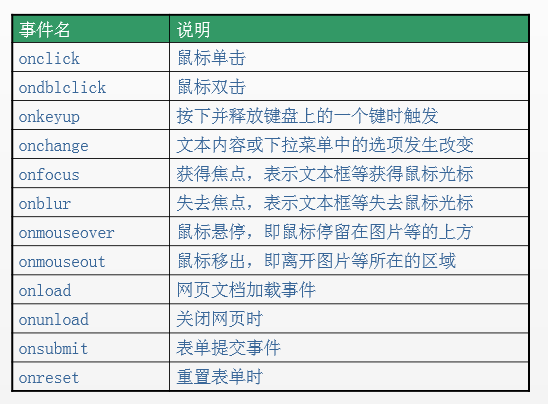

* 类型转换

  * 其他的简单类型 --> String

    * 隐式类型转换：字符串拼接；实际上内部是调用的 String() 函数。也就是说，c = c + ""等价于 c = String(c)。

    * 调用 toString()方法；语法：变量.toString()；该方法不会影响到原变量，它会将转换的结果返回。

      注意：null 和 undefined 这两个值没有 toString()方法，所以它们不能用此方法，如果调用，会报错。另外，Number 类型的变量，在调用 toString()时，可以在方法中传递一个整数作为参数。此时它将会把数字转换为指定的进制，如果不指定则默认转换为 10 进制。

    * 强制转换：使用 String()函数；语法：String(变量)；使用 String()函数做强制类型转换时：对于 Number 和 Boolean 而言，本质上就是调用 toString()方法。但是对于 null 和 undefined，则不会调用 toString()方法。它会将 null 直接转换为 "null"。将undefined 直接转换为 "undefined"。

  * 其他的数据类型 --> Number 

    * 使用 Number() 函数

      * 字符串 --> 数字
        * 如果字符串中是纯数字，则直接将其转换为数字。
        * 如果字符串是一个空串或者是一个全是空格的字符串，则转换为 0。
        * 只要字符串中包含了其他非数字的内容（小数点按数字来算），则转换为 NaN。
      * 布尔 --> 数字；true 转成 1，false 转成 0
      * null --> 数字；结果为：0
      * undefined --> 数字；结果为：NaN

    * 使用 parseInt()函数：字符串 -> 整数；parseInt()的作用是将字符串中的有效的整数内容转为数字。parse 表示“转换”，Int 表示“整数”（注意Int的拼写）。

      * 字符串 --> 数字

        * 只保留字符串最开头的数字，后面的中文自动消失。
        * 如果字符串不是以数字开头，则转换为 NaN。
        * 如果字符串是一个空串或者是一个全是空格的字符串，转换时会报错

      * boolean --> 数字；结果为：NaN

      * null --> 数字：结果为：NaN

      * undefined --> 数字；结果为：NaN

      * parseInt()具有以下特性：

        * 如果对非 String使用 parseInt()或 parseFloat()，它会先将其转换为 String 然后再操作。
        * 自动带有截断小数的功能：取整，不四舍五入。
        * 带两个参数时，表示在转换时，包含了进制转换。

      * parseFloat()函数：字符串 --> 浮点数（小数）；parseFloat()的作用是：将字符串转换为浮点数；parseFloat()和 parseInt()的作用类似，不同的是，parseFloat()可以获得有效的小数部分。

        代码举例：
        var a = '123.456.789px';
        console.log(parseFloat(a)); // 打印结果：123.456

        parseFloat() 的几个特性，可以参照 parseInt()。

  * 转换为 Boolean

    * 数字 --> 布尔。除了 0 和 NaN，其余的都是 true。也就是说，Boolean(NaN)的结果是 false。
    * 字符串 ---> 布尔。除了空串，其余的都是 true。全是空格的字符串，转换结果也是 true。字符串'0'的转换结果也是 true。
    * null 和 undefined 都会转换为 false。
    * 引用数据类型会转换为 true。注意，空数组[]和空对象{}，转换结果也是 true，这一点，很多人都不知道。
    * 显式转换为 Boolean 类型：
      * 使用 !!可以显式转换为 Boolean 类型。比如 !!3的结果是true。
      * 使用 Boolean()函数可以显式转换为 Boolean 类型。

* isNaN() 函数；语法：isNaN(参数)；解释：判断指定的参数是否为 NaN（非数字类型），返回结果为 Boolean 类型。也就是说：任何不能被转换为数值的参数，都会让这个函数返回 true。执行过程：先调用Number(参数)函数；然后将Number(参数)的返回结果和NaN进行比较（应该说是对比）。

* 自增/自减运算符：++、--；执行过程：先调用Number(参数)函数；然后将Number(参数)的返回结果进行 加 1 操作。

* 正号/负号：+a、-a；注意，这里说的是正号/负号，不是加号/减号。任何值做+a、-a、/a运算时，运算结果都会自动转换为 Number 类型。 内部调用的是 Number() 函数。

  加号：+

  * 字符串 + 数字

    当加号的两边，只要有一个是字符串的时候，就会调用 String() 函数将数字转为字符串，然后再计算。导致最终的运算结果是字符串。

  * Boolean + 数字

    Boolean 型和数字型相加时， true 按 1 来算 ，false 按 0 来算。这里其实是先调 Number() 函数，将 Boolean 类型转换为 Number类型，然后再和 数字相加。

  * null + 数字等价于：0 + 数字

  * undefined + 数字，计算结果：NaN

* 非数值的比较

  * 对于非数值进行比较时，会将其转换为数字然后再比较。
  * 特殊情况：如果符号两侧的值都是字符串时，不会将其转换为数字进行比较。比较两个字符串时，比较的是字符串的Unicode编码。

* == 这个符号并不严谨，会做隐式转换，将不同的数据类型，转为相同类型进行比较（大部分情况下，都是转换为数字）。例外：

  console.log(null == 0);   // 打印结果：false

  console.log(undefined == null);  //打印结果：true。

  全等在比较时，不会做类型转换。如果要保证绝对等于（完全等于），我们就要用三个等号===。==的反面是!=，===的反面是!==。

* 基本包装类

  String()：将基本数据类型字符串，转换为 String 对象。

  Number()：将基本数据类型的数字，转换为 Number 对象。

  Boolean()：将基本数据类型的布尔值，转换为 Boolean 对象。

  通过上面这这三个包装类，我们可以将基本数据类型的数据转换为对象。

  当我们对一些基本数据类型的值去调用属性和方法时，浏览器会临时使用包装类将基本数据类型转换为引用数据类型，这样的话，基本数据类型就有了属性和方法，然后再调用对象的属性和方法；调用完以后，再将其转换为基本数据类型。例如：string.length

* javascript的内置对象

  * String

    * indexOf()/lastIndexOf()：获取字符串中指定内容的索引
    * search()：获取字符串中指定内容的索引（参数里一般是正则）
    * includes()：字符串中是否包含指定的内容
    * startsWith()：字符串是否以指定的内容开头
    * endsWith()：字符串是否以指定的内容结尾
    * 获取指定位置的字符
      * charAt(index)
      * str[index]
      * charCodeAt(index)
    * 字符串截取
      * slice()
      * substring()
      * substr()
    * fromCharCode()：根据字符的 Unicode 编码获取字符。
    * concat()
    * split()：字符串转换为数组 
    * replace()
    * repeat()：重复字符串
    * trim()：去除字符串前后的空白。
    * 大小写转换toLowerCase()和toUpperCase()
    * html 方法：anchor() 创建 a 链接、big()、sub()、sup()、link()、bold()；注意，str.link() 返回值是字符串。

  * Number

    * isInteger() 判断是否为整数
    * toFixed() 小数点后面保留多少位
    * isFinite(i)：判断是否为有限大的数。比如Infinity这种无穷大的数，返回的就是 false。
    * isNaN(i)：判断是否为 NaN。
    * isInteger(i)：判断是否为整数。
    * parseInt(str)：将字符串转换为对应的数值。

  * Date

    需要注意的是：与 Math 对象不同，Date 对象是一个构造函数 ，需要先实例化后才能使用。创建Date对象有两种写法：

    * 如果Date()不写参数，就返回当前时间对象
    * 如果Date()里面写参数，就返回括号里输入的时间对象

    ```javascript
    var date1 = new Date();
    console.log(date1);
    打印结果：
    Mon Feb 17 2020 21:57:22 GMT+0800 (中国标准时间)
    Date对象 有如下方法，可以获取日期和时间的指定部分：
    getFullYear()	获取年份	
    getMonth()	获取月： 0-11	0代表一月
    getDate()	获取日：1-31	获取的是几号
    getDay()	获取星期：0-6	0代表周日，1代表周一
    getHours()	获取小时：0-23	
    getMinutes()	获取分钟：0-59	
    getSeconds()	获取秒：0-59	
    getMilliseconds()	获取毫秒	1s = 1000ms
    getTime() 获取日期对象的时间戳（单位：毫秒）
    format()
    ```

  * Array

    伪数组：包含 length 属性的对象或可迭代的对象（如字符串），但是伪数组的原型链中没有 Array.prototype，而真数组的原型链中有 Array.prototype。因此伪数组没有数组的一般方法，比如 pop()、join() 等方法。

    * Array.isArray()：判断是否为数组

    * toString()：将数组转换为字符串

    * Array.from(arrayLike)：将伪数组转化为真数组

    * Array.of(value1, value2, value3)：创建数组：将一系列值转换成数组

    * push()：向数组的最后面插入一个或多个元素，返回结果为新数组的长度，会改变原数组

    * pop()：删除数组中的最后一个元素，返回结果为被删除的元素，会改变原数组

    * unshift()：在数组最前面插入一个或多个元素，返回结果为新数组的长度，会改变原数组

    * shift()：删除数组中的第一个元素，返回结果为被删除的元素，会改变原数组

    * slice()：从数组中提取指定的一个或多个元素，返回结果为新的数组，不会改变原数组

    * splice()：从数组中删除指定的一个或多个元素，返回结果为被删除元素组成的新数组，会改变原数组

    * fill()：填充数组，用固定的值填充数组，返回结果为新的数组，不会改变原数组

    * concat()：合并数组，连接两个或多个数组，返回结果为新的数组，不会改变原数组

    * join()：将数组转换为字符串，返回结果为转换后的字符串，不会改变原数组

    * split()：将字符串按照指定的分隔符，组装为数组，不会改变原字符串

    * reverse()：反转数组，返回结果为反转后的数组，会改变原数组

    * sort()：对数组的元素,默认按照Unicode 编码，从小到大进行排序，会改变原数组

      如果返回一个大于 0 的值，则元素会交换位置

      如果返回一个小于 0 的值，则元素位置不变

      如果返回一个等于 0 的值，则认为两个元素相等，则不交换位置

    * 查找数组的元素

      * indexOf(value)：从前往后索引，检索一个数组中是否含有指定的元素	
      * lastIndexOf(value)：从后往前索引，检索一个数组中是否含有指定的元素	
      * includes(item)：数组中是否包含指定的内容	
      * find(function())：找出第一个满足「指定条件返回 true」的元素
      * findIndex(function())：找出第一个满足「指定条件返回 true」的元素的 index
      * every()：确保数组中的每个元素都满足「指定条件返回 true」，则停止遍历，此方法才返回 true，全真才为真。要求每一项都返回 true，最终的结果才返回 true
      * some()：数组中只要有一个元素满足「指定条件返回 true」，则停止遍历，此方法就返回 true，一真即真。只要有一项返回 true，最终的结果就返回 true

    * 遍历数组

      * for 循环

      * forEach()：回调函数中传递三个参数：

        第一个参数，就是当前正在遍历的元素

        第二个参数，就是当前正在遍历的元素的索引

        第三个参数，就是正在遍历的数组

      * map()：对原数组中的每一项进行加工，将组成新的数组并返回	不会改变原数组

      * filter()：过滤数组：返回结果是 true 的项，将组成新的数组，返回结果为新的数组，不会改变原数组

      * reduce：接收一个函数作为累加器，返回值是回调函数累计处理的结果	

  * Math

    * Math.max()获取最大值
    * Math.min()获取最小值
    * 向上舍 Math.ceil()
    * 向下舍 Math.floor()
    * 四舍五入 Math.round()
    * 随机数： Math.random()
    * Math.trunc(i)：去除小数部分

  * RegExp

    * 创建正则表达式的对象

      * 使用构造函数创建正则表达式的对象

        var 变量 = new RegExp("正则表达式"); // 注意，参数是字符串

        var 变量 = new RegExp("正则表达式", "匹配模式"); // 注意，两个参数都是字符串，匹配模式作为第二个参数。这个参数可以是：i 忽略大小写。这里的 i 指的是 ignore；g 全局匹配模式。这里的 g 指的是 global。

      * 使用字面量创建正则表达式，语法：

        var 变量 = /正则表达式/;  // 注意，这个语法里没有引号

        var 变量 = /正则表达式/匹配模式;  // 注意，这个语法里没有引号

    * 以上两种方式的对比

      * 使用构造函数创建时，更加灵活，因为参数中还可以传递变量。
      * 使用字面量的方式创建，更加简单。

    * 创建了正则表达式的对象后，该怎么使用呢？大致分为两个步骤：创建正则表达式的对象 reg；使用 reg 的test() 方法，判断指定字符串是否符合规则。

    * 正则表达式的test()方法：myReg.test(str); // 判断字符串 str 是否符合指定的myReg 这个正则表达式的规则；解释：使用test()这个方法可以用来检查一个字符串是否符合正则表达式的规则，如果符合则返回true，否则返回false。

      * 避坑指南：全局匹配 g 慎用test()方法；对于非全局匹配的正则表达式，test()只会检测是否存在某个目标字符串（只要存在就为 true），多次检测的结果都相同。当设置全局标志 /g 时，一旦字符串中还存在匹配，test() 方法都将返回 true，同时匹配成功后将把 lastIndex 属性（你赋值的正则对象里面的）的值设置为上次匹配成功结果之后的第一个字符所在的位置，下次匹配将从 lastIndex 指示的位置开始；匹配不成功时返回 false，同时将 lastIndex 属性的值重置为 0。
      * 总结：
        * 全局匹配模式g一般用于 exec()、match()、replace()等方法。
        * 全局匹配模式g如果用于test()方法会有问题。因为g模式会生成一个lastindex参数来存储匹配最后一次的位置。

    * 正则表达式的简单语法

      * 检查一个字符串中是否包含 a或b

        写法1：var reg = /a|b/;解释：使用 | 表示或的意思。

        写法2：var reg = /[ab]/;  // 跟上面的那行语法，是等价的；解释：这里的[]也是表示或的意思。[]这个符号在正则还是比较常用的。我们接下来看几个例子。

        一些规则：

        /[ab]/ 等价于 /a|b/：检查一个字符串中是否包含 a或b

        /[a-z]/：检查一个字符串那种是否包含任意小写字母

        /[A-Z]/：任意大写字母

        /[A-z]/：任意字母

        /[0-9]/：任意数字

        /a[bde]c/：检查一个字符串中是否包含 abc 或 adc 或 aec

        \[^ \] 表示：除了

      * String对象的如下方法，是支持正则表达式的：

        split()	将字符串拆分成数组	

        search()	搜索字符串中是否含有指定内容，返回索引 index	

        match()	根据正则表达式，从一个字符串中将符合条件的内容提取出来	

        replace()	将字符串中的指定内容，替换为新的内容并返回	

      * 常见正则表达式举例

        * 检查一个字符串是否是一个合法手机号

          手机号的规则：以1开头，第二位是3~9之间任意数字，三位以后任意9位数字

          正则实现：

          var phoneStr = "13067890123";

          var phoneReg = /^1\[3-9][0-9]{9}$/;

          console.log(phoneReg.test(phoneStr));

          备注：如果在正则表达式中同时使用^和$符号，则要求字符串必须完全符合正则表达式。

        * 去掉字符串开头和结尾的空格

          正则实现：

          str = str.replace(/^\s*|\s*$/g,"");
          解释如下：

          str = str.replace(/^\s*/, ""); //去除开头的空格*

          str = str.replace(/\*$/, ""); //去除结尾的空格

        * 判断字符串是否为电子邮件

          正则实现：

          var emailReg = /^\w{3,}(\.\w+)*@[A-z0-9]+(\.[A-z]{2,5}){1,2}$/;

          var email = "abchello@163.com";

          console.log(emailReg.test(email));

* js中的特殊值
  * 在JS中所有的数值都是 Number 类型，包括整数和浮点数（小数）。如果只是一些简单的精度问题，可以使用 toFix() 方法进行小数的截取。在实战开发中，关于浮点数计算的精度问题，往往比较复杂。市面上有很多针对数学运算的开源库，比如decimal.js、 Math.js。这些开源库都比较成熟，我们可以直接拿来用。
    * Math.js：属于很全面的运算库，文件很大，压缩后的文件就有500kb。如果你的项目涉及到大型的复杂运算，可以使用 Math.js。
    * decimal.js：属于轻量的运算库，压缩后的文件只有32kb。大多数项目的数学运算，使用 decimal.js 足够了。
  * 由于内存的限制，ECMAScript 并不能保存世界上所有的数值。
    * 最大值：Number.MAX_VALUE，这个值为： 1.7976931348623157e+308
    * 最小值：Number.MIN_VALUE，这个值为： 5e-324
    * 如果使用 Number 表示的变量超过了最大值，则会返回Infinity。无穷大（正无穷）：Infinity；无穷小（负无穷）：-Infinity。注意：typeof Infinity的返回结果是number。typeof NaN的返回结果是 number。Undefined和任何数值计算的结果为 NaN。NaN 与任何值都不相等，包括 NaN 本身。

* .?、??、??=的用法和含义

  * .?这个就叫做可选链，let b = a?.name表达的意思只有当a存在,同时a具有name属性的时候,才会把值赋给b,否则就会将undefined赋值给b.重要的是,不管a存在与否,这么做都不会报错.
  * b = a ?? c当a除了undefined、或者null之外的任何值,b都会等于a,否则就等于c.
  * b ??= a当??=左侧的值为null、undefined的时候,才会将右侧变量的值赋值给左侧变量.其他所有值都不会进行赋值.

* 什么函数才是回调函数？你定义的，你没有调，但最终它执行了(在某个时刻或某个条件下)

* IIFE全称: Immediately-Invoked Function Expression，作用：隐藏实现；不会污染外部(全局)命名空间；用它来编码js模块。

  ```html
  <script type="text/javascript">
    (function () { //匿名函数自调用
      var a = 3
      console.log(a + 3)
    })()
    var a = 4
    console.log(a);
  
    (function () {
      var a = 1
      function test () {
        console.log(++a)
      }
      window.$ = function () { // 向外暴露一个全局函数
        return {
          test: test
        }
      }
    })()
  
    $().test() // 1. $是一个函数 2. $执行后返回的是一个对象
  
  
  </script>
  ```

* 作用域：（ES6 之前，ES6加了块级作用域）

  全局作用域：作用于整个 script 标签内部，或者作用域一个独立的 JS 文件。

  函数作用域（局部作用域）：作用于函数内的代码环境。

  使用var关键字声明的变量（ 比如 var a = 1），会在所有的代码执行之前被声明（但是不会赋值），但是如果声明变量时不是用var关键字（比如直接写a = 1），则变量不会被声明提前。

  使用函数声明的形式创建的函数function foo(){}，会被声明提前。也就是说，整个函数会在所有的代码执行之前就被创建完成。所以，在代码顺序里，我们可以先调用函数，再定义函数。使用函数表达式创建的函数var foo = function(){}，不会被声明提前，所以不能在声明前调用。

  两个规律：

  * 任何变量，如果未经声明就赋值，此变量是属于 window 的属性，而且不会做变量提升。（注意，无论在哪个作用域内赋值）
  * 一切声明的全局变量，全是window的属性。（注意，我说的是在全局作用域内声明的全局变量，不是说局部变量）

  ```javascript
  function foo() {
      var a = b = 100; // 连续赋值
  }
  foo();
  console.log(window.b); // 在全局范围内访问 b
  console.log(b); // 在全局范围内访问 b，但是前面没有加 window 这个关键字
  console.log(window.a); // 在全局范围内访问 a
  console.log(a); // 在全局范围内访问 a，但是前面没有加 window 这个关键字
  上方代码的打印结果：
  100
  100
  undefined
  （会报错，提示 Uncaught ReferenceError: a is not defined）
  ```

  * 当执行了foo()函数之后， var a = b = 100 这行连续赋值的代码等价于 var a = (b = 100)，其执行顺序是：先把 100 赋值给 b；再声明变量 a；再把 b 的值赋值给 a。我们可以看到，b 是未经声明的变量就被赋值了，此时，根据规律1，这个 b 是属于 window.b；而 a 的作用域仅限于 foo() 函数内部，不属于 window。所以也就有了这样的打印结果。

* 函数预编译的步骤

  * 创建AO对象。AO即 Activation Object 活跃对象，其实就是「执行期上下文」。

  * 找形参和变量声明，将形参名和变量作为 AO 的属性名，值为undefined。

  * 将实参值和形参统一，实参的值赋给形参。

  * 查找函数声明，函数名作为 AO 对象的属性名，值为整个函数体

    ```javascript
    function fn(a) {
        console.log(a);
        var a = 666;
        console.log(a);
        function a() {}
        console.log(a);
        var b = function() {};
        console.log(b);
        function d() {}
    }
    fn(1);
    打印结果：
    ƒ a() {}
    666
    666
    ƒ () {}
    
    接下来我们来按照前面的步骤详细分析它的预编译执行过程：
    创建AO对象
    AO{
        //空对象    
    }
    找形参和变量声明
    AO{
        a : undefined,
        b : undefined
    }
    形参和实参相统一
    AO{
        a : 1,
        b : undefined // 函数声明不会被提前
    }
    找函数声明
    AO{
        a : function a(){},
        b : undefined,
        d : function d(){}
    }
    预编译环节就此结束，此时的AO对象已经更新为：
    AO{
        a : function a(){},
        b : undefined,
        d : function d(){}
    }
    函数开始逐行顺序执行：
     function fn(a){
        console.log(a);// 输出functiona(){}
        var a = 123;//执行到这里重新对a赋，AO对象再一次更新
        console.log(a);// 输出123
        
        function a(){};//预编译环节已经进行了变量提升，故执行时不在看这行代码
        console.log(a);// 输出123
        var b = function(){};//这个是函数表达式不是函数声明，故不能提升，会对AO中的b重新赋值
        console.log(b);//输出function(){}
        function d(){};
     }
    至此，函数执行完毕，销毁AO对象。
    ```

* 对象的操作

  * 向对象中添加属性，语法：对象.属性名 = 属性值;
  * 获取对象属性的两种方法
    * 语法：对象.属性名；如果获取对象中没有的属性，不会报错而是返回undefined。
    * 语法格式如下：（读取时，也是采用这种方式）， 注意，括号里的属性名，必须要加引号；对象['属性名'] = 属性值;
  * 修改对象的属性值语法：对象.属性名 = 新值;
  * 删除对象的属性，语法：delete obj.name;
  * in 运算符，通过该运算符可以检查一个对象中是否含有指定的属性。如果有则返回 true，没有则返回 false。语法：'属性名' in 对象;
  * for of：遍历数组，for ... of获取的是数组里的值；如果采用for ... in遍历数组，则获取的是 index 索引值。for ... of既可以遍历数组，也可以遍历 Map 对象。
  * for in：遍历对象的属性，for ... in主要用于遍历对象，不建议用来遍历数组。
  * Object.freeze() 冻结对象；Object.freeze() 方法可以冻结一个对象。一个被冻结的对象再也不能被修改；冻结了一个对象则不能向这个对象添加新的属性，不能删除已有属性，不能修改该对象已有属性的可枚举性、可配置性、可写性，以及不能修改已有属性的值。此外，冻结一个对象后该对象的原型也不能被修改。freeze() 返回和传入的参数相同的对象。
  
* js判断类型

  * typeof()表示“获取变量的数据类型”，返回的是类型的小写字符串；返回结果举例：console.log(typeof []); // 空数组的打印结果：object；console.log(typeof {}); // 空对象的打印结果：object
  * typeof 无法区分数组，但 instanceof 可以。比如：console.log([] instanceof Array); // 打印结果：true；console.log({} instanceof Array); // 打印结果：false；使用 instanceof 可以检查一个对象是否为一个类的实例。

* JSON(JavaScript Object Notation)：是ECMAScript的子集。作用是进行数据的交换。语法更为简洁，网络传输、机器解析都更为迅速。

  语法规则：

  * 数据在键值对中
  * 数据由逗号分隔
  * 花括号保存对象
  * 方括号保存数组

  数据类型：

  * 数字（整数或浮点数）
  * 字符串（在双引号中）
  * 逻辑值（true 或 false）
  * 数组（在方括号中）
  * 对象（在花括号中）
  * null

  JSON 和对象字面量的区别：JSON 的属性必须用双引号引号引起来，对象字面量可以省略；json 采用 for...in...进行遍历

  js对象(数组) --> json对象(数组)：JSON.stringify(obj/arr)
  json对象(数组) --> js对象(数组)：JSON.parse(json)

* 浅拷贝和深拷贝

  * ES6 给我们提供了新的语法糖，通过 Object.assgin() 可以实现浅拷贝。

    ```javascript
    浅拷贝代码实现：
    var shallowCopy = function(obj) {
    // 只拷贝对象
    if (typeof obj !== 'object') return;
    // 根据obj的类型判断是新建一个数组还是对象
    var newObj = obj instanceof Array ? [] : {};
    // 遍历obj，并且判断是obj的属性才拷贝
    for (var key in obj) {
    if (obj.hasOwnProperty(key)) {
    newObj[key] = obj[key];
    }
    }
    return newObj;
    }
    ```

  * 深拷贝一个数组的技巧：原理是JOSN对象中的stringify可以把一个js对象序列化为一个JSON字符串，parse可以把JSON字符串反序列化为一个js对象，通过这两个方法，也可以实现对象的深复制。但是这个方法不能够拷贝函数

    ```javascript
    递归实现深拷贝：通过递归可以简单实现对象的深度克隆，但是这种方法不管是ES6还是ES5实现，都有同样的缺陷，就是只能实现特定的object的深度复制（比如数组和函数），不能实现包装对象Number，String ， Boolean，以及Date对象，RegExp对象的复制。
    function deepClone(obj){
    var newObj= obj instanceof Array?[]:{};
    for(var i in obj){
    newObj[i]=typeof obj[i]=='object'?
    deepClone(obj[i]):obj[i];
    }
    return newObj;
    }
    
    对象的深度复制分类
    对于原始值或者包装类：
    function baseClone(base){
    return base.valueOf();
    }
    对于Date类型：
    因为valueOf方法，日期类定义的valueOf()方法会返回它的一个内部表示：1970年1月1日以来的毫秒数.因此我们可以在Date的原型上定义克隆的方法：
    Date.prototype.clone=function(){
    return new Date(this.valueOf());
    }
    对于正则对象RegExp：
    RegExp.prototype.clone = function() {
    var pattern = this.valueOf();
    var flags = '';
    flags += pattern.global ? 'g' : '';
    flags += pattern.ignoreCase ? 'i' : '';
    flags += pattern.multiline ? 'm' : '';
    return new RegExp(pattern.source, flags);
    };
    ```

* 闭包：当一个嵌套的内部(子)函数引用了嵌套的外部(父)函数的变量(函数)时, 就产生了闭包；一句话可以概括：闭包就是能够读取其他函数内部变量的函数，或者子函数在外调用，子函数所在的父函数的作用域不会被释放。

  闭包的作用：

  * 函数执行完后, 函数内部声明的局部变量是否还存在?  一般是不存在, 存在于闭中的变量才可能存在
  * 在函数外部能直接访问函数内部的局部变量吗? 不能, 但我们可以通过闭包让外部操作它

  闭包的生命周期：

  * 产生: 在嵌套内部函数定义执行完时就产生了(不是在调用)
  * 死亡: 在嵌套的内部函数成为垃圾对象时

  闭包的应用：定义JS模块

  * 具有特定功能的js文件
  * 将所有的数据和功能都封装在一个函数内部(私有的)
  * 只向外暴露一个包信n个方法的对象或函数
  * 模块的使用者, 只需要通过模块暴露的对象调用方法来实现对应的功能

  ```javascript
  myModule2.js
  (function () {
    //私有数据
    var msg = 'My atguigu'
    //操作数据的函数
    function doSomething() {
      console.log('doSomething() '+msg.toUpperCase())
    }
    function doOtherthing () {
      console.log('doOtherthing() '+msg.toLowerCase())
    }
  
    //向外暴露对象(给外部使用的方法)
    window.myModule2 = {
      doSomething: doSomething,
      doOtherthing: doOtherthing
    }
  })()
  ```

  ```html
  <!DOCTYPE html>
  <html lang="en">
  <head>
    <meta charset="UTF-8">
    <title>05_闭包的应用_自定义JS模块2</title>
  </head>
  <body>
  <script type="text/javascript" src="myModule2.js"></script>
  <script type="text/javascript">
    myModule2.doSomething()
    myModule2.doOtherthing()
  </script>
  </body>
  </html>
  ```

* ES5给Object扩展了一些静态方法，常用的有2个

  * Object.create(prototype, [descriptors])，作用: 以指定对象为原型，创建新的对象。同时，第二个参数可以为为新的对象添加新的属性，并对此属性进行描述。
  * bject.defineProperties(object, descriptors)，作用：为指定对象定义扩展多个属性。
  
* this是什么：任何函数本质上都是通过某个对象来调用的，如果没有直接指定就是window；所有函数内部都有一个变量this；它的值是调用函数的当前对象。

  * this永远指向的是最后调用它的对象，也就是看它执行的时候是谁调用的。

    * 如果一个函数中有this，但是它没有被上一级的对象所调用，那么this指向的就是window，这里需要说明的是在js的严格版中this指向的不是window，在严格版中的默认的this不再是window，而是undefined。test(): window

    * 如果一个函数中有this，这个函数有被上一级的对象所调用，那么this指向的就是上一级的对象。p.test(): p

    * 如果一个函数中有this，这个函数中包含多个对象，尽管这个函数是被最外层的对象所调用，this指向的也只是它上一级的对象。

    * 如果函数的返回值是一个对象，那么函数内的this指向的就是那个返回的对象，如果返回值不是一个对象，那么this还是指向函数的实例，也即函数的本身。

      ```html
      <!DOCTYPE html>
      <html lang="en">
      <head>
        <meta charset="UTF-8">
        <title>07_面试题1</title>
      </head>
      <body>
      
      <script type="text/javascript">
        //代码片段一
        var name = "The Window";
        var object = {
          name : "My Object",
          getNameFunc : function(){
            return function(){
              return this.name;
            };
          }
        };
        alert(object.getNameFunc()());  //?  the window，这个不是闭包，没有引用函数外部变量，return返回的时候没有指定对象
        //代码片段二
        var name2 = "The Window";
        var object2 = {
          name2 : "My Object",
          getNameFunc : function(){
            var that = this;
            return function(){
              return that.name2;
            };
          }
        };
        alert(object2.getNameFunc()()); //?  my object 这个是闭包，函数嵌套加引用函数外部变量that
      </script>
      </body>
      </html>
      ```

  * 函数对象的方法（js中的apply,call,bind）

    * 每个函数都有两个方法call()和apply()。call()和apply()都可以指定一个函数的运行环境对象，换句话说就是设置函数执行时的this值。

    * 使用方式：函数对象.call(this对象,参数数组) ；函数对象.apply(this对象,参数1,参数2,参数N)

    * call和apply都是改变上下文中的this并立即执行这个函数，bind方法可以让对应的函数想什么时候调就什么时候调用，并且可以将参数在执行的时候添加，这是它们的区别，根据自己的实际情况来选择使用。

      ```javascript
      var a = {
          user:"追梦子",
          fn:function(e,d,f){
              console.log(this.user); //追梦子
              console.log(e,d,f); //10 1 2
          }
      }
      var b = a.fn;
      var c = b.bind(a,10);
      c(1,2);
      ```

    * 自己实现一个bind函数，原理：通过apply或者call方法来实现

      ```javascript
      (1)初始版本
      Function.prototype.bind=function(obj,arg){
      var arg=Array.prototype.slice.call(arguments,1);
      var context=this;
      return function(newArg){
      arg=arg.concat(Array.prototype.slice.call(newArg));
      return context.apply(obj,arg);
      }
      }
      
      (2) 考虑到原型链
      为什么要考虑？因为在new 一个bind过生成的新函数的时候，必须的条件是要继承原函数的原型
      Function.prototype.bind=function(obj,arg){
      var arg=Array.prototype.slice.call(arguments,1);
      var context=this;
      var bound=function(newArg){
      arg=arg.concat(Array.prototype.slice.call(newArg));
      return context.apply(obj,arg);
      }
      var F=function(){}
      //这里需要一个寄生组合继承
      F.prototype=context.prototype;
      bound.prototype=new F();
      return bound;
      }
      ```
  
* 构造函数：是一种特殊的函数，主要用来创建和初始化对象，也就是为对象的成员变量赋初始值。它与 new 一起使用才有意义。我们可以把对象中一些公共的属性和方法抽取出来，然后封装到这个构造函数里面。

  构造函数和普通函数的区别：构造函数的创建方式和普通函数没有区别，不同的是构造函数习惯上首字母大写；构造函数和普通函数的区别就是调用方式的不同：普通函数是直接调用，而构造函数需要使用 new 关键字来调用，正因为用new调用，所以造成了this 的指向也有所不同。

  var a = new Test(): this的值为新创建的对象。为什么this会指向a？首先new关键字会创建一个空的对象，然后会自动调用一个函数apply方法，将this指向这个空对象，这样的话函数内部的this就会被这个空的对象替代。

  ```javascript
  new的具体过程模拟：
  function TestObj(num) {
  	this.num = num
  }
  function newFun(cont, ...args) {
      //cont是构造函数，args是构造函数的所需参数
      // 新建一个对象，new出来返回的就是这个
      let obj = Object.create(cont.prototype); 
      // 给这个对象指定原型链，构造函数有什么，obj也会有
      
      let result = cont.apply(obj, args)
      //运行构造函数，把构造函数的参数挂到obj上，注意是obj
      // 
      return result instanceof Object ? result : obj
  }
  const test1 = newFun(TestObj,1)
  ```

  JavaScript 的构造函数中可以添加一些成员，可以在构造函数本身上添加，也可以在构造函数内部的 this 上添加。通过这两种方式添加的成员，就分别称为静态成员和实例成员。

  * 静态成员：在构造函数本上添加的成员称为静态成员，只能由构造函数本身来访问。
  * 实例成员：在构造函数内部创建的对象成员称为实例成员，只能由实例化的对象来访问。

* JS 中的面向对象，是基于原型的面向对象。\_\_proto\_\_、 constructor属性是对象所独有的；prototype属性是函数独有的；

  原型的概念：每一个javascript对象(除null外)创建的时候，就会与之关联另一个对象，这个对象就是我们所说的原型，每一个对象都会从原型中“继承”属性。也即是说我们所创建的每一个函数，解析器都会向函数中添加一个属性 prototype。这个属性对应着一个对象，这个对象就是我们所谓的原型对象。使用 in 检查对象中是否含有某个属性时，如果对象中没有但是原型中有，也会返回true。可以使用对象的hasOwnProperty()来检查对象自身中是否含有该属性。

  原型对象也是对象，所以它也有原型，称之为原型链。如图所示，蓝色的就是原型链

  new 操作符新建了一个空对象，这个对象原型指向构造函数的prototype，执行构造函数后返回这个对象。

  * 在 ES6 中，我们可以通过 ES6 引入的类 class 来实现面向对象的编程。但是在 ES6 之前，我们是通过构造函数和原型，来模拟类的实现机制

    ```javascript
    //定义类
    class Point {
      constructor(x, y) {
        this.x = x;
        this.y = y;
      }
      toString() {
        return '(' + this.x + ', ' + this.y + ')';
      }
    }
    ```

  * 构造函数的prototype属性，在ES6的“类”上面继续存在。事实上，类的所有方法都定义在类的prototype属性上面，上面的toString方法相当于ES5的Point.prototype = {toString(){}};多个方法用逗号隔开。

  * 类的属性名，可以采用表达式。

    ```javascript
    let methodName = "getArea";
    class Square{
      constructor(length) {
        // ...
      }
      [methodName]() {
        // ...
      }
    }
    ```

  * constructor方法是类的默认方法，通过new命令生成对象实例时，自动调用该方法。一个类必须有constructor方法，如果没有显式定义，一个空的constructor方法会被默认添加。constructor方法默认返回实例对象（即this），完全可以指定返回另外一个对象。类的构造函数，不使用new是没法调用的，会报错。

  * 可以通过实例的\_\_proto\_\_属性为Class添加方法。使用实例的\_\_proto\_\_属性改写原型，必须相当谨慎，不推荐使用，因为这会改变Class的原始定义，影响到所有实例。

  * class不存在变量提升（hoist）。

  * 当使用 extends 关键字实现了继承， 子类的 constructor 构造函数中，必须显式调用super() 方法，这个 super 表示父类中 constructor 的引用。也就是说，在子类当中，要么不写 constructor，如果写了 constructor，就一定要把 super()也加上。

    ```javascript
    class Person {
      constructor(name, age) {
        console.log(3);
        this.name = name;
        this.age = age;
      }
      say() {
        console.log("这是 Person中的 say 方法");
      }
      static info = 123;
    }
    // 使用 extends 实现继承，extends的前面的是子类，后面的是父类
    class Chinese extends Person {
      constructor(name, age, color, language) {
        console.log(1);
        // 注意： 当使用 extends 关键字实现了继承， 子类的 constructor 构造函数中，必须显示调用 super() 方法，这个 super 表示父类中 constructor 的引用
        super(name, age);
        this.color = color;
        this.language = language;
        console.log(2);
      }
    }
    var c1 = new Chinese("张三", 22, "yellow", "汉语");
    console.log(c1);
    // 父类中任何东西，子类都能继承到
    c1.say();
    ```

* 类的继承与创建

  * 原型链继承，基本思想：利用原型让一个引用类型继承另一个引用类型的属性和方法；
    * 重点：让新实例的原型等于父类的实例。
    * 特点：实例可继承的属性有：实例的构造函数的属性，父类构造函数属性，父类原型的属性。（新实例不会继承父类实例的属性！）
    * 缺点：
      * 新实例无法向父类构造函数传参。
      * 继承单一。
      * 所有新实例都会共享父类实例的属性。（原型上的属性是共享的，一个实例修改了原型属性，另一个实例的原型属性也会被修改！）
  * 借用构造函数继承，基本思想：在子类型构造函数的内部调用超类型构造函数。函数只不过是在特定环境中执行代码的对象，因此可通过使用call()和apply()在新创建的对象上执行构造函数。
    * 重点：用.call()和.apply()将父类构造函数引入子类函数（在子类函数中做了父类函数的自执行（复制））
    * 特点：
      * 只继承了父类构造函数的属性，没有继承父类原型的属性。
      * 解决了原型链继承缺点
      * 可以继承多个构造函数属性（call多个）。
      * 在子实例中可向父实例传参。
    * 缺点：
      * 只能继承父类构造函数的属性，不能继承原型上的属性和方法。
      * 无法实现构造函数的复用。（每次用每次都要重新调用）
      * 每个新实例都有父类构造函数的副本，臃肿。
  * 组合继承（组合原型链继承和借用构造函数继承）
    * 重点：结合了两种模式的优点，传参和复用
    * 特点：
      * 可以继承父类原型上的属性，可以传参，可复用。
      * 每个新实例引入的构造函数属性是私有的。
    * 缺点：调用了两次父类构造函数（耗内存），子类的构造函数会代替原型上的那个父类构造函数。
  * 原型式继承
    * 重点：用一个函数包装一个对象，然后返回这个函数的调用，这个函数就变成了个可以随意增添属性的实例或对象。object.create()就是这个原理。
    * 特点：类似于复制一个对象，用函数来包装。
    * 缺点：
      * 所有实例都会继承原型上的属性。
      * 无法实现复用。（新实例属性都是后面添加的）
  * 寄生式继承
    * 重点：就是给原型式继承外面套了个壳子。
    * 优点：没有创建自定义类型，因为只是套了个壳子返回对象（这个），这个函数顺理成章就成了创建的新对象。
    * 缺点：没用到原型，无法复用。
  * 寄生组合式继承（常用）
    * 寄生：在函数内返回对象然后调用；组合：函数的原型等于另一个实例，在函数中用apply或者call引入另一个构造函数，可传参
    * 重点：修复了组合继承的问题

* babel ：写 ES6 语法的 js 代码，然后通过 Babel将 ES6 转换为 ES5，作用是将 ES6 语法转为 ES5 语法，支持低端浏览器。

* 高阶函数：如果一个函数符合下面2个规范中的任何一个，那该函数就是高阶函数，常见的高阶函数有：Promise、setTimeout、arr.map()等等

  * 若A函数，接收的参数是一个函数，那么A就可以称之为高阶函数。
  * 若A函数，调用的返回值依然是一个函数，那么A就可以称之为高阶函数。

* 函数的柯里化：通过函数调用继续返回函数的方式，实现多次接收参数最后统一处理的函数编码形式。

* 实现一个私有变量，用getName方法可以访问，不能直接访问

  * 通过defineProperty来实现

    ```javascript
    obj={
    name:yuxiaoliang,
    getName:function(){
    return this.name
    }
    }
    object.defineProperty(obj,"name",{
    //不可枚举不可配置
    });
    ```

  * 通过函数的创建形式

    ```javascript
    function product(){
    var name='yuxiaoliang';
    this.getName=function(){
    return name;
    }
    }
    var obj=new product();
    ```

* js监听对象属性的改变

  * ES5中可以通过Object.defineProperty来实现已有属性的监听
  * ES6中可以通过Proxy来实现

* ES6 引入了一种新的原始数据类型Symbol，表示独一无二的值。它是 JavaScript 语言的第七种数据类型，前六种是：undefined、null、布尔值（Boolean）、字符串（String）、数值（Number）、对象（Object）；除了定义自己使用的 Symbol 值以外，ES6 还提供了 11 个内置的 Symbol 值，指向语言内部使用的方法。

  特点：

  * Symbol属性对应的值是唯一的，解决命名冲突问题

  * Symbol值不能与其他数据进行计算，包括同字符串拼串

  * for in、for of 遍历时不会遍历Symbol属性。

  * symbol并不是100%隐藏，有内置方法Object.getOwnPropertySymbols(obj)可以获得所有的symbol。也有一个方法Reflect.ownKeys(obj)返回对象所有的键，包括symbol。

  * ```javascript
    将Symbol作为对象的属性值
        let mySymbol = Symbol();
        let obj = {
            name: 'smyhvae',
            age: 26
        };
        //obj.mySymbol = 'male'; //错误：不能用 . 这个符号给对象添加 Symbol 属性。
        obj[mySymbol] = 'hello';    //正确：通过**属性选择器**给对象添加 Symbol 属性。后面的属性值随便写。
        console.log(obj);
    ```

    

* ES6的解构赋值：ES6 允许我们，按照一一对应的方式，从数组或者对象中提取值，再将提取出来的值赋值给变量。

  * 数组的结构赋值：将数组中的值按照位置提取出来，然后赋值给变量。let [a, b = 'smyhvae'] = ['生命壹号']; //a 赋值为：生命壹号。b 采用默认值 smyhvae
  * 对象的结构赋值：将对象中的值按照属性匹配的方式提取出来，然后赋值给变量。const person = { name: 'qianguyihao', age: 28, sex: '男' };let { name, age, sex } = person; // 对象的结构赋值，或者改名：let { name: myName, age: myAge } = person; // 对象的结构赋值，console.log(myName); // 打印结果：qianguyihao
  * 字符串解构：字符串也可以解构，这是因为，此时字符串被转换成了一个类似数组的对象。const [a, b, c, d] = 'hello';console.log(a);打印结果：h

  圆括号的使用

  * 如果变量 foo 在解构之前就已经定义了，此时你再去解构，就会出现问题。

    ```javascript
    下面是错误的代码，编译会报错：
    	let foo = 'haha';
    	{ foo } = { foo: 'smyhvae' };
    	console.log(foo);
    要解决报错，只要在解构的语句外边，加一个圆括号即可：
    let foo = 'haha';
    ({ foo } = { foo: 'smyhvae' });
    console.log(foo); //输出结果：smyhvae
    ```

* ES6的rest参数和扩展运算符，rest参数的形式为：...变量名，相当于直接打包；扩展运算符是三个点（...），相当于解包。与解构赋值结合：const [first, ...rest] = [1, 2, 3, 4, 5];first //1，rest  // [2, 3, 4, 5]

* ES6模板字符串（模板字面量）：\`${}`

* ES6箭头函数：箭头函数根本就没有绑定自己的this，在箭头函数中调用 this 时，仅仅是简单的沿着作用域链向上寻找，找到最近的一个 this 拿来使用

* Promise

  * Promise 构造函数: Promise (excutor) {}，说明: executor 会在 Promise 内部立即同步调用,异步操作在执行器中执行

    * executor 函数: 执行器 (resolve, reject) => {} 
    * resolve 函数: 内部定义成功时我们调用的函数 value => {}
    * reject 函数: 内部定义失败时我们调用的函数 reason => {}

  * Promise.prototype.then 方法: (onResolved, onRejected) => {}，说明: 指定用于得到成功 value 的成功回调和用于得到失败 reason 的失败回调，返回一个新的 promise 对象

    * onResolved 函数: 成功的回调函数 (value) => {}
    * onRejected 函数: 失败的回调函数 (reason) => {}.

  * Promise.prototype.catch 方法: (onRejected) => {}，说明: then()的语法糖, 相当于: then(undefined, onRejected)

    onRejected 函数: 失败的回调函数 (reason) => {}

  * Promise.resolve 方法: (value) => {}，value: 成功的数据或 promise 对象，说明: 返回一个成功/失败的 promise 对象

  * Promise.reject 方法: (reason) => {}，reason: 失败的原因，说明: 返回一个失败的 promise 对象

  * Promise.all 方法: (promises) => {}，promises: 包含 n 个 promise 的数组；说明: 返回一个新的 promise, 只有所有的 promise 都成功才成功, 只要有一个失败了就直接失败

  * Promise.race 方法: (promises) => {}，promises: 包含 n 个 promise 的数组；说明: 返回一个新的 promise, 第一个完成的 promise 的结果状态就是最终的结果状态

  自定义(手写)Promise

  ```javascript
  /*
  自定义 Promise
  */
  (function (window) {
  /*
  Promise 构造函数
  excutor: 内部同步执行的函数 (resolve, reject) => {}
  */
      function Promise(excutor) {
      }
  /*
  为 promise 指定成功/失败的回调函数
  函数的返回值是一个新的 promise 对象
  */
      Promise.prototype.then = function (onResolved, onRejected) {
      }
  /*
  为 promise 指定失败的回调函数
  是 then(null, onRejected)的语法糖
  */
      Promise.prototype.catch = function (onRejected) {
      }
  /*
  返回一个指定了成功 value 的 promise 对象
  */
      Promise.resolve = function (value) {
      }
  /*
  返回一个指定了失败 reason 的 promise 对象
  */
      Promise.reject = function (reason) {
      }
  /*
  返回一个 promise, 只有 promises 中所有 promise 都成功时, 才最终成功, 只要有一个失败就直接
  失败
  */
      Promise.all = function (promises) {
      }
  /*
  返回一个 promise， 一旦某个 promise 解决或拒绝， 返回的 promise 就会解决或拒绝。
  */
      Promise.race = function (promises) {
      }
  // 暴露构造函数
  	window.Promise = Promise
  })(window)
  ```

  ```javascript
  /*
  Promise 构造函数
  excutor: 内部同步执行的函数 (resolve, reject) => {}
  */
  function Promise(excutor) {
      const self = this
      self.status = 'pending' // 状态值, 初始状态为 pending, 成功了变为resolved, 失败了变为 rejected
      self.data = undefined // 用来保存成功 value 或失败 reason 的属性
      self.callbacks = [] // 用来保存所有待调用的包含 onResolved 和 onRejected回调函数的对象的数组
      
  /*
  异步处理成功后应该调用的函数
  value: 将交给 onResolve()的成功数据
  */
      function resolve(value) {
          if(self.status!=='pending') { // 如果当前不是 pending, 直接结束
          	return
      	}
  // 立即更新状态, 保存数据
          self.status = 'resolved'
          self.data = value
  // 异步调用所有待处理的 onResolved 成功回调函数
          if (self.callbacks.length>0) {
              setTimeout(() => {
                  self.callbacks.forEach(obj => {obj.onResolved(value)})
  			})
  		}
  	}
      
  /*
  异步处理失败后应该调用的函数
  reason: 将交给 onRejected()的失败数据
  */
      function reject(reason) {
          if(self.status!=='pending') { // 如果当前不是 pending, 直接结束
          	return
      	}
  // 立即更新状态, 保存数据
          self.status = 'rejected'
          self.data = reason
  // 异步调用所有待处理的 onRejected 回调函数
          setTimeout(() => {
              self.callbacks.forEach(obj => {obj.onRejected(reason)})
  		})
  	}
      
  	try {
  // 立即同步调用 excutor()处理
  		excutor(resolve, reject)
  	} catch (error) { // 如果出了异常, 直接失败
  		reject(error)
  	}
  }
  ```

  ```javascript
  /*
  为 promise 指定成功/失败的回调函数
  函数的返回值是一个新的 promise 对象
  */
  Promise.prototype.then = function (onResolved, onRejected) {
  	const self = this
  // 如果 onResolved/onRejected 不是函数, 可它指定一个默认的函数
  	onResolved = typeof onResolved==='function' ? onResolved : value => v
  	alue // 指定返回的 promise 为一个成功状态, 结果值为 value
  	onRejected = typeof onRejected === 'function' ? onRejected : reason =
  	> {throw reason} // 指定返回的 promise 为一个失败状态, 结果值为 reason
  // 返回一个新的 promise 对象
  	return new Promise((resolve, reject) => {
  /*
  专门抽取的用来处理 promise 成功/失败结果的函数
  callback: 成功/失败的回调函数
  */
  		function handle(callback) {
  // 1. 抛出异常 ===> 返回的 promise 变为 rejected
  			try {
  				const x = callback(self.data)
  // 2. 返回一个新的 promise ===> 得到新的 promise 的结果值作为返回的promise 的结果值
  				if (x instanceof Promise) {
  					x.then(resolve, reject) // 一旦 x 成功了,resolve(value), 一旦 x失败了: reject(reason)
  				} else {
  // 3. 返回一个一般值(undefined) ===> 将这个值作为返回的 promise 的成功值
  					resolve(x)
  				}
  			} catch (error) {
  				reject(error)
  			}
  		}
  		if (self.status === 'resolved') { // 当前 promise 已经成功了
  			setTimeout(() => {
  				handle(onResolved)
  			})
  		} else if (self.status === 'rejected') { // 当前 promise 已经失败了
  			setTimeout(() => {
  				handle(onRejected)
  			})
  		} else { // 当前 promise 还未确定 pending
  // 将 onResolved 和 onRejected 保存起来
  			self.callbacks.push({
  				onResolved(value) {
  					handle(onResolved)
  				},
  				onRejected(reason) {
  					handle(onRejected)
  				}
  			})
  		}
  	})
  }
  
  /*
  为 promise 指定失败的回调函数
  是 then(null, onRejected)的语法糖
  */
  Promise.prototype.catch = function (onRejected) {
  	return this.then(null, onRejected)
  }
  ```

  ```javascript
  /*
  返回一个指定了成功 value 的 promise 对象
  value: 一般数据或 promise
  */
  Promise.resolve = function (value) {
  	return new Promise((resolve, reject) => {
  		if (value instanceof Promise) {
  			value.then(resolve, reject)
  		} else {
  			resolve(value)
  		}
  	})
  }
  
  /*
  返回一个指定了失败 reason 的 promise 对象
  reason: 一般数据/error
  */
  Promise.reject = function (reason) {
  	return new Promise((resolve, reject) => {
  		reject(reason)
  	})
  }
  ```

  ```javascript
  /*
  返回一个新的 promise 对象, 只有 promises 中所有 promise 都产生成功 value 时, 才
  最终成功, 只要有一个失败就直接失败
  */
  Promise.all = function (promises) {
  // 返回一个新的 promise
  	return new Promise((resolve, reject) => {
  // 已成功的数量
  		let resolvedCount = 0
  // 待处理的 promises 数组的长度
  		const promisesLength = promises.length
  // 准备一个保存成功值的数组
  		const values = new Array(promisesLength)
  // 遍历每个待处理的 promise
  		for (let i = 0; i < promisesLength; i++) {
  // promises 中元素可能不是一个数组, 需要用 resolve 包装一下
  			Promise.resolve(promises[i]).then(
  				value => {
  // 成功当前 promise 成功的值到对应的下标
  					values[i] = value
  // 成功的数量加 1
  					resolvedCount++
  // 一旦全部成功
  					if(resolvedCount===promisesLength) {
  // 将所有成功值的数组作为返回 promise 对象的成功结果值
  						resolve(values)
  					}
  				},
  				reason => {
  // 一旦有一个promise产生了失败结果值, 将其作为返回promise对象的失败结果值
  					reject(reason)
  				}
  			)
  		}
  	})
  }
  
  /*
  返回一个 promise，一旦某个 promise 解决或拒绝， 返回的 promise 就会解决或拒绝。
  */
  Promise.race = function (promises) {
  // 返回新的 promise 对象
  	return new Promise((resolve, reject) => {
  // 遍历所有 promise
  		for (var i = 0; i < promises.length; i++) {
  			Promise.resolve(promises[i]).then(
  				(value) => { // 只要有一个成功了, 返回的 promise 就成功了
  					resolve(value)
  				},
  				(reason) => { // 只要有一个失败了, 返回的结果就失败了
  					reject(reason)
  				}
  			)
  		}
  	})
  }
  ```

  ```javascript
  /*
  返回一个延迟指定时间才确定结果的 promise 对象
  */
  Promise.resolveDelay = function (value, time) {
  	return new Promise((resolve, reject) => {
  		setTimeout(() => {
  			if (value instanceof Promise) { // 如果 value 是一个 promise, 取这个promise 的结果值作为返回的 promise 的结果值
  				value.then(resolve, reject) // 如果 value 成功, 调用resolve(val), 如果 value 失败了, 调用 reject(reason)
  			} else {
  				resolve(value)
  			}
  		}, time);
  	})
  }
  
  /*
  返回一个延迟指定时间才失败的 Promise 对象。
  */
  Promise.rejectDelay = function (reason, time) {
  	return new Promise((resolve, reject) => {
  		setTimeout(() => {
  			reject(reason)
  		}, time)
  	})
  }
  ```

* generator函数，使用：分段执行，可以暂停；可以控制阶段和每个阶段的返回值；可以知道是否执行到结尾

  ```javascript
  function* g() {
  var o = 1;
  yield o++;
  yield o++;
  }
  var gen = g();
  console.log(gen.next()); //  Object {value: 1, done: false}
  var xxx = g();
  console.log(gen.next()); // Object {value: 2, done: false}
  console.log(xxx.next()); // Object {value: 1, done: false}
  console.log(gen.next()); // Object {value: undefined, done: true}
  ```

  generator和异步控制：利用generator函数的暂停执行的效果，可以把异步操作写在yield语句里面，等到调用next方法时再往后执行。这实际上等同于不需要写回调函数了，因为异步操作的后续操作可以放在yield语句下面，反正要等到调用next方法时再执行。所以，generator函数的一个重要实际意义就是用来处理异步操作，改写回调函数。

* async和异步，用法：async 表示这是一个async函数，await只能用在这个函数里面。await 表示在这里等待异步操作返回结果，再继续执行。await 后一般是一个promise对象

  示例：async用于定义一个异步函数，该函数返回一个Promise。如果async函数返回的是一个同步的值，这个值将被包装成一个理解resolve的Promise，等同于return Promise.resolve(value)。await用于一个异步操作之前，表示要“等待”这个异步操作的返回值。await也可以用于一个同步的值。

  ```javascript
  let timer = async function timer(){
  return new Promise((resolve,reject) => {
  setTimeout(() => {
  resolve('500');
  },500);
  });
  }
  timer().then(result => {
  console.log(result);  //500
  }).catch(err => {
  console.log(err.message);
  });
  //返回一个同步的值
  
  let sayHi = async function sayHi(){
  let hi = await 'hello world';
  return hi;  //等同于return Promise.resolve(hi);
  }
  sayHi().then(result => {
  console.log(result);
  });
  ```

* DOM

  DOM树构建过程：浏览器从⽹络或硬盘中获得HTML字节数据后会经过⼀个流程将字节解析为DOM树

  * 编码： 先将HTML的原始字节数据转换为⽂件指定编码的字符。
  * 令牌化： 然后浏览器会根据HTML规范来将字符串转换成各种令牌（如、这样的标签以及标签中的字符串和属性等都会被转化为令牌，每个令牌具有特殊含义和⼀组规则）。令牌记录了标签的开始与结束，通过这个特性可以轻松判断⼀个标签是否为⼦标签（假设有与两个标签，当标签的令牌还未遇到它的结束令牌就遇⻅了标签令牌，那么就是的⼦标签）。
  * ⽣成对象： 接下来每个令牌都会被转换成定义其属性和规则的对象（这个对象就是节点对象）。
  * 构建完毕： DOM树构建完成，整个对象集合就像是⼀棵树形结构。可能有⼈会疑惑为什么DOM是⼀个树形结构，这是因为标签之间含有复杂的⽗⼦关系，树形结构正好可以诠释这个关系（CSSOS同理，层叠样式也含有⽗⼦关系。例如： div p {font-size: 18px}，会先寻找所有p标签并判断它的⽗标签是否为div之后才会决定要不要采⽤这个样式进⾏渲染）。

  整个DOM树的构建过程其实就是： 字节 -> 字符 -> 令牌 -> 节点对象 -> 对象模型

  浏览器渲染引擎⼯作流程都差不多，⼤致分为5步，创建DOM树——创建StyleRules——创建
  Render树——布局Layout——绘制Painting

  * ⽤HTML分析器，分析HTML元素，构建⼀颗DOM树(标记化和树构建)。

  * ⽤CSS分析器，分析CSS⽂件和元素上的inline样式，⽣成⻚⾯的样式表。

  * 将DOM树和样式表，关联起来，构建⼀颗Render树(这⼀过程⼜称为Attachment)。每个DOM节点都有attach⽅法，接受样式信息，返回⼀个render对象(⼜名renderer)。这些render对象最终会被构建成⼀颗Render树。

  * 有了Render树，浏览器开始布局，为每个Render树上的节点确定⼀个在显示屏上出现的精确坐标。

  * Render树和节点显示坐标都有了，就调⽤每个节点paint⽅法，把它们绘制出来。

    DOM树的构建是⽂档加载完成开始的？构建DOM数是⼀个渐进过程，为达到更好⽤户体验，渲染引擎会尽快将内容显示在屏幕上。它不必等到整个HTML⽂档解析完毕之后才开始构建render数和布局。

    Render树是DOM树和CSSOM树构建完毕才开始构建的吗？这三个过程在实际进⾏的时候⼜不是完全独⽴，⽽是会有交叉。会造成⼀边加载，⼀遍解析，⼀遍渲染的⼯作现象。

    CSS的解析是从右往左逆向解析的(从DOM树的下－上解析⽐上－下解析效率⾼)，嵌套标签越多，解析越慢

  * 事件的三要素：事件源、事件、事件驱动程序

    * 事件源

      获取事件源的方式（DOM节点的获取）

      * 获取元素节点，通过document对象调用

        * getElementById()，通过id属性获取一个元素节点对象
        * getElementsByTagName()，通过标签名获取一组元素节点对象
        * getElementsByName()，通过name属性获取一组元素节点对象

      * 获取元素节点的子节点，通过具体的元素节点调用

        * getElementsByTagName()方法，返回当前节点的指定标签名后代节点
        * childNodes属性，表示当前节点的所有子节点
        * firstChild属性，表示当前节点的第一个子节点
        * lastChild属性，表示当前节点的最后一个子节点
        * children非标准属性。返回的是指定元素的子元素节点的集合。它只返回HTML节点，甚至不返回文本节点。在IE6/7/8中包含注释节点（在IE678中，注释节点不要写在里面）。虽然不是标准的DOM属性，但它和innerHTML方法一样，得到了几乎所有浏览器的支持。

      * 获取父节点和兄弟节点，通过具体的节点调用

        * parentNode属性，表示当前节点的父节点
        * previousSibling属性，表示当前节点的前一个兄弟节点
        * nextSibling属性，表示当前节点的后一个兄弟节点

        ```html
        <!DOCTYPE html>
        <html>
        <head lang="en">
            <meta charset="UTF-8">
            <title></title>
            <style>
                * {
                    padding: 0;
                    margin: 0;
                    text-align: center;
                }
        
                .wrap {
                    width: 500px;
                    margin: 100px auto 0;
                }
        
                table {
                    border-collapse: collapse;
                    border-spacing: 0;
                    border: 1px solid #c0c0c0;
                    width: 500px;
                }
        
                th,
                td {
                    border: 1px solid #d0d0d0;
                    color: #404060;
                    padding: 10px;
                }
        
                th {
                    background-color: #09c;
                    font: bold 16px "微软雅黑";
                    color: #fff;
                }
        
                td {
                    font: 14px "微软雅黑";
                }
        
                tbody tr {
                    background-color: #f0f0f0;
                    cursor: pointer;
                }
        
                .current {
                    background-color: red !important;
                }
            </style>
        </head>
        <body>
        <div class="wrap">
            <table>
                <thead>
                <tr>
                    <th>序号</th>
                    <th>姓名</th>
                    <th>课程</th>
                    <th>成绩</th>
                </tr>
                </thead>
                <tbody id="target">
                <tr>
                    <td>
                        1
                    </td>
                    <td>生命壹号</td>
                    <td>语文</td>
                    <td>100</td>
        
                </tr>
                <tr>
                    <td>
                        2
                    </td>
                    <td>生命贰号</td>
                    <td>日语</td>
                    <td>99</td>
                </tr>
                <tr>
                    <td>
                        3
                    </td>
                    <td>生命叁号</td>
                    <td>营销学</td>
                    <td>98</td>
                </tr>
                <tr>
                    <td>
                        4
                    </td>
                    <td>生命伍号</td>
                    <td>数学</td>
                    <td>90</td>
                </tr>
                <tr>
                    <td>
                        5
                    </td>
                    <td>许嵩</td>
                    <td>英语</td>
                    <td>96</td>
                </tr>
                <tr>
                    <td>
                        6
                    </td>
                    <td>vae</td>
                    <td>体育</td>
                    <td>90</td>
                </tr>
                </tbody>
            </table>
        </div>
        
        <script>
            //需求：让tr各行变色，鼠标放入tr中，高亮显示。
        
            //1.隔行变色。
            var tbody = document.getElementById("target");
            var trArr = tbody.children;
            //循环判断并各行赋值属性（背景色）
            for (var i = 0; i < trArr.length; i++) {
                if (i % 2 !== 0) {
                    trArr[i].style.backgroundColor = "#a3a3a3";
                } else {
                    trArr[i].style.backgroundColor = "#ccc";
                }
        
                //鼠标进入高亮显示
                //难点：鼠标移开的时候要回复原始颜色。
                //计数器（进入tr之后，立刻记录颜色，然后移开的时候使用记录好的颜色）
                var myColor = "";
                trArr[i].onmouseover = function () {
                    //赋值颜色之前，先记录颜色
                    myColor = this.style.backgroundColor;
                    this.style.backgroundColor = "#fff";
                }
                trArr[i].onmouseout = function () {
                    this.style.backgroundColor = myColor;
                }
            }
        
        
        </script>
        
        </body>
        </html>
        ```

      * 元素节点的属性

        * 获取：元素节点.属性名 或 元素节点[“属性名”] 或 元素节点.getAttribute("属性名称");
        * 设置：元素对象.属性名=新的值。myNode.src = "images/2.jpg"   //修改src的属性值 或 myNode.className = "image2-box";  //修改class的name 或 元素节点.setAttribute("属性名", "新的属性值");
        * 删除：元素节点.removeAttribute(属性名);

        总结：获取节点的属性值和设置节点的属性值，都有两种方式。如果是节点的“原始属性”（比如 普通标签的class/className属性、普通标签的style属性、普通标签的 title属性、img 标签的src属性、超链接的href属性等），方式1和方式2是等价的，可以混用。但如果是节点的“非原始属性”，比如：div.aaa = 'qianguyihao';div.setAttribute('bbb', 'qianguyihao');上面的这个“非原始属性”，在使用这两种方式时，是有区别的。区别如下：方式1 的元素节点.属性和元素节点[属性]：绑定的属性值不会出现在标签上。方式2 的get/set/removeAttribut：绑定的属性值会出现在标签上。这两种方式不能交换使用，get值和set值必须使用同一种方法。

        * 其他属性

          * nodeValue：文本节点可以通过nodeValue属性获取和设置文本节点的内容

            ```html
            nodeType、nodeName、nodeValue
            nodeType == 1 表示的是元素节点（标签） 。记住：在这里，元素就是标签。
            nodeType == 2 表示是属性节点。
            nodeType == 3 是文本节点。
            <div id="box" value="111">
                生命壹号
            </div>
            <script>
                var element = document.getElementById("box1");  //获取元素节点（标签）
                var attribute = element.getAttributeNode("id"); //获取box1的属性节点
                var txt = element.firstChild;                   //获取box1的文本节点
            
                //获取nodeType
                console.log(element.nodeType);       //1
                console.log(attribute.nodeType);     //2
                console.log(txt.nodeType);           //3
            
                console.log("--------------");
            
                //获取nodeName
                console.log(element.nodeName);       //DIV
                console.log(attribute.nodeName);     //id
                console.log(txt.nodeName);           //#text
            
                console.log("--------------");
            
                //获取nodeValue
                console.log(element.nodeValue);     //null
                console.log(attribute.nodeValue);   //box1
                console.log(txt.nodeValue);         //生命壹号
            </script>
            ```

          * innerHTML：元素节点通过该属性获取和设置标签内部的html代码（包含标签）。

          * innerHTML：双闭合标签里面的内容（不包含标签）。

          * style：style是一个对象，只能获取行内样式，不能获取内嵌的样式和外链的样式。box.style.cssText = “字符串形式的样式”。例：box1.style.cssText = "width: 300px;height: 300px;background-color: green;";

            style的常用属性包括：backgroundColor、backgroundImage、color、width、height、border、opacity 设置透明度 (IE8以前是filter:alpha(opacity=xx))

            注意DOM对象style的属性和标签中style内的值不一样，因为在JS中，-不能作为标识符。比如：DOM中：backgroundColor；CSS中：background-color

            那如何获取元素当前显示的样式（包括行内样式、内嵌样式、外链样式）呢？

            * 获取元素当前正在显示的样式
              * w3c的做法：window.getComputedStyle("要获取样式的元素", "伪元素");两个参数都是必须要有的。参数二中，如果没有伪元素就用 null 代替（一般都传null）
              * IE和opera的做法：obj.currentStyle;
            * 使用CSS选择器进行查询：querySelector() 和 querySelectorAll()，这两个方法都是用document对象来调用，两个方法使用相同，都是传递一个选择器字符串作为参数，方法会自动根据选择器字符串去网页中查找元素。不同的地方是querySelector()只会返回找到的第一个元素，而querySelectorAll()会返回所有符合条件的元素。

      * 获取 html 文档的方法

        * document.title 文档标题；
        * document.head 文档的头标签
        * document.body 文档的body标签；
        * document.documentElement，document.documentElement表示文档的html标签。也就是说，基本结构当中的 html 标签而是通过document.documentElement访问的，并不是通过 document.html 去访问的。

      * 节点的修改，这里的修改我们主要指对元素节点的操作。

        * 创建节点：document.createElement(标签名) 

        * 删除节点：父节点.removeChild(子节点) 如果我想删除自己这个节点，可以这么做：node1.parentNode.removeChild(node1);

        * 替换节点：父节点.replaceChild(新节点 , 旧节点)

        * 复制节点（克隆节点）：格式如下：要复制的节点.cloneNode(); //括号里不带参数和带参数false，效果是一样的；要复制的节点.cloneNode(true);
          括号里带不带参数，效果是不同的。解释如下：不带参数/带参数false：只复制节点本身，不复制子节点。带参数true：既复制节点本身，也复制其所有的子节点。

        * 插入节点：父节点.appendChild(子节点) ；节点.insertBefore(新节点 , 旧节点)解释：在参考节点前插入一个新的节点。如果参考节点为null，那么他将在父节点里面的最后插入一个子节点。特别强调：关于appendChild方法，这里要强调一下。比如，现在有下面这样一个div结构：

          ```html
          <div class="box11">
              <div class="box12">生命壹号</div>
          </div>
          <div class="box21">
              <div class="box22">永不止步</div>
          </div>
          上方结构中，子盒子box12是在父亲box11里的，子盒子box22是在父亲box21里面的。现在，如果我调用方法box11.appendChild(box22)，最后产生的结果是：box22会跑到box11中（也就是说，box22不在box21里面了）。这是一个很神奇的事情：
          ```

    * 事件

      * 当页面加载（文本和图片）完毕的时候，触发onload事件。建议整个页面上所有元素加载完毕再执行js内容。所以，window.onload可以预防使用标签在定义标签之前。也可以把js代码写在 <body> 标签里的，代码的位置是处在页面的下方。这么做，也可以确保：在页面加载完毕后，再执行 js 代码。
      * 鼠标的拖拽事件，拖拽的流程：
        * onmousedown：当鼠标在被拖拽元素上按下时，开始拖拽；
        * onmousemove：当鼠标移动时被拖拽元素跟随鼠标移动；
        * onmouseup：当鼠标松开时，被拖拽元素固定在当前位置。
        * mouseover：当鼠标移入元素或其子元素都会触发事件，所以有一个重复触发，冒泡的过程，对应的移除事件是mouseout；mouseenter：当鼠标移除元素本身（不包含元素的子元素）会触发事件，也就是不会冒泡，对应的移除事件是mouseleave
      * 鼠标的滚轮事件
        * onmousewheel：鼠标滚轮滚动的事件，会在滚轮滚动时触发。但是火狐不支持该属性。
        * DOMMouseScroll：在火狐中需要使用 DOMMouseScroll 来绑定滚动事件。注意该事件需要通过addEventListener()函数来绑定。
      * 键盘事件，事件名：
        * onkeydown：按键被按下。
        * onkeyup：按键被松开。
        * 注意：如果一直按着某一个按键不松手，那么，onkeydown事件会一直触发。此时，松开键盘，onkeyup事件会执行一次。当onkeydown连续触发时，第一次和第二次之间会间隔稍微长一点，后续的间隔会非常快。这种设计是为了防止误操作的发生。键盘事件一般都会绑定给一些可以获取到焦点的对象或者是document。

    * 事件驱动程序，绑定事件的方法：onclick 和 addEventListener

      * addEventListener(event, function, useCapture)，其中，event指定事件名，function指定要事件触发时执行的函数，useCapture指定事件是否在捕获或冒泡阶段执行（true表示捕获阶段触发，false表示冒泡阶段触发（默认）。如果不写，则默认为false）。

        一个元素的一个事件，可以绑定多个响应函数。不存在响应函数被覆盖的情况。执行顺序是：事件被触发时，响应函数会按照函数的绑定顺序执行。

        addEventListener()中的this，是绑定事件的对象。addEventListener()不支持 IE8 及以下的浏览器。在IE8中可以使用attachEvent来绑定事件element.attachEvent('onclick', function () {});attachEvent()中的this，是window

      * DOM标准的浏览器会将一个event对象传入到事件的处理程序当中，无论事件处理程序是什么都会传入一个event对象。可以通过这种方式获取：

        ```javascript
        btn.onclick = function(event){
        	alert(event.type);
        };
        ```

        Event对象包含与创建它的特定事件有关的属性和方法，触发的事件类型不一样，可用的属性和方法也不一样。

        ie 678 的写法是 window.event。此时，事件对象 event 是作为window对象的属性保存的。于是，我们可以采取一种兼容性的写法。如下：event = event || window.event; // 兼容性写法

      * 事件的传播

        * 捕获阶段：在捕获阶段时从最外层的祖先元素，向目标元素进行事件的捕获，但是默认此时不会触发事件
        * 目标阶段：事件捕获到目标元素，捕获结束开始在目标元素上触发事件
        * 冒泡阶段：事件从目标元素向他的祖先元素传递，依次触发祖先元素上的事件，以下事件不冒泡：blur、focus、load、unload、onmouseenter、onmouseleave。意思是，事件不会往父元素那里传递。我们检查一个元素是否会冒泡，可以通过事件的以下参数：event.bubbles，如果返回值为true，说明该事件会冒泡；反之则相反。
        * 取消事件传播：我们可以使用event对象的两个方法完成：stopPropagation() 和 stopImmediatePropagation()，IE10以下则是：event.cancelBubble = true

      * 事件委托：事件委托指的是，不在事件的发生地（直接dom）上设置监听函数，而是在其父元素上设置监听函数，通过事件冒泡，父元素可以监听到子元素上事件的触发，通过判断事件发生元素DOM的类型，来做出不同的响应。

        举例：最经典的就是ul和li标签的事件监听，比如我们在添加事件时候，采用事件委托机制，不会在li标签上直接添加，而是在ul父元素上添加。

        好处：比较合适动态元素的绑定，新添加的子元素也会有监听函数，也可以有事件触发机制。事件委托是利用了冒泡机制，减少了事件绑定的次数，减少内存消耗，提高性能。

      * 事件处理程序的返回值：通常情况下，返回值false就是告诉浏览器不要执行这个事件相关的默认操作。例如，表单提交按钮的onclick事件处理程序能通过返回false阻止浏览器提交表单，再如a标签的onclick事件处理程序通过返回false阻止跳转href页面。类似地，如果用户输入不合适的字符，输入域上的onkeypress事件处理程序能通过返回false来过滤键盘输入。事件处理程序的返回值只对通过属性注册的处理程序才有意义。 

        取消事件默认行为、阻止事件传播：在支持addEventListener()的浏览器中，可以通过调用事件对象的preventDefault()方法取消事件的默认操作。IE9之前的IE中，可以通过设置事件对象的returnValue属性为false达到同样的效果。下面一段代码是结合三种技术取消事件：

        ```javascript
        function cancelHandler(event){
            var event=event||window.event;//兼容IE
            
            //取消事件相关的默认行为
            if(event.preventDefault)    //标准技术
                event.preventDefault();
            if(event.returnValue)    //兼容IE9之前的IE
                event.returnValue=false;
            return false;    //用于处理使用对象属性注册的处理程序
        }
        ```

  * js动画的主要内容如下：

    * 三大家族和一个事件对象：三大家族：offset/scroll/client，也叫三大系列；事件对象/event（事件被触动时，鼠标和键盘的状态）（通过属性控制）。
    * 动画(闪现/匀速/缓动)
    * 冒泡/兼容/封装

  * js的各种位置

    * clientHeight：表示的是可视区域的高度，不包含border和滚动条
    * offsetHeight：表示可视区域的高度，包含了border和滚动条
    * scrollHeight：表示了所有区域的高度，包含了因为滚动被隐藏的部分。
    * clientTop：表示边框border的厚度，在未指定的情况下一般为0
    * scrollTop：滚动后被隐藏的高度，获取对象相对于由offsetParent属性指定的父坐标(css定位的元素或body元素)距离顶端的高度。

  * js的节流和防抖：在绑定 scroll 、resize 这类事件时，当它发生时，它被触发的频次非常高，间隔很近。如果事件中涉及到大量的位置计算、DOM 操作、元素重绘等工作且这些工作无法在下一个 scroll 事件触发前完成，就会造成浏览器掉帧。加之用户鼠标滚动往往是连续的，就会持续触发 scroll 事件导致掉帧扩大、浏览器 CPU 使用率增加、用户体验受到影响。针对此类高频度触发事件问题（例如页面 scroll ，屏幕 resize，监听用户输入等），两种常用的解决方法，防抖和节流。

    * 防抖（Debouncing）：即是可以把多个顺序地调用合并成一次，也就是在一定时间内，后一次的操作会覆盖前一次的，直到时间间隔够了。

      ```javascript
      // 防抖动函数
      function debounce(func, wait, immediate) {
          var timeout;
          return function() {
              var context = this, args = arguments;
              var later = function() {
                  timeout = null;
                  if (!immediate) func.apply(context, args);
              };
              var callNow = immediate && !timeout;
              clearTimeout(timeout);
              timeout = setTimeout(later, wait);
              if (callNow) func.apply(context, args);
          };
      };
       
      var myEfficientFn = debounce(function() {
          // 滚动中的真正的操作
      }, 250);
       
      // 绑定监听
      window.addEventListener('resize', myEfficientFn);
      ```

    * 节流（Throttling）：防抖函数确实不错，但是也存在问题，譬如图片的懒加载，我希望在下滑过程中图片不断的被加载出来，而不是只有当我停止下滑时候，图片才被加载出来。又或者下滑时候的数据的 ajax 请求加载也是同理。这个时候，我们希望即使页面在不断被滚动，但是滚动 handler 也可以以一定的频率被触发（譬如 250ms 触发一次），这类场景，就要用到另一种技巧，称为节流函数（throttling）。节流函数，只允许一个函数在 X 毫秒内执行一次。

      ```javascript
      // 简单的节流函数
      function throttle(func, wait, mustRun) {
          var timeout,
              startTime = new Date();
       
          return function() {
              var context = this,
                  args = arguments,
                  curTime = new Date();
       
              clearTimeout(timeout);
              // 如果达到了规定的触发时间间隔，触发 handler
              if(curTime - startTime >= mustRun){
                  func.apply(context,args);
                  startTime = curTime;
              // 没达到触发间隔，重新设定定时器
              }else{
                  timeout = setTimeout(func, wait);
              }
          };
      };
      // 实际想绑定在 scroll 事件上的 handler
      function realFunc(){
          console.log("Success");
      }
      // 采用了节流函数
      window.addEventListener('scroll',throttle(realFunc,500,1000));
      ```

    * 上面介绍的抖动与节流实现的方式都是借助了定时器 setTimeout ，但是如果页面只需要兼容高版本浏览器或应用在移动端，又或者页面需要追求高精度的效果，那么可以使用浏览器的原生方法 rAF（requestAnimationFrame）

      ```javascript
      使用 requestAnimationFrame 来触发滚动事件，相当于上面的：
      throttle(func, xx, 1000/60) //xx 代表 xx ms内不会重复触发事件 handler
      
      var ticking = false; // rAF 触发锁
       
      function onScroll(){
        if(!ticking) {
          requestAnimationFrame(realFunc);
          ticking = true;
        }
      }
       
      function realFunc(){
          // do something...
          console.log("Success");
          ticking = false;
      }
      // 滚动事件监听
      window.addEventListener('scroll', onScroll, false);
      ```

  * 重排和重绘

    重绘（repaint或redraw）：当盒子的位置、大小以及其他属性，例如颜色、字体大小等都确定下来之后，浏览器便把这些原色都按照各自的特性绘制一遍，将内容呈现在页面上。重绘是指一个元素外观的改变所触发的浏览器行为，浏览器会根据元素的新属性重新绘制，使元素呈现新的外观。触发重绘的条件：改变元素外观属性。如：color，background-color等。注意：table及其内部元素可能需要多次计算才能确定好其在渲染树中节点的属性值，比同等元素要多花两倍时间，这就是我们尽量避免使用table布局页面的原因之一。

    重排（重构/回流/reflow）：当渲染树中的一部分(或全部)因为元素的规模尺寸，布局，隐藏等改变而需要重新构建, 这就称为回流(reflow)。每个页面至少需要一次回流，就是在页面第一次加载的时候。

    重绘和重排的关系：在回流的时候，浏览器会使渲染树中受到影响的部分失效，并重新构造这部分渲染树，完成回流后，浏览器会重新绘制受影响的部分到屏幕中，该过程称为重绘。所以，重排必定会引发重绘，但重绘不一定会引发重排。

* BOM

  BOM 提供了很多对象，用于访问浏览器的功能，这些功能与任何网页内容无关。

  BOM将浏览器中的各个部分转换成了一个一个的对象，我们通过修改这些对象的属性，调用他们的方法，从而控制浏览器的各种行为。

  * window对象

    window对象是BOM的核心，它表示一个浏览器的实例。

    在浏览器中我们可以通过window对象来访问操作浏览器，同时window也是作为全局对象存在的。

    全局作用域：window对象是浏览器中的全局对象，因此所有在全局作用域中声明的变量、对象、函数都会变成window对象的属性和方法。

    浏览器中提供了四个属性用来确定窗口的大小，网页窗口的大小：innerWidth 和 innerHeight；浏览器本身的尺寸：outerWidth 和 outerHeight

    使用 window.open() 方法既可以导航到一个特定的 URL，也可以打开一个新的浏览器窗口。关闭窗口：window.close()

    超时调用setTimeout()，超过一定时间以后执行指定函数；取消超时调用clearTimeout()，超时调用都是在全局作用域中执行的。

    间歇调用setInterval()，每隔一段时间执行指定代码；取消间隔调用：clearInterval()

    系统对话框：浏览器通过 alert() 、 confirm() 和 prompt() 方法可以调用系统对话框向用户显示消息。它们的外观由操作系统及（或）浏览器设置决定，而不是由 CSS 决定。 显示系统对话框时会导致程序终止，当关闭对话框程序会恢复执行。

  * location对象

    location对象提供了与当前窗口中加载的文档有关的信息，还提供了一些导航功能。 

    属性：

    * href：跳转；href属性可以获取或修改当前页面的完整的URL地址，使浏览器跳转到指定页面。
    * hash 返回url中#后面的内容，包含#
    * host 主机名，包括端口
    * hostname 主机名
    * pathname url中的路径部分
    * protocol 协议 一般是http、https
    * search 查询字符串

    方法：

    * assign() 方法：所用和href一样，使浏览器跳转页面，新地址错误参数传递到assign ()方法中
    * replace()方法：功能一样，只不过使用replace方法跳转地址不会体现到历史记录
    * reload() 方法：用于强制刷新当前页面

  * navigator对象

    navigator 对象包含了浏览器的版本、浏览器所支持的插件、浏览器所使用的语言等
    各种与浏览器相关的信息。 我们有时会使用navigator的userAgent属性来检查用户浏览器的版本。

  * screen对象

    screen 对象基本上只用来表明客户端的能力，其中包括浏览器窗口外部的显示器的
    信息，如像素宽度和高度等。 该对象作用不大，我们一般不太使用。

  * history对象

    history 对象保存着用户上网的历史记录，从窗口被打开的那一刻算起。使用 go() 方法可以在用户的历史记录中任意跳转，可以向后也可以向前。back()：向后跳转。forward()：向前跳转
    
  * performance对象

    ```js
    ⽹⻚加载整个过程的耗时的计算⽅法如下:
    var t = performance.timing;
    var pageLoadTime = t.loadEventEnd - t.navigationStart;
    navigationStart：当前浏览器窗⼝的前⼀个⽹⻚关闭，发⽣ unload 事件时的 Unix 毫秒时间戳。如果没有前⼀个⽹⻚，则等于 fetchStart 属性。
    loadEventEnd：返回当前⽹⻚ load 事件的回调函数运⾏结束时的 Unix 毫秒时间戳。如果该事件还没有发⽣，返回 0。
    ```

* Eventloop

  中间的环就是单线程等待，左边的是任务队列（要执行的事件），右边的是渲染（S是计算css，L创建一个渲染树，P是绘制）

  任务队列中，在每一次事件循环中，macrotask只会提取一个执行，而microtask会一直提取，直到microsoft队列为空为止之后再执行宏任务，如此循环。以上不断重复的过程就叫做 Event Loop(事件循环)

  * macrotasks: setTimeout, setInterval, setImmediate, I/O, UI rendering
  * microtasks: process.nextTick, Promise, MutationObserver

* setInterval(fn(), N)的意思其实是fn()将会在 N 秒之后被推入任务队列。在 setInterval 被推入任务队列时，如果在它前面有很多任务或者某个任务等待时间较长比如网络请求等，那么这个定时器的执行时间和我们预定它执行的时间可能并不一致。

  每个 setTimeout 产生的任务会直接 push 到任务队列中；而 setInterval 在每次把任务 push 到任务队列前，都要进行一下判断(看上次的任务是否仍在队列中，如果有则不添加，没有则添加)。因而我们一般用 setTimeout 模拟 setInterval，来规避掉上面的缺点：

  ```javascript
  let timer = null
  interval(func, wait){
  	let interv = function(){
          func.call(null);
          timer=setTimeout(interv, wait);
      };
      timer= setTimeout(interv, wait);
  }
  interval(function() {}, 20);
  if (timer) {
  	window.clearSetTimeout(timer);
  	timer = null;
  }
  ```

* CSS动画和js动画的区别：渲染线程分为main thread和compositor thread，如果css动画只改变transform和opacity，这时整个CSS动画得以在compositor trhead完成（而js动画则会在main thread执行，然后出发compositor thread进行下一步操作），特别注意的是如果改变transform和opacity是不会layout或者paint的。

  区别：

  * 功能涵盖面，js比css大
  * 实现/重构难度不一，CSS3比js更加简单，性能跳优方向固定
  * 对帧速表现不好的低版本浏览器，css3可以做到自然降级
  * css动画有天然事件支持
  * css3有兼容性问题

* ajax的实现方法：

  * 原生ajax：XMLHttpRequest对象

  * jQuery-ajax

  * axios-ajax(promise)

  * fetch-ajax(promise)

    * fetch发送2次请求的原因?

      fetch发送post请求的时候，总是发送2次，第一次状态码是204，第二次才成功？原因很简单，因为你用fetch的post请求的时候，导致fetch 第一次发送了一个Options请求，询问服务器是否支持修改的请求头，如果服务器支持，则在第二次中发送真正的请求。

* 跨域，是指浏览器不能执行其他网站的脚本。它是由浏览器的同源策略造成的，是浏览器对JavaScript实施的安全限制，那么只要协议、域名、端口有任何一个不同，都被当作是不同的域。跨域原理，即是通过各种方式，避开浏览器的安全限制。

  * 通过jsonp跨域

    通常为了减轻web服务器的负载，我们把js、css，img等静态资源分离到另一台独立域名的服务器上，在html页面中再通过相应的标签从不同域名下加载静态资源，而被浏览器允许，基于此原理，我们可以通过动态创建script，再请求一个带参网址实现跨域通信。jsonp缺点：只能实现get一种请求。

    ```javascript
    <script>
        var script = document.createElement('script');
        script.type = 'text/javascript';
    
        // 传参一个回调函数名给后端，方便后端返回时执行这个在前端定义的回调函数
        script.src = 'http://www.domain2.com:8080/login?user=admin&callback=handleCallback';
        document.head.appendChild(script);
    
        // 回调执行函数
        function handleCallback(res) {
            alert(JSON.stringify(res));
        }
    </script>
    ```

  * document.domain + iframe跨域

    此方案仅限主域相同，子域不同的跨域应用场景。实现原理：两个页面都通过js强制设置document.domain为基础主域，就实现了同域。

    ```javascript
    父窗口：
    <iframe id="iframe" src="http://child.domain.com/b.html"></iframe>
    <script>
        document.domain = 'domain.com';
        var user = 'admin';
    </script>
    
    子窗口：
    <script>
        document.domain = 'domain.com';
        // 获取父窗口中变量
        alert('get js data from parent ---> ' + window.parent.user);
    </script>
    ```

  * location.hash + iframe跨域

    实现原理： a欲与b跨域相互通信，通过中间页c来实现。 三个页面，不同域之间利用iframe的location.hash传值，相同域之间直接js访问来通信。

    ```javascript
    a.html:
    <iframe id="iframe" src="http://www.domain2.com/b.html" style="display:none;"></iframe>
    <script>
        var iframe = document.getElementById('iframe');
    
        // 向b.html传hash值
        setTimeout(function() {
            iframe.src = iframe.src + '#user=admin';
        }, 1000);
        
        // 开放给同域c.html的回调方法
        function onCallback(res) {
            alert('data from c.html ---> ' + res);
        }
    </script>
    
    b.html:
    <iframe id="iframe" src="http://www.domain1.com/c.html" style="display:none;"></iframe>
    <script>
        var iframe = document.getElementById('iframe');
    
        // 监听a.html传来的hash值，再传给c.html
        window.onhashchange = function () {
            iframe.src = iframe.src + location.hash;
        };
    </script>
    
    c.html:
    <script>
        // 监听b.html传来的hash值
        window.onhashchange = function () {
            // 再通过操作同域a.html的js回调，将结果传回
            window.parent.parent.onCallback('hello: ' + location.hash.replace('#user=', ''));
        };
    </script>
    ```

  * window.name + iframe跨域

    通过iframe的src属性由外域转向本地域，跨域数据即由iframe的window.name从外域传递到本地域。这个就巧妙地绕过了浏览器的跨域访问限制，但同时它又是安全操作。

    ```javascript
    a.html:
    var proxy = function(url, callback) {
        var state = 0;
        var iframe = document.createElement('iframe');
    
        // 加载跨域页面
        iframe.src = url;
    
        // onload事件会触发2次，第1次加载跨域页，并留存数据于window.name
        iframe.onload = function() {
            if (state === 1) {
                // 第2次onload(同域proxy页)成功后，读取同域window.name中数据
                callback(iframe.contentWindow.name);
                destoryFrame();
    
            } else if (state === 0) {
                // 第1次onload(跨域页)成功后，切换到同域代理页面
                iframe.contentWindow.location = 'http://www.domain1.com/proxy.html';
                state = 1;
            }
        };
    
        document.body.appendChild(iframe);
    
        // 获取数据以后销毁这个iframe，释放内存；这也保证了安全（不被其他域frame js访问）
        function destoryFrame() {
            iframe.contentWindow.document.write('');
            iframe.contentWindow.close();
            document.body.removeChild(iframe);
        }
    };
    
    // 请求跨域b页面数据
    proxy('http://www.domain2.com/b.html', function(data){
        alert(data);
    });
    
    proxy.html：
    中间代理页，与a.html同域，内容为空即可。
    
    b.html:
    <script>
        window.name = 'This is domain2 data!';
    </script>
    ```

  * postMessage跨域

    postMessage是HTML5 XMLHttpRequest Level 2中的API，且是为数不多可以跨域操作的window属性之一。它可用于解决以下方面的问题：页面和其打开的新窗口的数据传递；多窗口之间消息传递；页面与嵌套的iframe消息传递；上面三个场景的跨域数据传递

    用法：postMessage(data,origin)方法接受两个参数。data： html5规范支持任意基本类型或可复制的对象，但部分浏览器只支持字符串，所以传参时最好用JSON.stringify()序列化；origin： 协议+主机+端口号，也可以设置为"*"，表示可以传递给任意窗口，如果要指定和当前窗口同源的话设置为"/"。

    ```javascript
    a.html:
    <iframe id="iframe" src="http://www.domain2.com/b.html" style="display:none;"></iframe>
    <script>       
        var iframe = document.getElementById('iframe');
        iframe.onload = function() {
            var data = {
                name: 'aym'
            };
            // 向domain2传送跨域数据
            iframe.contentWindow.postMessage(JSON.stringify(data), 'http://www.domain2.com');
        };
    
        // 接受domain2返回数据
        window.addEventListener('message', function(e) {
            alert('data from domain2 ---> ' + e.data);
        }, false);
    </script>
    
    b.html:
    <script>
        // 接收domain1的数据
        window.addEventListener('message', function(e) {
            alert('data from domain1 ---> ' + e.data);
    
            var data = JSON.parse(e.data);
            if (data) {
                data.number = 16;
    
                // 处理后再发回domain1
                window.parent.postMessage(JSON.stringify(data), 'http://www.domain1.com');
            }
        }, false);
    </script>
    ```

  * 跨域资源共享（CORS）

    普通跨域请求：只服务端设置Access-Control-Allow-Origin即可，前端无须设置，若要带cookie请求，前后端都需要设置。需注意的是：由于同源策略的限制，所读取的cookie为跨域请求接口所在域的cookie，而非当前页。如果想实现当前页cookie的写入，可参考nginx反向代理中设置proxy_cookie_domain 和 NodeJs中间件代理中cookieDomainRewrite参数的设置。

  * nginx代理跨域

    * nginx配置解决iconfont跨域：浏览器跨域访问js、css、img等常规静态资源被同源策略许可，但iconfont字体文件(eot|otf|ttf|woff|svg)例外，此时可在nginx的静态资源服务器中加入以下配置。

      ```nginx
      location / {
        add_header Access-Control-Allow-Origin *;
      }
      ```

    * nginx反向代理接口跨域

      跨域原理： 同源策略是浏览器的安全策略，不是HTTP协议的一部分。服务器端调用HTTP接口只是使用HTTP协议，不会执行JS脚本，不需要同源策略，也就不存在跨越问题。

      实现思路：通过nginx配置一个代理服务器（域名与domain1相同，端口不同）做跳板机，反向代理访问domain2接口，并且可以顺便修改cookie中domain信息，方便当前域cookie写入，实现跨域登录。

    * Nodejs中间件代理跨域

      node中间件实现跨域代理，原理大致与nginx相同，都是通过启一个代理服务器，实现数据的转发，也可以通过设置cookieDomainRewrite参数修改响应头中cookie中域名，实现当前域的cookie写入，方便接口登录认证。

    * WebSocket协议跨域

      WebSocket protocol是HTML5一种新的协议。它实现了浏览器与服务器全双工通信，同时允许跨域通讯，是server push技术的一种很好的实现。

      原生WebSocket API使用起来不太方便，我们使用Socket.io，它很好地封装了webSocket接口，提供了更简单、灵活的接口，也对不支持webSocket的浏览器提供了向下兼容。

* Ajax解决浏览器缓存问题：如果运行在IE内核的浏览器下，其如果向同一个url发送多次请求时，就会产生所谓的缓存问题。

  * 在ajax发送请求前加上 anyAjaxObj.setRequestHeader("If-Modified-Since","0")。
  * 在ajax发送请求前加上 anyAjaxObj.setRequestHeader("Cache-Control","no-cache")。
  * 在URL后面加上一个随机数： "fresh=" + Math.random()。
  * 在URL后面加上时间搓："nowtime=" + new Date().getTime()。
  * 如果是使用jQuery，直接这样就可以了 $.ajaxSetup({cache:false})。这样页面的所有ajax都会执行这条语句就是不需要保存缓存记录。

* 前端模块化：复杂的文件编程一个一个独立的模块，比如js文件等等，分成独立的模块有利于重用（复用性）和维护（版本迭代），这样会引来模块之间相互依赖的问题，所以有了commonJS规范，AMD，CMD规范等等，以及用于js打包（编译等处理）的工具webpack

  * Commonjs：开始于服务器端的模块化，同步定义的模块化，每个模块都是一个单独的作用域，模块输出，module.exports，模块加载require()引入模块。

    CommonJS 规范规定：每个模块内部，module 变量代表当前模块。这个变量是一个对象，它的 exports 属性（即 module.exports）是对外的接口对象。加载某个模块，其实是加载该模块的 module.exports 对象。
    在 CommonJS 中，每个文件都可以当作一个模块：

    * 在服务器端：模块的加载是运行时同步加载的。
    * 在浏览器端: 模块需要提前编译打包处理。首先，既然同步的，很容易引起阻塞；其次，浏览器不认识require语法，因此，需要提前编译打包。

  * AMD（Asynchronous Module Definition）：异步模块定义。AMD专门用于浏览器端，模块的加载是异步的。requireJS实现了AMD规范，主要用于解决下述两个问题。

  * CMD（Common Module Definition）：同步模块定义。CMD专门用于浏览器端，模块的加载是同步的。模块在使用时才会加载执行。CMD规范：是 SeaJS 在推广过程中对模块化定义的规范化产出。

  * ES6模块化，依赖模块需要编译打包处理。原因如下：

    * 有些浏览器不支持 ES6 的语法，写完 ES6 的代码后，需要通过Babel将 ES6 转化为 ES5。
    * 生成了ES5之后，里面仍然有require语法，而浏览器并不认识require这个关键字。此时，可以用 Browserify编译打包 js，进行再次转换。

    基本语法：导出模块：export；引入模块：import xxx from '路径'

* 图片的懒加载和预加载

  * 预加载：提前加载图片，当用户需要查看时可直接从本地缓存中渲染。
  * 懒加载：懒加载的主要目的是作为服务器前端的优化，减少请求数或延迟请求数。
  * 两种技术的本质：两者的行为是相反的，一个是提前加载，一个是迟缓甚至不加载。
    懒加载对服务器前端有一定的缓解压力作用，预加载则会增加服务器前端压力。

* web worker

* JS中的垃圾回收机制，垃圾回收的方法：标记清除、计数引用。

  * 标记清除

    这是最常见的垃圾回收方式，当变量进入环境时，就标记这个变量为”进入环境“,从逻辑上讲，永远不能释放进入环境的变量所占的内存，永远不能释放进入环境变量所占用的内存，只要执行流程进入相应的环境，就可能用到他们。当离开环境时，就标记为离开环境。

    垃圾回收器在运行的时候会给存储在内存中的变量都加上标记（所有都加），然后去掉环境变量中的变量，以及被环境变量中的变量所引用的变量（条件性去除标记），删除所有被标记的变量，删除的变量无法在环境变量中被访问所以会被删除，最后垃圾回收器，完成了内存的清除工作，并回收他们所占用的内存。

  * 引用计数法

    另一种不太常见的方法就是引用计数法，引用计数法的意思就是每个值没引用的次数，当声明了一个变量，并用一个引用类型的值赋值给改变量，则这个值的引用次数为1,；相反的，如果包含了对这个值引用的变量又取得了另外一个值，则原先的引用值引用次数就减1，当这个值的引用次数为0的时候，说明没有办法再访问这个值了，因此就把所占的内存给回收进来，这样垃圾收集器再次运行的时候，就会释放引用次数为0的这些值。用引用计数法会存在内存泄露

* jQuery：引入 jQuery 的原因是在用 js 写代码时，会遇到一些问题：window.onload 事件有事件覆盖的问题，因此只能写一个事件；代码容错性差；浏览器兼容性问题；书写很繁琐，代码量多；代码很乱，各个页面到处都是；动画效果很难实现。

  jQuery主要学习如何使用jQuery操作DOM，其实就是学习jQuery封装好的那些API。这些API的共同特点是：几乎全都是方法。所以，在使用jQuery的API时，都是方法调用，也就是说要加小括号()，小括号里面是相应的参数，参数不同，功能不同。

  jQuery 的主要特性（jQuery 的核心函数$、jQuery 对象）。jQuery 对象：jquery核心函数$()调用返回的对象就是jquery对象的数组（可能有只有一个）。

  jQuery 的两大特点：链式编程 和 隐式迭代（隐式对应的是显式。隐式迭代的意思是：在方法的内部会为匹配到的所有元素进行循环遍历，执行相应的方法；而不用我们再进行循环，简化我们的操作，方便我们调用）

  jQuery入口函数与js入口函数的区别：

  * 书写个数不同：Js 的入口函数只能出现一次，出现多次会存在事件覆盖的问题；jQuery 的入口函数，可以出现任意多次，并不存在事件覆盖问题。
  * 执行时机不同：Js的入口函数是在所有的文件资源加载完成后，才执行。这些文件资源包括：页面文档、外部的js文件、外部的css文件、图片等；jQuery的入口函数，是在文档加载完成后，就执行。文档加载完成指的是：DOM树加载完成后，就可以操作DOM了，不用等到所有的外部资源都加载完成。文档加载的顺序：从上往下，边解析边执行。

  js中的DOM对象和jQuery对象，二者的区别：通过 jQuery 获取的元素是一个数组，数组中包含着原生JS中的DOM对象。总结：jQuery 就是把 DOM 对象重新包装了一下，让其具有了 jQuery 方法。二者的相互转换：

  * DOM 对象转为jQuery对象：$(js对象);
  * jQuery对象转为DOM对象：jquery对象[index];      //方式1（推荐） 或 jquery对象.get(index);  //方式2

  多库共存指的是：jQuery占用了 $ 和 jQuery 这两个变量。当在同一个页面中引用了 jQuery 库以及其他的库（或者其他版本的jQuery库），恰好其他的库中也用到了 $ 或者jQuery变量.那么，要保证每个库都能正常使用，就产生了多库共存的问题。

* Zepto：轻量级的JavaScript库，专门为移动端定制的框架。与jquery有着类似的API，俗称：会jquery就会用zepto。zepto的特点：针对移动端；轻量级，压缩版本只有8kb左右；响应，执行快；语法、API大部分同jquery一样，学习难度低，上手快；目前API完善的框架中体积最小的一个

* Bootstap：因为 bootstrap.js依赖jQuery，所以要先引用jquery.js 然后引用bootstrap.js。
