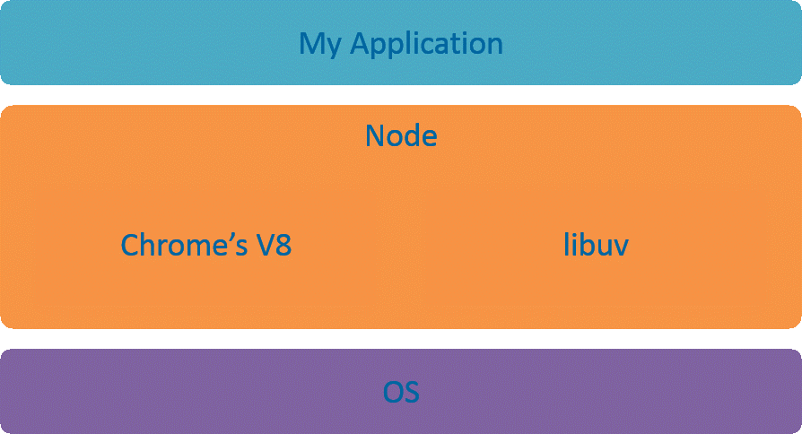
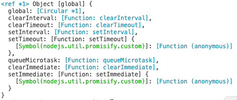

* Node.js 的架构如下：

  Node.js 运行环境的核心：V8 引擎 和 libuv 库

  * V8 引擎 ：编译和执行 JS 代码、管理内存、垃圾回收。V8 给 JS 提供了运行环境，可以说是 JS 的虚拟机。V8 引擎本身是用 C++ 写的。
  * libuv： libuv 是一个专注于异步 I/O 的跨平台类库，目前主要在 Node.js 上使用。它是 Node.js 最初的作者 Ryan Dahl 为 Node.js 写的底层类库，也可以称之为虚拟机。libuv 本身是用 C 写的。

* Node.js 是 JavaScript 在服务器端的运行环境，在这个意义上，Node.js 的地位其实就是 JavaScript 在服务器端的虚拟机，类似于 Java 语言中的 Java 虚拟机。

  在 Node.js 里运行 JavaScript，跟在 Chrome 里运行 JavaScript 有什么不同？二者采用的是同样的 JS 引擎。在 Node.js 里写 JS，和在前端写 JS，几乎没有不同。在写法上的区别在于：Node.js 没有浏览器、页面标签相关的 API，但是新增了一些 Node.js 相关的 API。通俗来说，对于开发者而言，在前端写 JS 是用于控制浏览器；而 Node.js 环境写 JS 可以控制整个计算机。

  我们知道，JavaScript 的组成分为三个部分：ECMAScript；DOM：标签元素相关的API；BOM：浏览器相关的API。ECMAScript 是 JS 的语法；DOM 和 BOM 浏览器端为 JS 提供的 API。而 Node.js 的组成分为：ECMAScript，ECMAScript 的所有语法在 Node 环境中都可以使用；Node 环境提供的一些附加 API(包括文件、网络等相关的 API)。

  Node.js 内部采用 Google Chrome 的 V8 引擎，作为 JavaScript 语言解释器；同时结合自行开发的 libuv 库，扩展了 JS 在后端的能力（比如 I/O 操作、文件读写、数据库操作等）。使得 JS 既可以在前端进行 DOM 操作（浏览器前端），又可以在后端调用操作系统资源，是目前最简单的全栈式语言。

* 客户端渲染（CSR / Client side render）：前端通过一大堆接口请求数据，然后通过 JS 动态处理和生成页面结构和展示。优点是前后端分离、减小服务器压力、局部刷新。缺点是不利于 SEO（如果你的页面然后通过 Ajax 异步获取内容，抓取工具并不会等待异步完成后再行抓取页面内容）、首屏渲染慢。

  服务端渲染（SSR / Server Side Render）：服务器返回的不是接口数据，而是一整个页面（或整个楼层）的 HTML 字符串，浏览器直接显示即可。也就是说，在服务器端直接就渲染好了，然后一次性打包返回给前端。优点是有利于 SEO、首屏渲染很快。

  总结： 搜索引擎优化 + 首屏速度优化 = 服务端渲染。

* Node.js 的特点：

  * 异步、非阻塞 IO 模型
  * 事件循环
  * 单线程

  总结：轻量和高效

  Node.js 的性能和效率非常高。传统的 Java 语言是一个请求开启一个线程，当请求处理完毕后就关闭这个线程。而 Node.js 则完全没有采用这种模型，它本质上就是一个单线程。你可能会疑问：一个线程如何服务于大量的请求、如何处理高并发的呢？这是因为，Node.js 采用的是异步的、非阻塞的模型。

  这里所谓的“单线程”，指的是 Node 的主线程只有一个。为了确保主线程不被阻塞，主线程是用于接收客户端请求。但不会处理具体的任务。而 Node 的背后还有一个线程池，线程池会处理长时间运行的任务（比如 IO 操作、网络操作）。线程池里的任务是通过队列和事件循环的机制来执行。

  使用 Node.js 时的劣势：

  * 程序运行不稳定，可能会出现服务不可用的情况
  * 程序运行效率较低，每秒的请求数维持在一个较低的水平

* NodeJS全局对象

  * global：类似于客户端 JavaScript 运行环境中的 window。
  * process：用于获取当前的 Node 进程信息，一般用于获取环境变量之类的信息。
  * console：Node 中内置的 console 模块，提供操作控制台的输入输出功能，常见使用方式与客户端类似。

* 开发环境配置

  * 通过 Node.js 安装包（不推荐）

    Node.js 版本常识，偶数版本为稳定版（0.6.x ，0.8.x ，8.10.x）奇数版本为非稳定版（0.7.x ，0.9.x ，9.11.x），LTS（Long Term Support）

  * 通过 NVM（推荐）

    NVM：node.js version manager，用来管理 node 的版本。我们可以先安装 NVM，然后通过 NVM 安装 Node.js。

* NodeJS模块

  require方法用于加载模块。require 加载第三方包的机制：

  * 第三方包安装好后，这个包一般会存放在当前项目的 node_modules 文件夹中。我们找到这个包的 package.json 文件，并且找到里面的main属性对应的入口模块，这个入口模块就是这个包的入口文件。
  * 如果第三方包中没有找到package.json文件，或者package.json文件中没有main属性，则默认加载第三方包中的index.js文件。
  * 如果在 node_modules 文件夹中没有找到这个包，或者以上所有情况都没有找到，则会向上一级父级目录下查找node_modules文件夹，查找规则如上一致。
  * 如果一直找到该模块的磁盘根路径都没有找到，则会报错：can not find module xxx。

  Node.js中的模块分为三种：

  * 内置模块。常见的内置模块包括：FS：文件系统模块；path：路径模块；OS：操作系统相关；net：网络相关；http。。。
  * 第三方模块
  * 自定义模块。每个文件就是一个模块，有自己的作用域。在一个文件里面定义的变量、函数、类，都是私有的，对其他文件不可见。