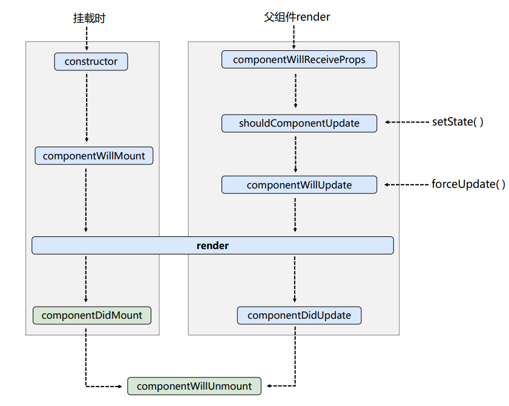
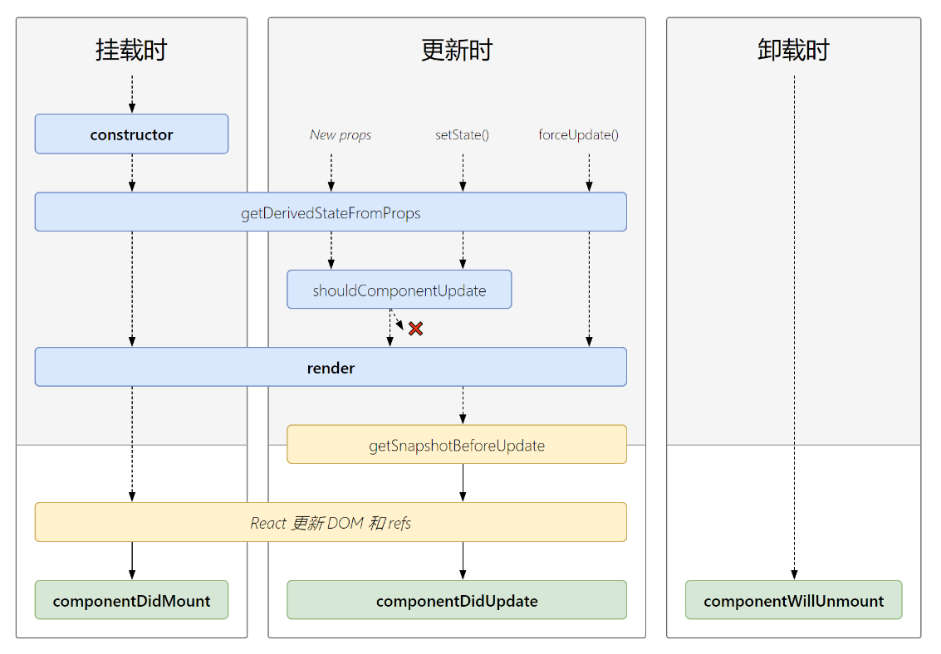
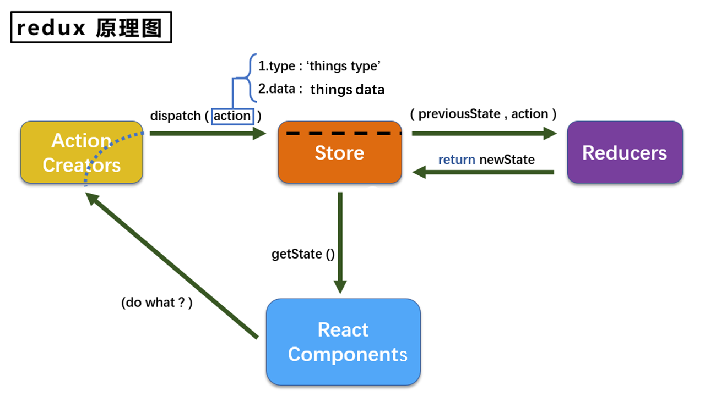

* 虚拟DOM

  问题描述：假设我们的数据发生一点点的变化，也会被强制重建整颗DOM树，这么做，会涉及到很多元素的重绘和重排，导致性能浪费严重。

  解决上述问题的思路：实现按需更新页面上的元素即可。也就是说，把 需要修改的元素，所对应的 DOM 元素重新构建；其他没有变化的数据，所对应的 DOM 节点不需要被强制更新。

  具体实现方案：（如何按需更新页面上的元素）只需要拿到页面更新前的 内存中的DOM树，同时再拿到 页面更新前的 新渲染出来的 内存DOM树；然后，对比这两颗新旧DOM树，找到那些需要被重新创建和修改的元素即可。这样就能实现 DOM 的按需更新。

  如何拿到这两棵DOM树：（即：如何从浏览器的内存住哪个获取到 浏览器私有的那两颗DOM树？）如果要拿到浏览器私有的DOM树，那我们必须调用浏览器提供的相关JS的API才行。但是问题来了，浏览器并没有提供这样的API。既然如此，那我们可以自己模拟这两颗 新旧DOM树。

  如何自己模拟这两颗 新旧DOM树：（即：如何自己模拟一个DOM节点？）这里涉及到手动模拟DOM树的原理：使用 JS 创建一个对象，用和这个对象来模拟每一个DOM节点；然后在每个DOM节点中，又提供了类似于 children 这样的属性来描述当前DOM的子节点。这样的话，当DOM节点形成了嵌套关系，就模拟出了一颗 DOM 树。

  总结：虚拟DOM的本质：使用 JS 对象模拟DOM树。虚拟DOM的目的：为了实现 DOM 节点的高效更新。

* diff算法

  怎么实现 两颗新旧DOM树的对比 呢？这里就涉及到了 diff算法。常见的 diff算法如下：

  * tree diff：新旧DOM树，逐层对比的方式，就叫做 tree diff。每当我们从前到后，把所有层的节点对比完后，必然能够找到那些 需要被更新的元素。
  * component diff：在对比每一层的时候，组件之间的对比，叫做 component diff。当对比组件的时候，如果两个组件的类型相同，则暂时认为这个组件不需要被更新，如果组件的类型不同，则立即将旧组件移除，新建一个组件，替换到被移除的位置。
  * element diff：在组件中，每个元素之间也要进行对比，那么，元素级别的对比，叫做 element diff。
  * key：key这个属性，可以把 页面上的 DOM节点 和 虚拟DOM中的对象，做一层关联关系。

* React 环境搭建，为了通过 React 写一个Hello World程序，我们需要先安装几个包：

  * react.js: React的核心库。这个包，是专门用来创建React组件、组件生命周期等。
  * react-dom.js: 操作DOM的扩展库。这个包，主要封装了和 DOM 操作相关的包（比如，把组件渲染到页面上）。
  * babel.min.js: 将 JSX语法 解析为 纯JS语法代码。

* 创建虚拟DOM的两种方式

  * 纯JS方式(一般不用)
  * JSX方式

  React提供了一些API来创建一种 “特别” 的一般js对象：const VDOM = React.createElement('xx',{id:'xx'},'xx')，上面创建的就是一个简单的虚拟DOM对象
  虚拟DOM对象最终都会被React转换为真实的DOM，我们编码时基本只需要操作react的虚拟DOM相关数据, react会转换为真实DOM变化而更新界。

* JSX全称:  JavaScript XML。react定义的一种类似于XML的JS扩展语法: JS + XML本质是React.createElement(component, props, ...children)方法的语法糖。作用: 用来简化创建虚拟DOM 

  写法：var ele = <h1>Hello JSX!</h1>；注意：它不是字符串, 也不是HTML/XML标签；它最终产生的就是一个JS对象。标签名任意，标签属性任意。

  基本语法

  * 在 JSX内部 写 JS代码：如果要在 JSX 语法内部，书写 JS 代码，那么，所有的JS代码必须写到 {} 的内部。在{}内部，可以写任何符合JS规范的代码。

  * 当编译引擎在编译JSX代码的时候，如果遇到了<，会把它当作 HTML代码 去编译；如果遇到了 {}， 会把方括号里面的代码当作 普通JS代码 去编译。

  * 在JSX中，如果要为元素添加class属性，则必须写成className，因为 class在ES6中是一个关键字；和class类似，label标签的 for 属性需要替换为 htmlFor。

  * 在JSX创建DOM的时候，所有的节点，必须有唯一的根元素进行包裹（也就是加一层div）。

  * 如果要写注释，注释必须放到 {} 内部。

    ```html
    <!DOCTYPE html>
    <html lang="">
      <head>
        <meta />
        <meta />
        <meta />
        <title>Document</title>
      </head>
      <body>
        <!-- 引入React相关的js库 -->
        <script type="text/javascript" src="./libs/react.js"></script>
        <script type="text/javascript" src="./libs/react-dom.js"></script>
        <script type="text/javascript" src="./libs/babel.min.js"></script>
    
        <div id="app"></div>
    
        <!-- 注意，这一行的 type 是写 "text/babel"，而不是 "text/javascript" -->
        <script type="text/babel">
          //页面中的真实容器元素
          var containDiv = document.getElementById("app");
    
          var arr = []
          for (var i = 0; i < 6; i++) {
            var p = <p className="myp" key={i}>这个是p标签</p>  // 注意这个地方的写法： key = {i}
            arr.push(p)
          }
    
          //1、使用JSX语法 创建虚拟DOM对象
          var vDom = (
            <div>
              Hello, React!
                {arr}
            </div>
          );
    
          //2、渲染虚拟DOM对象
          ReactDOM.render(vDom, containDiv); // 参数1：虚拟DOM对象；参数2：页面中的容器
        </script>
      </body>
    </html>
    ```

* 创建组件

  组件名必须首字母大写

  虚拟DOM元素只能有一个根元素

  虚拟DOM元素必须有结束标签

  * 创建组件的第一种方式：函数式组件

    在React中，构造函数就是一个最基本的组件。如果想要把组件放到页面中，可以把构造函数的名称当作组件的名称，以 HTML标签形式引入页面中即可。

    ```html
    <!DOCTYPE html>
    <html lang="">
      <head>
        <meta />
        <meta />
        <meta />
        <title>Document</title>
      </head>
      <body>
        <!-- 引入React相关的js库 -->
        <script type="text/javascript" src="./libs/react.js"></script>
        <script type="text/javascript" src="./libs/react-dom.js"></script>
        <script type="text/javascript" src="./libs/babel.min.js"></script>
    
        <div id="app"></div>
    
        <!-- 注意，这一行的 type 是写 "text/babel"，而不是 "text/javascript" -->
        <script type="text/babel">
          // 父组件中的数据
          var person = {
            name: "qianguyihao",
            age: 27,
            gender: "男",
            address: "深圳"
          };
    
    	  // 在子组件中，如果想要使用外部传递过来的数据，必须显示的在 构造函数参数列表中，定义 props 属性来接收
    	  // 通过 props 得到的任何数据都是只读的，不能重新赋值
          function Hello(props) {
            return (
              <div>
                <h3>这是 Hello子组件 中定义的元素： {props.name}</h3>
              </div>
            );
          }
    
          ReactDOM.render(
          	<!-- 注意：这里的 ...Obj 语法，是 ES6中的属性扩散，表示：把这个对象上的所有属性，展开了，放到这个位置 -->
            <div>
              <Hello {...person}> </Hello>
            </div>,
            document.getElementById("app")
          );
        </script>
      </body>
    </html>
    ```

    Hook：Hook是React 16.8.0版本增加的新特性/新语法，可以让你在函数组件中使用 state 以及其他的 React 特性

    六个常用的Hook

    * State Hook

      State Hook让函数组件也可以有state状态, 并进行状态数据的读写操作，class组件中this.setState更新是state是合并， useState中setState是替换。

      语法: const [xxx, setXxx] = React.useState(initValue)，useState()说明：参数: 第一次初始化指定的值在内部作缓存；返回值: 包含2个元素的数组, 第1个为内部当前状态值, 第2个为更新状态值的函数

      setXxx()2种写法:

      * setXxx(newValue): 参数为非函数值, 直接指定新的状态值, 内部用其覆盖原来的状态值
      * setXxx(value => newValue): 参数为函数, 接收原本的状态值, 返回新的状态值, 内部用其覆盖原来的状态值

    * Effect Hook

      Effect Hook 可以让你在函数组件中执行副作用操作(用于模拟类组件中的生命周期钩子)

      React中的副作用操作：发ajax请求数据获取；设置订阅 / 启动定时器；手动更改真实DOM

      语法和说明: 

      ```javascript
           useEffect(() => { 
             // 在此可以执行任何带副作用操作
             return () => { // 在组件卸载前执行
               // 在此做一些收尾工作, 比如清除定时器/取消订阅等
             }
           }, [stateValue]) // 仅在指定的state更新时执行，如果指定的是[], 回调函数只会在第一次render()后执行
      可以把 useEffect Hook 看做如下三个函数的组合
           componentDidMount()
           componentDidUpdate()
       	componentWillUnmount() 
      ```

    * Context Hook：跨组件共享数据

      React.createContext();创建一个TestContext对象，TestContext.Provider包裹子组件，数据放在<TestContext.Provider value={value}>的value中，子组件中通过useContext(TestContext)获取值，但在TestContext中的共享数据只要发生变化，子组件都会重新渲染，子组件如果并没有绑定数据，不希望他做无意义的渲染，可以使用React.memo解决

      ```jsx
      import React, { useContext, useState } from 'react';
      const TestContext = React.createContext();
      const Parent = () => {
          const [value, setValue] = useState(0);
          return (
              <div>
                  {(() => console.log("Parent-render"))()}
                  <button onClick={() => setValue(value + 1)}>value + 1</button>
                  <TestContext.Provider value={value}>
                      <Child1 />
                      <Child2 />
                  </TestContext.Provider>
              </div>
          );
      }
      const Child1 = () => {
          const value = useContext(TestContext);
          return (
              <div>
                  {(() => console.log('Child1-render'))()}
                  <h3>Child1-value: {value}</h3>
              </div>
          );
      }
      const Child2 = React.memo(() => {
          return (
              <div>
                  {(() => console.log('Child2-render'))()}
                  <h3>Child2</h3>
              </div>
          );
      });
      ```

    * Callback Hook：性能优化

      useCallback返回的是一个 memoized（缓存）函数，在依赖不变的情况下,多次定义的时候,返回的值是相同的，他的实现原理是当使用一组参数初次调用函数时，会缓存参数和计算结果，当再次使用相同的参数调用该函数时，会直接返回相应的缓存结果。

      useCallback返回的是一个memoized回调函数，仅在其中绑定的一个依赖项变化后才更改可防止不必要的渲染，在跨组件共享数据中举例的事件是在父组件中点击触发，而现在是使用状态提升，在父组件中传递方法供子组件调用，每次render时函数也会变化，导致子组件重新渲染，上面例子useCallback将函数进行包裹，依赖值未发生变化时会返回缓存的函数，配合React.memo即可优化无意义的渲染。

      ```jsx
      import React, { useState, useCallback, memo } from 'react';
      const Parent = () => {
          const [value1, setValue1] = useState(0);
          const [value2, setValue2] = useState(0);
          const handleClick1 = useCallback(()=> {
              setValue1(value1 + 1);
          }, [value1]);
          const handleClick2 = useCallback(()=> {
              setValue2(value2 + 1);
          }, [value2]);
          return (
              <>
                  {(() => console.log("Parent-render"))()}
                  <h3>{value1}</h3>
                  <h3>{value2}</h3>
                  <Child1 handleClick1={handleClick1} />
                  <Child2 handleClick2={handleClick2} />
              </>
          );
      }
      const Child1 = memo(props => {
          return (
              <div>
                  {(() => console.log("Child1-render"))()}
                  <button onClick={() => props.handleClick1()}>value1 + 1</button>
              </div>
          );
      });
      const Child2 = memo(props => {
          return (
              <div>
                  {(() => console.log("Child2-render"))()}
                  <button onClick={() => props.handleClick2()}>value2 + 1</button>
              </div>
          );
      });
      export default Parent
      ```

    * Memo Hook：性能优化

      传入 useMemo 的函数会在渲染期间执行(useCallback同理)，所以使用useMemo就能解决DOM改变的时候，控制某些函数不被触发。不要在useMemo这个函数内部执行与渲染无关的操作，诸如副作用这类的操作属于 useEffect 的适用范畴，而不是 useMemo

      useMemo和useCallback的共同点：

      * 接收的参数都是一样的，第一个是回调函数，第二个是依赖的数据
      * 它们都是当依赖的数据发生变化时才会重新计算结果，起到了缓存作用

      useMemo和useCallback的区别：

      * useMemo计算结果是return回来的值，通常用于缓存计算结果的值
      * useCallback计算结果是一个函数，通常用于缓存函数

      ```jsx
      import React, { useState, useMemo } from 'react'
      const Test = ()=> {
          const [value, setValue] = useState(0);
          const [count, setCount] = useState(1);
          const getDoubleCount = useMemo(() => {
              console.log('getDoubleCount进行计算了');
              return count * 2;
          },[count]);
          return (
              <div>
                  <h2>value: {value}</h2>
                  <h2>doubleCount: {getDoubleCount}</h2>
                  <button onClick={() => setValue(value + 1)}>value+1</button>
              </div>
          )
      }
      export default Test
      ```

    * Ref Hook：Ref Hook可以在函数组件中存储/查找组件内的标签或任意其它数据

      语法：const refContainer = useRef()

      作用：保存标签对象,功能与React.createRef()一样，useRef就像一个储物箱，你可以随意存放任何东西，再次渲染时它会去储物箱找，createRef每次渲染都会返回一个新的引用，而useRef每次都会返回相同的引用。

    * Reducer Hook：整合逻辑

      useReducer可以把它理解为一个轻量的redux。useReducer 返回一个状态对象和一个可以改变状态对象的dispatch函数。跟redux类似的，dispatch函数接受action作为参数，action包含type和payload属性。

      ```jsx
      const dataFetchReducer = (state, action) => {
        switch (action.type) {
          case 'FETCH_INIT':
            return {
              ...state,
              isLoading: true,
              isError: false
            };
          case 'FETCH_SUCCESS':
            return {
              ...state,
              isLoading: false,
              isError: false,
              data: action.payload,
            };
          case 'FETCH_FAILURE':
            return {
              ...state,
              isLoading: false,
              isError: true,
            };
          default:
            throw new Error();
        }
      };
      
      const useDataApi = (initialUrl, initialData) => {
        const [url, setUrl] = useState(initialUrl);
       
        const [state, dispatch] = useReducer(dataFetchReducer, {
          isLoading: false,
          isError: false,
          data: initialData,
        });
       
        useEffect(() => {
          // didCancel变量，如果这个变量为true，不会再发送dispatch，也不会再执行设置状态这个动作。这里我们在useEffe的返回函数中将didCancel置为true，在卸载组件时会自动调用这段逻辑。也就避免了再卸载的组件上设置状态。
          let didCancel = false;
       
          const fetchData = async () => {
            dispatch({ type: 'FETCH_INIT' });
       
            try {
              const result = await axios(url);
       
              if (!didCancel) {
                dispatch({ type: 'FETCH_SUCCESS', payload: result.data });
              }
            } catch (error) {
              if (!didCancel) {
                dispatch({ type: 'FETCH_FAILURE' });
              }
            }
          };
        fetchData();
       
          return () => {
            didCancel = true;
          };
        }, [url]);
       
        const doFetch = url => {
          setUrl(url);
        };
       
        return { ...state, doFetch };
      };
      ```

  * 创建组件的第二种方式：类式组件

    使用 class 创建的类，通过 extends 关键字，继承 React.Component 之后，这个类，就是一个组件的模板了。如果想要引用这个组件，可以把类的名称以标签的形式，导入到 JSX 中使用。在 class 实现的组件内部，必须定义一个 render 函数。在 render 函数中，还必须 return 一个东西，如果没有什么需要被return 的，则需要 return null。渲染类组件标签的基本流程：

    * React内部会创建组件实例对象
    * 调用render()得到虚拟DOM, 并解析为真实DOM
    * 插入到指定的页面元素内部

    ```html
    <!DOCTYPE html>
    <html lang="">
      <head>
        <meta />
        <meta />
        <meta />
        <title>Document</title>
      </head>
      <body>
        <!-- 引入React相关的js库 -->
        <script type="text/javascript" src="./libs/react.js"></script>
        <script type="text/javascript" src="./libs/react-dom.js"></script>
        <script type="text/javascript" src="./libs/babel.min.js"></script>
    
        <div id="app"></div>
    
        <!-- 注意，这一行的 type 是写 "text/babel"，而不是 "text/javascript" -->
        <script type="text/babel">
          // 使用 class 创建的类，通过 extends 关键字，继承 `React.Component` 之后，这个类，就是一个组件的模板了。
          // 如果想要引用这个组件，可以把类的名称以**标签的形式**，导入到 JSX 中使用。
          class Hello2 extends React.Component {
            constructor(props) {
              super(props);
              console.log(props.name);
    
              // 注意：`this.state` 是固定写法，表示当前组件实例的私有数据对象，就好比 vue 中，组件实例身上的 data(){ return {} } 函数
              // 如果想要使用 组件中 state 上的数据，直接通过 this.state.*** 来访问即可
              this.state = {
                msg: "这是 Hello2 组件的私有msg数据",
                info: "永不止步"
              };
            }
            // 在 class 实现的组件内部，必须定义一个 render 函数
            render() {
              // 在 render 函数中，还必须 return 一个东西，如果没有什么需要被return 的，则需要 return null
              return (
                <div>
                  <h3>这是使用 class 类创建的组件 </h3>
                </div>
              );
            }
          }
    
          ReactDOM.render(
            <div>
              <Hello2 name="qianguyihao"> </Hello2>
            </div>,
            document.getElementById("app")
          );
        </script>
      </body>
    </html>
    ```

    类式组件三大核心属性

    * state

      state是组件对象最重要的属性, 值是对象(可以包含多个key-value的组合)；组件被称为"状态机", 通过更新组件的state来更新对应的页面显示(重新渲染组件)

      强烈注意：

      * 组件中render方法中的this为组件实例对象
      * 组件自定义的方法中this为undefined，如何解决？
        * 强制绑定this: 通过函数对象的bind()
        * 箭头函数

      状态数据，不能直接修改或更新，使用setState，setState更新状态的2种写法

      * setState(stateChange, [callback])------对象式的setState
        * stateChange为状态改变对象(该对象可以体现出状态的更改)
        * callback是可选的回调函数, 它在状态更新完毕、界面也更新后(render调用后)才被调用
      * setState(updater, [callback])------函数式的setState
        * updater为返回stateChange对象的函数。
        * updater可以接收到state和props。
        * callback是可选的回调函数, 它在状态更新、界面也更新后(render调用后)才被调用。

      总结:

      * 对象式的setState是函数式的setState的简写方式(语法糖)
      * 使用原则：
        * 如果新状态不依赖于原状态 ===> 使用对象方式
        * 如果新状态依赖于原状态 ===> 使用函数方式
        * 如果需要在setState()执行后获取最新的状态数据, 要在第二个callback函数中读取

    * props

      每个组件对象都会有props(properties的简写)属性，组件标签的所有属性都保存在props中。

      作用：通过标签属性从组件外向组件内传递变化的数据，注意: 组件内部不要修改props数据

      编码操作：

      * 内部读取某个属性值：this.props.name
      * 对props中的属性值进行类型限制和必要性限制：使用prop-types库进限制（需要引入prop-types库）
      * 扩展属性: 将对象的所有属性通过props传递：<Person {...person}/>
      * 默认属性值：Person.defaultProps = {age: 18,sex:'男'}
      * 组件类的构造函数：constructor(props){super(props);console.log(props)//打印所有属性}

    * refs与事件处理

      组件内的标签可以定义ref属性来标识自己

      编码：

      * 字符串形式的ref：<input ref="input1"/>
      * 回调形式的ref：<input ref={(c)=>{this.input1 = c}}/>
      * createRef创建ref容器：myRef = React.createRef();<input ref={this.myRef}/>

      事件处理

      * 通过onXxx属性指定事件处理函数(注意大小写)
        * React使用的是自定义(合成)事件, 而不是使用的原生DOM事件
        * React中的事件是通过事件委托方式处理的(委托给组件最外层的元素)
      * 通过event.target得到发生事件的DOM元素对象

    表单的组件分类：

    * 受控组件：渲染表单的 React 组件还控制着用户输入过程中表单发生的操作。被 React 以这种方式控制取值的表单输入元素就叫做“受控组件”。在一个受控组件中，表单数据是由 React 组件来管理的。
    * 非受控组件：表单数据将交由 DOM 节点来处理。

    类式组件的生命周期：

    * 组件从创建到死亡它会经历一些特定的阶段。

    * React组件中包含一系列勾子函数(生命周期回调函数), 会在特定的时刻调用。

    * 我们在定义组件时，会在特定的生命周期回调函数中，做特定的工作

      生命周期流程图(旧)

      * 初始化阶段: 由ReactDOM.render()触发---初次渲染
        * constructor()
        * componentWillMount()
        * render()
        * componentDidMount()
      * 更新阶段: 由组件内部this.setSate()或父组件重新render触发
        * shouldComponentUpdate()
        * componentWillUpdate()
        * render()
        * componentDidUpdate()
      * 卸载组件: 由ReactDOM.unmountComponentAtNode()触发
        * componentWillUnmount()

      生命周期流程图(新)

      重要的勾子

      * render：初始化渲染或更新渲染调用
      * componentDidMount：开启监听, 发送ajax请求
      * componentWillUnmount：做一些收尾工作, 如: 清理定时器

      即将废弃的勾子：现在使用会出现警告，下一个大版本需要加上UNSAFE_前缀才能使用，以后可能会被彻底废弃，不建议使用。

      * componentWillMount
      * componentWillReceiveProps
      * componentWillUpdate

* Fragment，使用<Fragment><Fragment> 或 <></>，作用：可以不用必须有一个真实的DOM根标签了


* lazyLoad

  ```javascript
  路由组件的lazyLoad
  	//1.通过React的lazy函数配合import()函数动态加载路由组件 ===> 路由组件代码会被分开打包
  	const Login = lazy(()=>import('@/pages/Login'))
  	//2.通过<Suspense>指定在加载得到路由打包文件前显示一个自定义loading界面
  	<Suspense fallback={<h1>loading.....</h1>}>
          <Switch>
              <Route path="/xxx" component={Xxxx}/>
              <Redirect to="/login"/>
          </Switch>
      </Suspense>
  ```

* Context：一种组件间通信方式, 常用于【祖组件】与【后代组件】间通信

  使用：

  * 创建Context容器对象：const XxxContext = React.createContext()  

  * 渲染子组时，外面包裹xxxContext.Provider, 通过value属性给后代组件传递数据：

    ```html
    <xxxContext.Provider value={数据}>
    	子组件
    </xxxContext.Provider>
    ```

  * 后代组件读取数据：

    ```html
    //第一种方式:仅适用于类组件 
      static contextType = xxxContext  // 声明接收context
      this.context // 读取context中的value数据
    //第二种方式: 函数组件与类组件都可以
      <xxxContext.Consumer>
        {
          value => ( // value就是context中的value数据
            要显示的内容
          )
        }
      </xxxContext.Consumer>
    ```

  注意：在应用开发中一般不用context, 一般都用它的封装react插件

* 组件优化

  Component的2个问题 

  * 只要执行setState(),即使不改变状态数据, 组件也会重新render() ==> 效率低
  * 只当前组件重新render(), 就会自动重新render子组件，纵使子组件没有用到父组件的任何数据 ==> 效率低

  效率高的做法：只有当组件的state或props数据发生改变时才重新render()

  原因：Component中的shouldComponentUpdate()总是返回true

  解决：

  * 重写shouldComponentUpdate()方法，比较新旧state或props数据, 如果有变化才返回true, 如果没有返回false
  * 使用PureComponent，PureComponent重写了shouldComponentUpdate(), 只有state或props数据有变化才返回true

  注意：只是进行state和props数据的浅比较, 如果只是数据对象内部数据变了, 返回false；不要直接修改state数据, 而是要产生新数据；项目中一般使用PureComponent来优化

* render props

  如何向组件内部动态传入带内容的结构(标签)?

  * Vue中：使用slot技术, 也就是通过组件标签体传入结构  <A><B/></A>

  * React中：

    * 使用children props: 通过组件标签体传入结构

      ```html
      	<A>
      	  <B>xxxx</B>
      	</A>
      	{this.props.children}
      	问题: 如果B组件需要A组件内的数据, ==> 做不到 
      ```

    * 使用render props: 通过组件标签属性传入结构,而且可以携带数据，一般用render函数属性

      ```html
      <A render={(data) => <C data={data}></C>}></A>
      	A组件: {this.props.render(内部state数据)}
      	C组件: 读取A组件传入的数据显示 {this.props.data} 
      ```

* 错误边界(Error boundary)：用来捕获后代组件错误，渲染出备用页面

  特点：只能捕获后代组件生命周期产生的错误，不能捕获自己组件产生的错误和其他组件在合成事件、定时器中产生的错误

  使用方式：getDerivedStateFromError配合componentDidCatch

  ```javascript
  // 生命周期函数，一旦后台组件报错，就会触发
  static getDerivedStateFromError(error) {
      console.log(error);
      // 在render之前触发
      // 返回新的state
      return {
          hasError: true,
      };
  }
  
  componentDidCatch(error, info) {
      // 统计页面的错误。发送请求发送到后台去
      console.log(error, info);
  }
  ```

* 组件通信方式总结

  组件间的关系：父子组件，兄弟组件（非嵌套组件），祖孙组件（跨级组件）

  几种通信方式：

  * props：children props 和 render props
  * 消息订阅-发布：pubs-sub、event等等
  * 集中式管理：redux、dva等等
  * conText：生产者-消费者模式

  比较好的搭配方式：

  * 父子组件：props
  * 兄弟组件：消息订阅-发布、集中式管理
  * 祖孙组件(跨级组件)：消息订阅-发布、集中式管理、conText(开发用的少，封装插件用的多)

* SPA：单页Web应用（single page web application，SPA）；整个应用只有一个完整的页面，点击页面中的链接不会刷新页面，只会做页面的局部更新，数据都需要通过ajax请求获取, 并在前端异步展现。

* 什么是路由？一个路由就是一个映射关系(key:value)，key为路径, value可能是function或component

  路由分类：

  * 后端路由：value是function, 用来处理客户端提交的请求。router.get(path, function(req, res))，工作过程：当node接收到一个请求时, 根据请求路径找到匹配的路由, 调用路由中的函数来处理请求, 返回响应数据
  * 前端路由：浏览器端路由，value是component，用于展示页面内容。注册路由: <Route path="/test" component={Test}>，工作过程：当浏览器的path变为/test时, 当前路由组件就会变为Test组件

* redux：一个专门用于做状态管理的JS库(不是react插件库)。它可以用在react, angular, vue等项目中, 但基本与react配合使用，作用: 集中式管理react应用中多个组件共享的状态。

  redux的三个核心概念

  * action：动作的对象，例子：{ type: 'ADD_STUDENT',data:{name: 'tom',age:18} }

    包含2个属性

    * type：标识属性, 值为字符串, 唯一, 必要属性
    * data：数据属性, 值类型任意, 可选属性

  * reducer：用于初始化状态、加工状态。加工时，根据旧的state和action， 产生新的state的纯函数。

  * store：将state、action、reducer联系在一起的对象

    ```javascript
    如何得到此对象?
    import {createStore} from 'redux'
    import reducer from './reducers'
    const store = createStore(reducer)
    
    此对象的功能?
    getState(): 得到state
    dispatch(action): 分发action, 触发reducer调用, 产生新的state
    subscribe(listener): 注册监听, 当产生了新的state时, 自动调用
    ```

  react-redux：一个react插件库，专门用来简化react应用中使用redux

  react-Redux将所有组件分成两大类

  * UI组件
    * 只负责 UI 的呈现，不带有任何业务逻辑
    * 通过props接收数据(一般数据和函数)
    * 不使用任何 Redux 的 API
    * 一般保存在components文件夹下
  * 容器组件
    * 负责管理数据和业务逻辑，不负责UI的呈现
    * 使用 Redux 的 API
    * 一般保存在containers文件夹下

