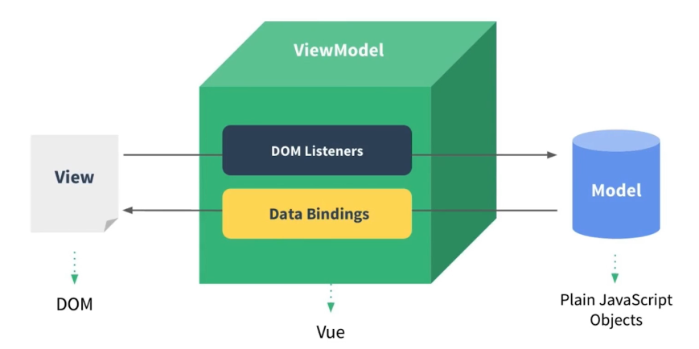

* 在Vue中，一个核心的概念就是：数据驱动，避免手动操作DOM元素。这样的话，可以让前端程序员可以更多的时间去关注数据的业务逻辑，而不是关心 DOM 是如何渲染的了。

* Vue的系统指令

  * 插值表达式 {{}}

    数据绑定最常见的形式就是使用 “Mustache” 语法（双大括号）的文本插值。例如：\<span>Message: {{ msg }}\</span>，Mustache 标签将会被替代为对应数据对象上 msg 属性（msg定义在data对象中）的值。 无论何时，绑定的数据对象上 msg 属性发生了改变，插值处的内容都会自动更新。
    {{}}对JavaScript 表达式支持，但是有个限制就是，每个绑定都只能包含单个表达式

  * v-cloak

    保持和元素实例的关联，直到结束编译后自动消失。

    v-cloak指令和CSS 规则一起用的时候，能够解决差值表达式闪烁的问题（即：可以隐藏未编译的标签直到实例准备完毕）。比如说，插值表达式{{name}}中的name内容，在网速很慢的情况下，一开始会直接显示{{name}}这个内容，等网络加载完成了，才会显示对应的值。那这个闪烁的问题该怎么解决呢？解决办法是：通过v-cloak隐藏{{name}}这个内容，当加载完毕后，再显示出来。

    ```html
    <!DOCTYPE html>
    <html lang="en">
    <head>
      <meta charset="UTF-8">
      <title>Document</title>
      <style>
        /*2、在样式表里设置：只要是有 v-cloak 属性的标签，我都让它隐藏。
        直到 Vue实例化完毕以后，v-cloak 会自动消失，那么对应的css样式就会失去作用，最终将span中的内容呈现给用户 */
        [v-cloak] {
          display: none;
        }
      </style>
    </head>
    <body>
      <div id="app">
        <!-- 1、给 span 标签添加 v-cloak 属性 -->
        <span v-cloak>{{name}}</span>
      </div>
    </body>
    <script src="vue2.5.16.js"></script>
    <script>
      new Vue({
        el: '#app',
        data: {
          name: 'smyhvae'
        }
      });
    </script>
    </html>
    ```

  * v-text

    v-text可以将一个变量的值渲染到指定的元素中。

    插值表达式和 v-text 的区别

    * v-text 没有闪烁的问题，因为它是放在属性里的。
    * 插值表达式只会替换自己的这个占位符，并不会把整个元素的内容清空。v-text 会覆盖元素中原本的内容。

  * v-html

    v-text是纯文本，而v-html会被解析成html元素。

    注意：使用v-html渲染数据可能会非常危险，因为它很容易导致 XSS（跨站脚本） 攻击，使用的时候请谨慎，能够使用{{}}或者v-text实现的不要使用v-html。

  * v-bind

    v-bind：用于绑定属性。比如说：

    ```html
    
    <div v-bind:style="{ fontSize: size + 'px' }"></div>
    或
    
    <div :style="{ fontSize: size + 'px' }"></div>
    ```

    上方代码中，给属性加了 v-bind 之后，属性值里的整体内容是表达式，属性值里的imageSrc和size是Vue实例里面的变量。也就是说， v-bind的属性值里，可以写合法的 js 表达式。属性值的写法如下面两种例子所示

    Vue中通过属性绑定为元素设置class 类样式

    * 直接传递一个数组。
    * 在数组中使用三元表达式
    * 在数组中使用对象来代替三元表达式
    * 直接使用对象

    Vue中通过属性绑定为元素设置 style 行内样式

    * 直接在元素上通过 :style 的形式，书写样式对象
    * 将样式对象，定义到 data 中，并直接引用到 :style 中
    * 在 :style 中通过数组，引用多个 data 上的样式对象

  * v-on

    绑定事件，并提供了很多事件修饰符来辅助实现一些功能

    ```html
     <button v-on:click="change">改变name的值</button>
    可以简写成：
        <button @click="change">改变name的值</button>
    
     <!-- 阻止默认行为，没有表达式 -->
            <form @submit.prevent></form>
            <!--  串联修饰符 -->
            <button @click.stop.prevent="doThis"></button>
    ```

    既然.stop和.self都可以阻止冒泡，那二者有什么区别呢？区别在于：前者能够阻止整个冒泡行为，而后者只能阻止自己身上的冒泡行为

  * v-model

    我现在要做的是：我在<input>标签里修改内容，要求data里的name的值自动更新。从而实现双向数据绑定。该怎么做呢？这就可以利用v-model这个属性。

    区别：

    * v-bind：只能实现数据的单向绑定，从 M 自动绑定到 V。
    * v-model：只有v-model才能实现双向数据绑定。注意，v-model 后面不需要跟冒号
    * 注意：v-model 只能运用在表单元素中，或者用于自定义组件。常见的表单元素包括：input(radio, text, address, email....) 、select、checkbox 、textarea。

  * v-for

    * 普通数组的遍历
    * 对象数组的遍历
    * 对象的遍历
    * 遍历数字

    注意：在 Vue 2.2.0+ 版本里，当在组件中使用 v-for 时，key 属性是必须要加上的。这样做是因为：每次 for 循环的时候，通过指定 key 来标示当前循环这一项的唯一身份。当 Vue.js 用 v-for 正在更新已渲染过的元素列表时，它默认用 “就地复用” 策略。如果数据项的顺序被改变，Vue将不是移动 DOM 元素来匹配数据项的顺序， 而是简单复用此处每个元素，并且确保它在特定索引下显示已被渲染过的每个元素。为了给 Vue 一个提示，以便它能跟踪每个节点的身份，从而重用和重新排序现有元素，你需要为每项提供一个唯一 key 属性。key的类型只能是：string/number，而且要通过 v-bind 来指定。

  * v-if

    v-if：设置元素的显示和隐藏（添加/删除DOM元素）

    作用：根据表达式的值的真假条件，来决定是否渲染元素，如果为false则不渲染（达到隐藏元素的目的），如果为true则渲染。在切换时，元素和它的数据绑定会被销毁并重建

  * v-show

    v-show：设置元素的显示和隐藏（在元素上添加/移除style="display:none"属性）

    作用：根据表达式的真假条件，来切换元素的 display 属性。如果为false，则在元素上添加 display:none属性；否则移除display:none属性。

    v-if和v-show都能够实现对一个元素的隐藏和显示操作。

    v-if和v-show的区别：

    * v-if：每次都会重新添加/删除DOM元素
    * v-show：每次不会重新进行DOM的添加/删除操作，只是在这个元素上添加/移除style="display:none"属性，表示节点的显示和隐藏。
    * v-if：有较高的切换性能消耗。这个很好理解，毕竟每次都要进行dom的添加／删除操作。
    * v-show：有较高的初始渲染消耗。也就是说，即使一开始v-show="false"，该节点也会被创建，只是隐藏起来了。而v-if="false"的节点，根本就不会被创建。

    总结：

    * 如果元素涉及到频繁的切换，最好不要使用 v-if, 而是推荐使用 v-show
    * 如果元素可能永远也不会被显示出来被用户看到，则推荐使用 v-if

  * 注意事项

    在Vue的实例中，如果想要获取data里的属性、methods里面的方法，都要通过this来访问。这里的this指向的是Vue的实例对象。

    VM实例，会监听自己身上 data 中所有数据的改变，只要数据一发生变化，就会自动把最新的数据，从 data 上同步到页面中去。这样做 的好处是：程序员只需要关心数据，不需要考虑如何重新渲染DOM页面；减少DOM操作。

* 过滤器

  概念：Vue.js 允许我们自定义过滤器，可被用作一些常见的文本格式化。过滤器可以用在两个地方：mustache 插值表达式、 v-bind表达式。过滤器应该被添加在 JavaScript 表达式的尾部，由“管道”符指示。

* 自定义按键修饰符&自定义指令

* vue生命周期

  vue实例的生命周期：从Vue实例创建、运行、到销毁期间，总是伴随着各种各样的事件，这些事件，统称为生命周期。

  生命周期钩子：就是生命周期事件的别名而已。

  生命周期钩子 = 生命周期函数 = 生命周期事件。

* vue动画

* Vue组件的定义和注册

* vue组件之间的传值

  * props/$emit

    ⽗组件给⼦组件添加属性 :fatherName="name" 传值，⼦组件通过 props:['fatherName'] 接收； ⼦组件可以通过 this.$emit('changeFatherName','吴彦祖') 向⽗组件发送事件和数据， ⽗组件通过 @changeFatherName="changeFatherName" 监听事件和传递过来的数据。

  * provide/inject

    ⽗组件通过 provide:{fatherAge:30} 传值，⼦组件通过 inject:["fatherAge"] 接收, provide 传递的数据， 不仅所有⼦组件都可以接收，所有后代组件均可以通过 inject 接收到。

  * $children/$parent

    ⽗组件通过 $children 访问⼦组件属性和⽅法，⼦组件通过 $parent 访问⽗组件属性和⽅法，this.$children[0].age=2 修改⼦组件数据，同理 this.$parent.age=30 修改⽗组件数据。

  * ref/refs

    ⼦组件绑定ref属性，⽗组件通过 this.$refs['xxx'] 访问⼦组件，⽤法和 $children 相同； 本例中 this.$refs['son']===this.$children[0] //true

  * EventBus

    eventBus ⼜称为事件总线，在vue中可以使⽤它来作为沟通桥梁的概念, 就像是所有组件共⽤相同的事件中⼼， 可以向该中⼼注册发送事件或接收事件， 所有组件都可以通知其他组件。 （维护困难，eventName起名字困难，不易维护，不及时注销事件会产⽣各种问题，复杂项⽬中还是使⽤Vuex）

    ```js
    //新建⼀个Vue实例作为中央事件总线
    let EventBus = new Vue();
    //监听事件
    EventBus.$on('eventName', (val) => {
    //......do something
    });
    //触发事件
    EventBus.$emit('eventName', 'this is a message.');
    //移除事件
    EventBus.$off('eventName', {})
    ```

  * Vuex

* Vue-router路由

  后端路由，就是把所有url地址都对应到服务器的资源，这个对应关系就是路由。

  前端路由：就是SPA（单页应用）的路径管理器。

  对于单页面应用程序来说，主要通过URL中的hash（url地址中的#号）来实现不同页面之间的切换。同时，hash有一个特点：HTTP请求中不会包含hash相关的内容。所以，单页面程序中的页面跳转主要用hash实现。

  总结：在单页应用程序中，这种通过hash改变来切换页面的方式，称作前端路由（区别于后端路由）。

* vue2和vue3的区别

  * 项⽬⽬录结构

    vue-cli2.0与3.0在⽬录结构⽅⾯，有明显的不同，vue-cli3.0移除了配置⽂件⽬录config 和 build ⽂件夹，同时移除了 static 静态⽂件夹，新增了 public ⽂件夹，打开层级⽬录还会发现，index.html 移动到 public 中

  * 配置项

    3.0 config⽂件已经被移除，但是多了.env.production和env.development⽂件，除了⽂件位置，实际配置起来和2.0没什么不同，没了config⽂件，跨域需要配置域名时，从config/index.js 挪到了vue.config.js中，配置⽅法不变

  * 渲染

    Vue2.x使⽤的Virtual Dom实现的渲染，Vue3.0不论是原⽣的html标签还是vue组件，他们都会通过h函数来判断，如果是原⽣html标签，在运⾏时直接通过Virtual Dom来直接渲染，同样如果是组件会直接⽣成组件代码

  * 数据监听

    Vue2.x⼤家都知道使⽤的是es5的object.defineproperties中getter和setter实现的，⽽vue3.0的版本，是基于Proxy进⾏监听的，其实基于proxy监听就是所谓的lazy by default，什么意思呢，就是只要你⽤到了才会监听，可以理解为‘按需监听’，官⽅给出的诠释是：速度加倍，同时内存占⽤还减半。

  * 按需引⼊

    Vue2.x中new出的实例对象，所有的东⻄都在这个vue对象上，这样其实⽆论你⽤到还是没⽤到，都会跑⼀遍。⽽vue3.0中可以⽤ES module imports按需引⼊，如：keep-alive内置组件、v-model指令，等等。

* vue 中 mixin 和 mixins 区别？

  mixin ⽤于全局混⼊，会影响到每个组件实例。

  mixins 应该是我们最常使⽤的扩展组件的⽅式了。如果多个组件中有相同的业务逻辑，就可以将这些逻辑剥离出来，通过 mixins 混⼊代码，⽐如上拉下拉加载数据这种逻辑等等。另外需要注意的是 mixins混⼊的钩⼦函数会先于组件内的钩⼦函数执⾏，并且在遇到同名选项的时候也会有选择性的进⾏合并

* computed和watch的区别？

  computed是计算属性，watch是监听。

  computed在调⽤值的时候不需要加括号，可以当属性⽤；⽽且它根据依赖会⾃动缓存，即如果依赖不变，computed的值就不会被重新计算

  watch有两个选项，immediate表示是否在第⼀次渲染的时候要执⾏这个函数，deep表示如果我们监听⼀个对象我们是否要看更深层次的变化；当⼀个属性发⽣变化，我就去执⾏⼀个函数
  就是watch

* vue双向数据绑定

  * 实现⼀个监听器Observer，⽤来劫持并监听所有属性，如果有变动的，就通知订阅者。

    Observer是⼀个数据监听器，其实现核⼼⽅法就是前⽂所说的Object.defineProperty( )。如果要对所有属性都进⾏监听的话，那么可以通过递归⽅法遍历所有属性值，并对其进⾏
    Object.defineProperty( )处理。

    需要创建⼀个可以容纳订阅者的消息订阅器Dep，订阅器Dep主要负责收集订阅者，然后再属性变化的时候执⾏对应订阅者的更新函数。所以显然订阅器需要有⼀个容器，这个容器就是list
    将订阅器Dep添加⼀个订阅者设计在getter⾥⾯，这是为了让Watcher初始化进⾏触发，因此需要判断是否要添加订阅者，⾄于具体设计⽅案，下⽂会详细说明的。在setter函数⾥⾯，如果数据变化，就会去通知所有订阅者，订阅者们就会去执⾏对应的更新的函数。

  * 实现⼀个订阅者Watcher，可以收到属性的变化通知并执⾏相应的函数，从⽽更新视图。

    监听器Observer是在get函数执⾏了添加订阅者Wather的操作的，所以我们只要在订阅者Watcher初始化的时候出发对应的get函数去执⾏添加订阅者操作即可，那要如何触发get的函数，再简单不过了，只要获取对应的属性值就可以触发了，核⼼原因就是因为我们使⽤了Object.defineProperty( )进⾏数据监听。这⾥还有⼀个细节点需要处理，我们只要在订阅者Watcher初始化的时候才需要添加订阅者，所以需要做⼀个判断操作，因此可以在订阅器上做⼀下⼿脚：在Dep.target上缓存下订阅者，添加成功后再将其去掉就可以了。

  * 实现⼀个解析器Compile，可以扫描和解析每个节点的相关指令，并根据初始化模板数据以及初始化相应的订阅器

    虽然上⾯已经实现了⼀个双向数据绑定的例⼦，但是整个过程都没有去解析dom节点，⽽是直接固定某个节点进⾏替换数据的，所以接下来需要实现⼀个解析器Compile来做解析和绑定⼯作。解析器Compile实现步骤：

    * 解析模板指令，并替换模板数据，初始化视图
    * 将模板指令对应的节点绑定对应的更新函数，初始化相应的订阅器

    为了解析模板，⾸先需要获取到dom元素，然后对含有dom元素上含有指令的节点进⾏处理，因此这个环节需要对dom操作⽐较频繁，所有可以先建⼀个fragment⽚段，将需要解析的dom节点存⼊fragment⽚段⾥再进⾏处理

* Vue和React区别

  Vue和React实现原理和流程基本一致，都是使用Virtual DOM + Diff算法。不管是Vue的template模板 + options api写法，还是React的Class或者Function（js 的class写法也是function函数的一种）写法，底层最终都是为了生成render函数，render函数执行返回VNode（虚拟DOM的数据结构，本质上是棵树）。当每一次UI更新时，总会根据render重新生成最新的VNode，然后跟以前缓存起来老的VNode进行比对，再使用Diff算法（框架核心）去真正更新真实DOM（虚拟DOM是JS对象结构，同样在JS引擎中，而真实DOM在浏览器渲染引擎中，所以操作虚拟DOM比操作真实DOM开销要小的多）。

  Vue和React通用流程：vue template/react jsx -> render函数 -> 生成VNode -> 当有变化时，新老VNode diff -> diff算法对比，并真正去更新真实DOM。

  区别：

  * Vue定位简单易上手，基于template模板 + options API；React本质上核心只有一个Virtual DOM + Diff算法，所以API非常少
  * 由于Vue定义简单易上手，能快速解决问题，所以很多常见的解决方案，是Vue官方主导开发和维护；React只关注底层，上层应用解决方案基本不插手
  * Vue源码实现是把options挂载到Vue核心类上，然后再new Vue({options})拿到实例（vue组件的script导出的是一个挂满options的纯对象而已）；React内部实现比较简单，直接定义render函数以生成VNode
  * Vue基于snabbdom库，它有较好的速度以及模块机制，Vue Diff使用双向指针，边对比，边更新DOM；React主要使用diff队列保存需要更新哪些DOM，得到patch树，再统一操作批量更新DOM
  * Vue原生事件使用标准Web事件；React原生事件被包装